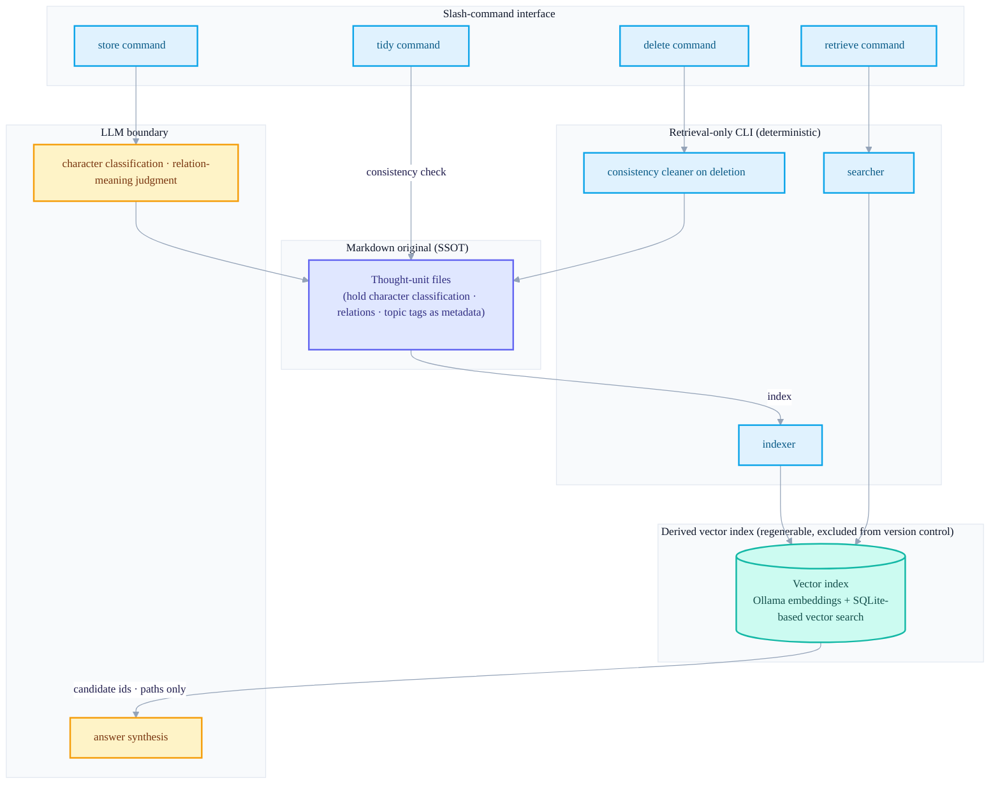
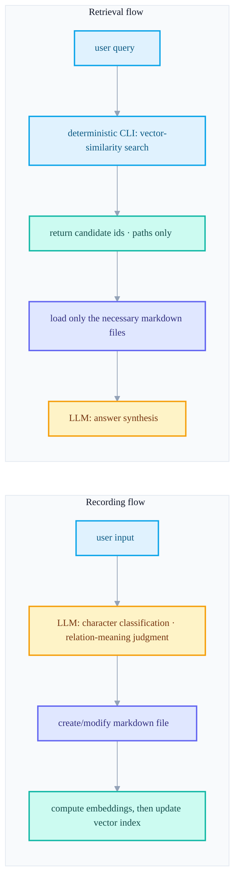
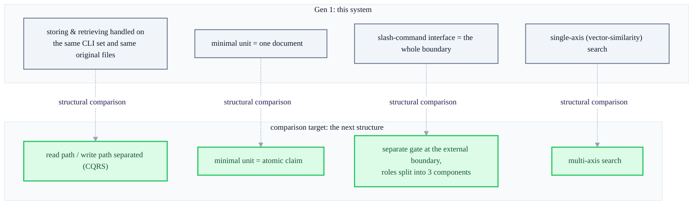

+++
date = '2026-05-30T21:00:00+09:00'
draft = false
title = '[2026-05-30] The First Second Brain, with Markdown as the Original'
summary = "A design record of a first-generation PKM system that made markdown the single source of truth (SSOT) and the vector index a derivative. It retraces three structural transitions — v5 3-tier → v6 vector → v6.1 flat — and the principle of narrowing the LLM's role to judgment and synthesis."
tags = ['Second Brain']
+++

In late May 2026, I began building a personal knowledge-management system that piles up the thoughts, experiences, and knowledge an individual writes into markdown files and has an AI agent store, retrieve, and organize them. This post is a record of what I pondered, what decisions I made, and what structure it settled into while building that first system.

There's one thing to state up front. Even as of the time I'm writing this, this system is a completely separate project that shares neither code nor data with the other second-brain system I built later. No direct line of succession between the two systems — inheriting code, or moving data — has been confirmed. So this post is not one that tells "what it became next," but one that honestly retraces "how I tried to solve this problem at the time." That said, in the last part of the post I will analyze how it differs when placed side by side with the other structure that remains as of now — and that too is strictly a structural comparison, not an explanation of why this system was folded. (In fact this system was never folded. I'll get back to that later.)

## 1. The situation and the worries at the time

I wanted to do personal knowledge management, commonly called PKM. The problem was simple — I do jot down what comes to mind somewhere, but later it's hard to find and use it again. Search works, but it doesn't find by meaning; I do classify, but the classification criteria themselves get vague, and the more it piles up, the more organizing gets pushed back.

In deciding to solve this problem with code, I set two principles.

First, the storage format would be markdown. There was no special reason — being text files, they're readable anywhere, you can keep a history with a version-control tool (git), and they don't depend on any tool. Building a knowledge-management tool, I wanted to avoid the situation where you can't even read the data without that tool.

Second, organizing and retrieval would be handled by an AI agent. Instead of a person tagging and choosing folders every time, I wanted the agent to classify and store on its own when you say, through a conversational interface, "I had this thought."

Combining these two principles brings up the very next question — how do you implement "finding by meaning" out of a heap of markdown files, and exactly how far should the AI agent be involved in that process? This system's design was, in effect, the answer to this one question.

## 2. Core decisions and reasons

### Markdown is the original, the search index is a derivative

The very first principle I set was that "the markdown files are the single source of truth (SSOT), and everything else must be a derivative that can be regenerated from the original."

To do meaning-based search, you need vector embeddings and a vector search index to hold them. But treating this index like the original causes a problem — if the index breaks or its format changes, you effectively lose the knowledge itself. So from the start I designed the vector index as a "cache that can be regenerated anytime by re-reading all the markdown files," and excluded it from version control too. The key was that, as long as the original isn't broken, the index can be rebuilt any number of times.

### Deliberately narrowing the LLM's role

The second decision was to divide what the LLM (large language model) would and wouldn't do. At first there was the temptation to "let the AI agent do everything on its own," but in practice, when I left even finding retrieval candidates to the LLM, the results varied every time and it became hard to explain why a given candidate was picked.

So I divided the roles like this.

- **What should be handled deterministically**: finding which records are semantically close to the current query (discovering retrieval candidates). This is a distance calculation between embedding vectors, so the same input must always yield the same result. So this job is left to a retrieval-only CLI tool that runs deterministically on the local machine, and the LLM doesn't get involved.
- **What the LLM should handle**: judging what character a newly arrived thought has (whether it's an experience, a concept, a procedure, an insight, or a claim), judging what the relation between records means (for example, whether one extends or refutes the other), and reading the retrieval candidates to synthesize an answer fitting the user's question. These need contextual and semantic understanding, so they can't be replaced by deterministic rules.

In short, the boundary was "finding candidates goes to the machine; judging meaning and making the answer goes to the model." Once divided this way, retrieval results became reproducible, and the LLM only had to judge over a small set of already-narrowed candidates.

### Two strategies for saving tokens

The third worry was cost. Making the model read the entire system rules and all the knowledge on every request is slow and expensive. I used two strategies here.

One is to load only as much as needed, only at the moment it's needed. When retrieving, rather than reading all the markdown files, the vector search returns only the candidates' identifiers and paths, and only the truly necessary files among them are read at that point. Heavy operating-rule documents likewise are loaded only when that task is actually being done.

The other is delegating tasks to a small model. I made each of the four standardized tasks — store, retrieve, delete, organize — into a slash command, and had a separate sub-execution unit that the command invokes hold the heavy rules. This sub-execution is left to a relatively light model (e.g., Claude's Haiku family), and the main conversation session reduces its burden by calling a single command and receiving only a summary of the result.

## 3. The structure I set out to build

Combining the above decisions into a single picture looks like this. The markdown original, the vector index derived from that original, the deterministic retrieval CLI that handles that index, the slash-command interface the user faces directly, and the LLM boundary that, amid all of this, handles only judgment and synthesis.

The point to watch in this structure is that when the arrow goes from the vector index to the LLM, only "candidate identifiers and paths" are passed. The vector index only points the direction; reading the actual content and interpreting its meaning always happens by returning to the original markdown files.

Drawing this again in time order reveals two separate paths — the recording flow and the retrieval flow.

The two flows meet at exactly one point — the vector index. The recording flow fills the index, and the retrieval flow reads it. Beyond that, they operate completely independently. Not having to mind the retrieval logic when storing, and not having to mind the storage logic when retrieving, was the practical benefit of this separation.

## 4. Internal evolution — three structural transitions

This system wasn't built into its current form in one go. Over the course of building it, I changed the structure three times in a big way, and that evolution itself shows what this system wrestled with.

```mermaid
%%{init: {'theme':'base','themeVariables':{'fontFamily':'ui-sans-serif, system-ui, -apple-system, Segoe UI, Roboto, sans-serif','fontSize':'14px','lineColor':'#94A3B8','primaryColor':'#EEF2FF','primaryBorderColor':'#6366F1','primaryTextColor':'#1E1B4B','clusterBkg':'#F8FAFC','clusterBorder':'#E2E8F0','edgeLabelBackground':'#FFFFFF','titleColor':'#0F172A'}}}%%
flowchart LR
    V5["3-tier structure<br/>(topic folder tree + 4 record-type fields)"] -->|"topic and character classification<br/>are different axes, yet I tried to<br/>express both with a single folder"| V6["vector introduced<br/>(5 character classes at the top,<br/>topics handled by tags + vectors)"]
    V6 -->|"no more reason to keep<br/>a folder per character class"| V61["flat structure<br/>(single location, no folders,<br/>character class by metadata field only)"]

    classDef good fill:#DCFCE7,stroke:#22C55E,stroke-width:2px,color:#14532D;
    classDef bad fill:#FFE4E6,stroke:#F43F5E,stroke-width:2px,color:#881337;
    classDef neutral fill:#F1F5F9,stroke:#64748B,stroke-width:1.5px,color:#0F172A;
    class V5 bad;
    class V6 neutral;
    class V61 good;
```

**The first form (3-tier structure)** started with the identity of a "topic-based information archive." Under broad topics like life and study I placed further layers of folders, and put records inside them. A record's character (whether conceptual knowledge, a procedure, an experience, or a reflection) was also marked in a separate field. Retrieval was a 3-stage method that narrows sequentially through keyword matching, tag matching, and semantic similarity, with time-weighting and rank-recombination logic layered on top. There were also rules where each folder held a list file and, once the item count exceeded a certain threshold, it would split again.

The problem was that I tried to express two different axes — "what topic is it" and "what character of record is it" — simultaneously with a single folder tree. Records of the same topic but different character scattered across multiple folders, creating situations where you had to search several paths at once when retrieving. A folder can hold only one axis, yet I tried to fit two, and it strained.

**The second form (vector introduced)** changed the identity to "thought records by character." I made the top-level classification the character of the record (experience, concept, procedure, insight, claim — five kinds) rather than topic, and handed the topic role over to tags and vector embeddings. The core insight of this transition was that "if vector search can take over retrieval routing, then you can keep the top-level classification by character while no longer needing to traverse multiple paths at retrieval time." Indeed, after this transition, the previous multi-stage cascade retrieval logic, time-weighting, and rank-recombination logic vanished wholesale — because they were replaced by a single vector-similarity search.

**The third form (flat structure)** went a step further and removed the folder structure itself. All records sit side by side in a single location, and character classification is identified by a single metadata field only. The individual list files that had been per-folder were also merged into a single statistics document covering the whole. With vector search already taking over routing, the judgment was that dividing character by folder was no longer needed for retrieval at all.

One flow runs through the three transitions — depending less and less on the physical structure of folders, and moving that role to metadata and vector search.

## 5. Placing them side by side as of now — a structural comparison

After building this system, I built a different second-brain structure as a completely separate project. As stated earlier, the two systems share neither code nor data, and there's no record of one leading to the other. So the comparison below is not an answer to "why did I fold this system" — this system was never folded in the first place. But placing this system's design side by side with the other structure that exists as of now reveals points this system can't handle in principle. I'd like it to be read as pure structural analysis.

Summarizing in a table the four concepts the next structure introduced and this system's counterparts looks like this.

| Comparison axis | This system's (gen-1) structure | What the next structure introduced |
|---|---|---|
| Read/write path | Storing and retrieving are ultimately handled through the same CLI toolset and the same original files | Read path and write path designed as separate from the outset (CQRS) |
| Minimal unit of memory | A single file (a markdown document holding one thought) is the minimal unit | Not the document unit, but the individual claims within it as the atomic minimal unit |
| Boundary with the outside world | The slash-command interface is itself the entrance and boundary of the whole system | A separate gate at the point touching the outside world, with roles split into three components including it |
| Search method | Single-axis search by vector similarity (+ metadata filter) | Multi-axis search using several axes at once |

As a diagram, it looks like this.

What this table says is not that this system is "wrong," but rather that the scope of the problem it set out to handle was different from the start. This system tried to solve "finding by meaning out of a heap of markdown files," and within that, taking one document as the minimal unit and unifying the search axis into a single vector similarity were perfectly reasonable choices. But for problems of treating memory in claim units chopped finer than the document, treating writing and reading as completely separate optimization targets, or placing a separate verification point on the interaction with the outside world — this structure has no place, in principle, to hold such demands. Again, this is not a record of why this system was folded, but merely an observation from placing the two structures side by side as of now.

## 6. Closing

This system was built intensively for about ten-odd days from late May 2026, and after that it went into maintenance mode — meaning it's being used as-is, without major structural changes. And interestingly, this system still remains, undiscarded and independent, to this day. The slash-command interface for store, retrieve, delete, and tidy is still alive, and the records that have actually accumulated still exist as they are. Building a new second brain later with a completely different structure did not mean tearing this system out — it has simply gone on existing as a separate timeline, with separate tools.

Looking back, the two decisions that lasted longest in this system were "separate the original from derivatives" and "narrow the LLM's role to judgment and synthesis." The structure changed three times, but these two principles never wavered once, from the first form to the last. Perhaps that's why this system is still running to this day without much tinkering.
