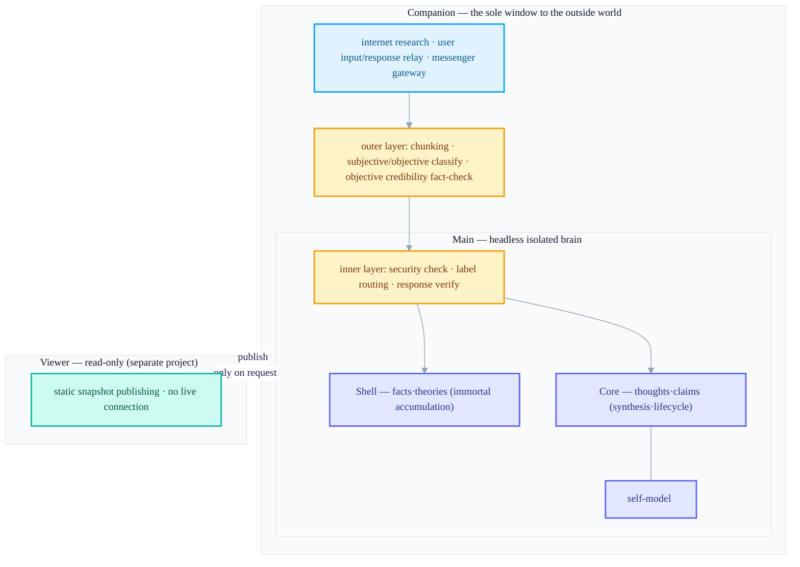
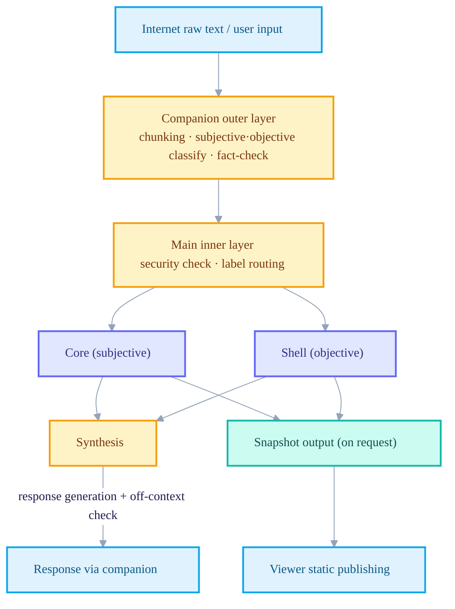

+++
date = '2026-06-21T21:00:00+09:00'
draft = false
title = '[2026-06-21] A Second Start: Why I Split the Brain into Three Processes'
summary = "Reflecting on the first generation, which crammed the subjective and the objective into one markdown file, and splitting the brain into main (isolated), companion (the external window), and viewer (read-only) — architecture v3.3. Six principles, including core/shell separation and a bidirectional gate, were fixed."
tags = ['Second Brain']
+++

Once before, I'd built a personal knowledge system by cramming all my thoughts and information picked up from the world into a single markdown file. The method was simple, but the more I used it, the more two things kept nagging at me. One was that the thoughts in my head and the facts fetched from the internet were held in the same vessel. The other was that it was vague exactly by what path, and in how controlled a manner, this system came into contact with the internet or with myself. Both were structural problems that "just add another file" couldn't solve.

So I decided to design it again from scratch. This time I reframed the question like this. Could I hold the subjective and the objective in different places from the very outset? And could I narrow this brain's passage to the outside world down to one, so that I only need to run checkpoints at that single passage?

## On a foundation where the plan itself becomes the rules

Before moving this design into actual code, I first decided "in what manner I would implement it." It's a pipeline where a person makes a request, that request becomes a draft plan, and once the plan passes a context-less cold review, the passed plan itself is compiled into enforced rules, and the actual build proceeds only under those rules. Put differently, it's a structure where, once a person validates the plan, that plan becomes the rules that constrain the build. Dangerous commands are always blocked, verification must be in place first along every path where code changes, and multiple layers enforce that the implementation can't leak beyond the scope the plan didn't include. The second-brain design proceeded on this harness from the very start — the design docs themselves were written on the premise that they would later be handed over to the build.

## Six principles

Of the core principles nailed down in the design docs, let me pick out the six fixed in this period.

### 1. Divide subjective and objective by nature

What's in my head is of two kinds. One is things not subject to true/false judgment, like thoughts, claims, experiences, and tastes. The other is things subject to verification, like facts, theories, news, and data. I decided to hold these two in physically different compartments within the brain — a concentric structure where the subjective ("core") lives inside and the objective ("shell") lives outside. Something that has once entered the core never crosses into the shell, nor does something in the shell cross into the core.

### 2. The core synthesizes, the shell accumulates

The core does synthesis work, where thought collides with thought to give birth to new insight. The shell, on the other hand, gathers facts and fact-checks them, but does not fabricate new theories by arbitrarily combining theory with theory. Because combining theories arbitrarily is not knowledge but hallucination. The gist of this asymmetry is that thoughts may grow, but facts must not be carelessly combined.

### 3. An isolated brain, a single window

The main brain meets neither the internet nor me directly. Internet research, my input, and the answers I receive all pass through a single window — a separate process called the companion. Main is isolated as headless, and the companion is the only point of contact with the outside.

### 4. A bidirectional gate — filter on the way in, verify on the way out

The membrane wrapping main operates in two layers. The outer layer (handled by the companion) splits incoming information into chunks, classifies it as subjective/objective, and fact-checks the credibility of only what's classified as objective. The inner layer (handled by the main boundary) takes that result, runs a security checkpoint, and pushes it into the core or shell according to the label. Outgoing responses, conversely, go out through the companion only after being verified for not straying oddly from context. It's a structure where the companion handles classification and fact-checking, and main handles security and routing.

### 5. Domains are born and die on their own

The unit corresponding to a topic folder (a domain) is not predetermined by a person. The AI, watching the pattern of thoughts accumulating in the core, creates new domains on its own, puts them to sleep when interest cools, and lets them perish if left untouched for long. This lifecycle, though, is core-only — the shell is immortal and does not perish.

### 6. Use the LLM sparingly

For things solvable by determinism, rules, embeddings, or graphs, I don't call the LLM at all. I set the principle at this point of using the LLM only where judgment or generation is truly necessary. Nailing down with a number exactly how many places it would be used — that I hadn't done yet at this stage.

## Structure: three independent processes

The result of physically laying these six principles down is not a single system but three projects split into different processes.

Main is a headless process not directly exposed to the outside, the companion is the only window that meets the internet and the user, and the viewer is a third sibling project that only reads those results. The three run separately, each from its own independent repository.

## The path the data flows along

Anything that comes in from outside must pass, in order, these two checkpoints — the companion's outer layer and main's inner layer — to reach the core or shell. Conversely, whatever goes out from the core or shell, whether a response or a snapshot, never just goes out without verification. At this point, what the canonical store was and what the minimal unit of memory was hadn't yet been fixed — that inner machinery would be pried open once more before long.
