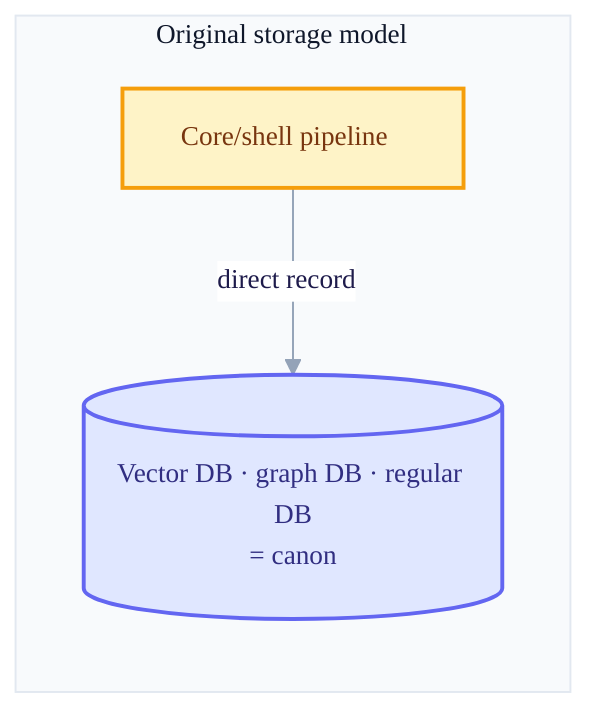
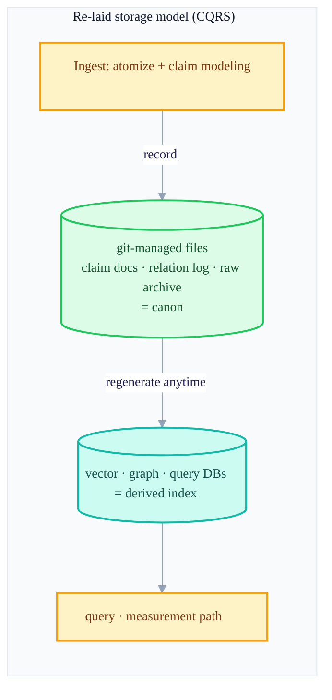
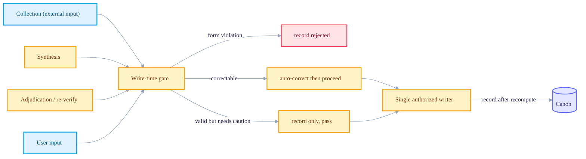

+++
date = '2026-06-28T21:00:00+09:00'
draft = false
title = '[2026-06-28] Overhauling the Storage Model: What Is the Minimal Unit of Memory?'
summary = "The v3.7 delta, which reopened the inner storage machinery while keeping the large skeleton intact. Five revisions — moving the canon from DB to git files, changing the minimal unit of memory from chunks to atomic claims, and shifting validation to a write-time gate."
tags = ['Second Brain']
+++

Earlier, while redesigning the second brain, I'd split the brain into core (subjective) and shell (objective), placed a headless process called main so that it touches the outside only through a single window called the companion, and even set the principle of not using the LLM for things solvable by determinism. But before going into the actual implementation with this large frame left intact, I decided to open up the inner machinery once more. It's a revision that inherits the large skeleton as-is but re-examines only the internal machinery — storage, the unit of memory, validation, search, and governance.

## What I re-examined

Going over the design one point at a time — "how do I actually store this, what do I treat as a single unit of memory, and when do I validate?" — five spots caught my attention.

### ① Moving the canon from DB to files

The original plan had a vector DB, a graph DB, and a regular DB as the canon. The truth was inside the DBs, and if a DB broke, the memories broke with it. I flipped this. Now the canon is files version-controlled by git — single-sheet claim documents, a log that only appends relations by event, a section gathering synthesized theses, and an archive that freezes raw text whole — and the vector, graph, and query DBs were demoted to derivatives that can be regenerated from the files at any time. It's a division of roles where the truth for writing and auditing lives in the files, and the speed for reading and serving is handled by the DBs. This way, reverting a memory ends with just a single version rollback, auditing and porting become possible without separate tools, and since the files are themselves the graph, you can run integrated consistency checks at the moment of recording. It's exactly what's called CQRS (a pattern that separates the write model and the read model).

### ② Changing the minimal unit of memory from document chunks to atomic claims

Originally I stored chunks split by meaning as-is. I changed this so that an incoming chunk is atomized once more by the LLM and modeled as a single claim that is complete in itself. A sentence left with an unresolved reference like "that one wasn't great" can't be stored; it has to make sense on its own, like "the X approach isn't great, for reason Y." For each such unit, I record together its content fingerprint (an identifier key that recognizes the same meaning even when it comes back in different wording), the history of how its wording changed, where it came from, and which raw text it is grounded on. I made clear at this point that chunking (splitting for classification, done by the companion) and atomization (splitting for storage, done by main) are different operations — a single chunk can give rise to several atomic claims.

### ③ Moving validation from a post-hoc audit to a write-time gate

Originally the way was to accept anything first and have the synthesis process audit it after the fact. I flipped this and set up a single gate that anything — collection, synthesis, or user input — must pass before it's actually recorded to the canon. If the form is wrong, it blocks the record itself (self-containment violations, fingerprint duplicates, circular relations, etc.); if a default is wrong, it auto-corrects and lets it through (e.g., the default visibility scope); and things that are still valid but could become a problem later, it doesn't block but merely records (contradicting claims, etc.). The reason this gate was needed is that the synthesis process itself is also an actor that creates new records internally, so it isn't filtered by the outer boundary's checkpoint alone — the write-time gate is exactly the place to catch the internal recording actor the outer boundary can't see.

### ④ Changing search from a single semantic axis to multi-axis fusion

Originally I combined the core and shell embeddings and searched by a single semantic similarity. I changed this to a method (RRF, a technique that fuses ranks rather than mixing scores) where you search separately along four axes — time, keyword, meaning, and relation — and then combine only the ranks. A query asking about recency is filtered strongly toward recent items; if there's a proper noun, the keyword axis weighs more, and a query asking about relations reflects the relation axis more heavily. The core rationale for this change was that, since all four axes are deterministic, I could afterward measure numerically whether I'm really finding what's close to the right answer, and tune it.

### ⑤ Gathering write authority into a single authorized writer

I serialized every path that changes the canon's state (collection, synthesis, adjudication, user input) into one place. I placed a single authorized writer as the only one that can actually record to the canon, and that writer doesn't take submitted claims at face value — it records only after recomputing and confirming them itself each time. For example, whether to merge duplicates or whether a relation is retracted is decided not by the submitter's judgment but by a value the writer re-measures. One operation remains as one structured record, and those records form a single connected sequence. Interestingly, this structure had the same form as the "single writer that never marks a plan complete without verifying it as-is" model on the side of the forced-build harness I was running this design under — I was solving a different problem, yet arrived at the same answer.

## The storage model, before and after

## The write path: anything must pass through this door

Keep what to accept still open (the principle of accepting anything, subjective or objective, remains), but enforce at this gate the shape in which what's accepted is stored — that's the through-line of this whole revision.

The decision nailed down in this revision — that "git-version-controlled files are the canon" — would be challenged once more later, as I actually operated the system.
