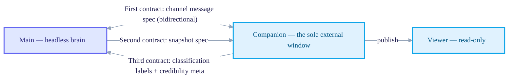

+++
date = '2026-07-02T21:00:00+09:00'
draft = false
title = '[2026-07-02] From Design to Execution Plan: 51 Units, 18 Partitions, 3 Contracts'
summary = "The record of turning five design docs into an execution plan buildable in parallel — carved into 51 units, 18 partitions, and 8 waves. Before writing any code, I froze the three contracts at the seams where the three processes interlock."
tags = ['Second Brain']
+++

Earlier I finished a design that splits the brain into three independent processes — main (a headless, isolated brain), companion (the sole window that meets the outside world), and viewer (read-only). I'd also reworked the inner machinery once more, changing the canonical store to files, the minimal unit of memory to atomic claims, and validation to a write-time gate. The remaining problem now was how to actually build this design.

## Design docs alone can't drive a build

Having all five design docs in place — the main volume and its revision, the companion design, the viewer design, and a document cutting across the LLM budget strategy — didn't mean I could immediately hand the build out to several workers to build in parallel. Design docs only tell you *what* to build; they don't tell you in what order and along which boundaries to build it simultaneously. I began the work of cutting those orders and boundaries.

## 51 units, 18 partitions

First I broke all the features scattered across the five design docs into minimal work units. 29 on the main side, 13 on the companion side, 5 on the viewer side, plus 4 corrective units that surfaced late while reviewing the plan — 51 units in all.

I grouped these 51 into 18 partitions so that no two would touch the same files — 10 main, 7 companion, 1 viewer. A partition is a unit that, even when handed to different workers at the same time, won't touch each other's files. For example, the units dealing with the canonical store, the atomic-claim model, and the core machinery around them were grouped into one partition, and the units dealing with search's four axes and query processing into another.

## Ordering dependencies into 8 waves

Splitting into partitions doesn't mean they can all start at once. Without the canonical store you can't build the write gate on top of it, and without the gate you can't validate ingest. So I ordered the partitions by dependency into 8 waves. Within a wave, work mostly proceeds in parallel; between waves, it proceeds sequentially.

```mermaid
%%{init: {'theme':'base','themeVariables':{'fontFamily':'ui-sans-serif, system-ui, -apple-system, Segoe UI, Roboto, sans-serif','fontSize':'14px','lineColor':'#94A3B8','primaryColor':'#EEF2FF','primaryBorderColor':'#6366F1','primaryTextColor':'#1E1B4B','clusterBkg':'#F8FAFC','clusterBorder':'#E2E8F0','edgeLabelBackground':'#FFFFFF','titleColor':'#0F172A'}}}%%
flowchart TB
    W0["Wave 0 — contracts & canonical store<br/>three seam contracts · canon · atomic-claim model · LLM provider factory"]
    W1["Wave 1 — main core machinery<br/>raw freeze · atomize · dedup · relation log · write governance · derived index · reindex"]
    W2["Wave 2 — gate · ingest · channel<br/>channel I/O · security check · routing · ingest digest · channel backbone · companion LLM factory"]
    W3["Wave 3 — search · query · fusion · quality<br/>multi-axis search + rank fusion · query classify · cross-layer fusion · deterministic reject · answer gen · quality gate"]
    W4["Wave 4 — interest · lifecycle · user model<br/>interest distill · user model · domain lifecycle · shell re-verify · synthesis sequence"]
    W5["Wave 5 — companion cognition · research · re-verify<br/>research loop · speech-act classify · subjective/objective classify · credibility fact-check · internet research · external re-verify"]
    W6["Wave 6 — interface · publish · maintenance<br/>messenger gateway · study sheet · viewer publish · companion security · self-maintenance · snapshot output · admin config"]
    W7["Wave 7 — viewer (static)<br/>scaffold · snapshot loader · graph viz · client-side search · security hardening"]

    W0 --> W1 --> W2 --> W3 --> W4 --> W5 --> W6 --> W7

    classDef canon fill:#E0E7FF,stroke:#6366F1,stroke-width:2px,color:#312E81;
    classDef proc fill:#FEF3C7,stroke:#F59E0B,stroke-width:2px,color:#78350F;
    classDef ext fill:#E0F2FE,stroke:#0EA5E9,stroke-width:2px,color:#075985;
    class W0 canon;
    class W1,W2,W3,W4,W5,W6 proc;
    class W7 ext;
```

## Fixing a contract at each seam first

As long as the three processes proceed separately in independent repositories, there are exactly three points where they interlock. I froze the specs of these three seams before any partition actually wrote code.

- **First contract** — the spec for what message format the single channel file shared between main and companion uses. Bidirectional.
- **Second contract** — the format spec for the snapshot published for viewing, which main creates and passes through companion all the way to the viewer.
- **Third contract** — the spec for the classification labels and credibility metadata that the companion's outer layer hands to main after finishing classification and fact-checking.

The reason I fixed these three contracts before starting the parallel build is simple. Even if each partition passes all of its own verification, if the specs of the interlocking seams are misaligned, the integration breaks when you merge. Freeze the contracts as contracts first, and each partition can proceed simultaneously — keeping only to that contract — without knowing anything about the others.

## But the logical spec alone wasn't enough

Even after all the partitions and contracts were set and the build had actually begun, there remained points where I'd fixed only the logical shape of the contracts, not physically what type and what value would be exchanged. These holes were filled one by one over the few days the build was actually running.

- One judgment point I'd initially meant to run only on a free local small model was fixed to switch to a commercial API provider's small model, after running the research loop by measurement yielded a harvest of zero.
- The embedding model, too, was fixed by swapping in a different 1024-dimension model after a hands-on measured comparison, instead of the originally shortlisted candidate.
- In the first contract (channel message spec), I nailed down the detailed spec of exactly what physical type the message identifier is (a string UUID) and which side signs first.
- In the third contract (dialogue-related metadata), I also canonicalized the name of the field that carries the user's question into a single one — until then there had been two candidates.

The logical schema — that is, "what to exchange" — alone wasn't enough to make code written in parallel actually mesh. That you have to nail down even the physical spec — whether a type is a string or a number, exactly what a field name is — for code written separately in different repositories to actually connect, was something I learned once more, even after I'd thought I had frozen the contracts first.
