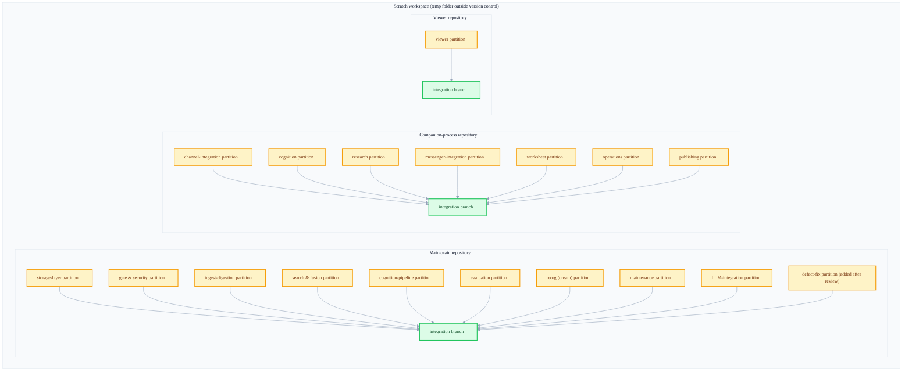
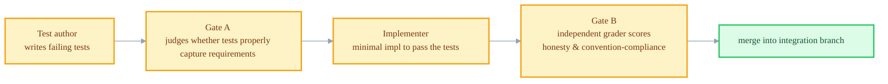
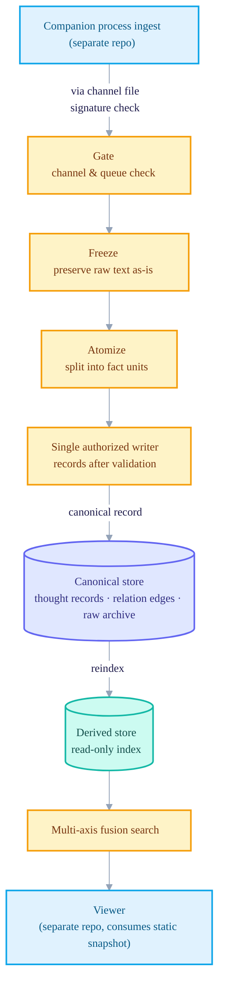

+++
date = '2026-07-04T21:00:00+09:00'
draft = false
title = '[2026-07-04] Building the System in Four Days with a Fleet of AI Agents'
summary = "The process of building the three components — main brain, companion, viewer — in four days by running many AI agents at once, «fleet» style. It walks through the three preconditions: non-overlapping partitions, three-role separation (test, verify, implement), and freezing shared conventions."
tags = ['Second Brain']
+++

This system is a personal, local knowledge-management tool. A main brain stores and indexes memories, a companion process handles communication with the outside world such as messengers, and a viewer shows those memories through graph and search screens. An implementation plan that carved the three components together into 51 work units was already prepared. The problem was who would turn that plan into code, and how.

## Building it solo, in order, lets the plan go stale

If one person (or one agent) implements the 51 units in order, two things go wrong. One is time. Writing it sequentially, from the storage layer through search, the cognition pipeline, and messenger integration, takes a long time to finish, and in the meantime the design assumptions made earlier go stale. The other is verification. When the person who built it judges for themselves that "it's done," the bias of grading one's own work favorably easily creeps in.

So this build proceeded in a "fleet" style, running many AI agents at once. But to run them in parallel, there were three preconditions to solve first.

**First, non-overlapping boundaries.** The 51 units had to be grouped into partitions that don't touch each other's files. If two partitions edit the same file at once, parallelization becomes meaningless. Storage layer, gate & security, ingest digestion, search & fusion, cognition pipeline, evaluation, reorg (dream) batch, maintenance, LLM integration — I first carved out areas of responsibility by component like this.

**Second, three-role separation.** Even within a single partition, I split "the one who writes the tests first," "the one who checks whether those tests fail and are meaningful," and "the implementer who makes the tests pass" into different agent sessions. Blocking the implementer from touching the tests physically guarantees at least that "the implementation was made to fit the tests." And the finished output is re-checked by an independent grader, not by the person who built it.

**Third, freezing shared conventions.** I fixed shared conventions like code style, commit-message rules, and gate-passing criteria into a single short document (about 55 lines) before starting the partitions. I updated it just once after the first partition passed, and didn't touch it after that. If conventions differ per partition, conflicts arise every time you merge later.

## The structure of the scratch workspace

The actual parallel build proceeded in a temporary workspace outside version control. Each component got its own independent repository, and inside it, partition branches split off and then merged one by one into an integration branch.

9 on the main-brain side, 7 on the companion-process side, 1 on the viewer side — 17 partitions in total proceeded in parallel on this structure. On top of these, one more partition that fixes, in one batch, the defects found later through review was additionally run in parallel.

## The role-separation pipeline

For a single partition to merge into the integration branch, it goes through a set flow.

The key is that the implementer can never touch the tests, and that grading happens in a separate session, not by the implementer themselves. Keeping just these two structurally prevents the common mistake of "loosening the tests themselves in order to pass them."

## A four-day record: partitions joining one by one

On the first day the workspace was created, the three repositories made their first commits at once. Over the next four days, the partitions joined in sequence.

| Timing | Progress |
|---|---|
| Day 1 | First commits in the three component repos at once. The main-brain storage layer's first wave begins — canonical layout, atomic-unit fact model, raw freeze, relation-edge log, pre-write format-check gate |
| Day 1–2 | The companion process's channel-integration partition and the entire viewer are integrated first (scores in the 90s) |
| Day 2–3 | Derived-index generation, deduplication, atomization, and incremental reindexing are all wrapped up, integrating the entire storage-layer partition |
| Day 3–4 | The channel & security gate and the snapshot-contract partition integrated. The search & fusion partition that ranks by combining four axes integrated. The ingest-digestion partition integrated — all scored in the 90–100 range |
| Day 4 | The evaluation partition, the cognition pipeline (interest distillation, self-model, lifecycle, re-verification), the 11-stage reorg (dream) batch, and the maintenance & format-check rules integrated in sequence |
| Day 4 | The partition that fixes, in one batch, the 31 defects confirmed in review is merged, and an assembly root that ties several background jobs (the task dispatcher, the periodic-check worker, the reorg scheduler) into one is newly created — with this merge, final integration is complete |

Over four days, 17 partitions merged into the integration branch in sequence, and the build wrapped up as the work of fixing the 31 defects review had caught finished at the end. Independent grading was done at each partition's merge point, and the scores were mostly between the high 90s and 100.

## The architecture completed after four days

The structure established at this point is a CQRS (a design that separates command and query) form. Writes go only to the canon, and reads happen only on a separate index derived from the canon. The companion process and the main brain exchange data with each other only through a single channel file — the two processes communicate directly through no other path.

The write path always goes through four stages in order: ingest → freeze → atomize → validate & record. It first freezes the raw text as-is (freeze), only then splits it into fact units (atomize), and finally only a singly authorized writer records to the canon. This way, "who wrote to the canon" can always be narrowed to a single point. Reads don't read the canon directly; search operates only on a derived index that is periodically reconstructed from the canon.

## Closing: the scratch history became the main repository as-is

The temporary workspace where the parallel build proceeded was not discarded. The first commit of the main-brain repository made inside it and the first commit of this system's main-brain repository now are completely identical, and the final integration commit of day four also remains intact within the current repository's log. That is, the scratch workspace was not a "discarded experiment" but the birth record of the current system itself.

At the point the build finished, the main-brain repository had about 100 commits. Afterward, on top of this repository, another ten-odd days of history accumulated — through execution planning, the full teardown of a completed feature, the redefinition of the canonical store, real-use gate validation, and ingest-method redesign — and the commit count grew about 1.5-fold. The temporary workspace where the parallel build had proceeded, on the other hand, remained quietly dormant after the final merge with no further commits — having done its job, it handed its history to the main repository and stopped.
