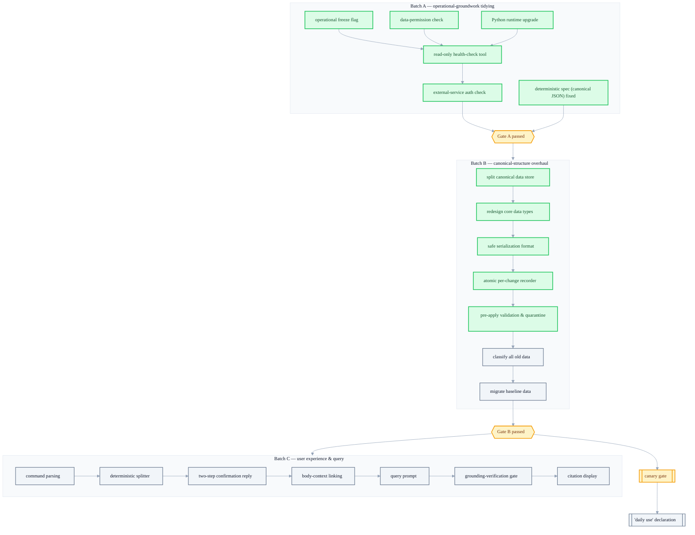

+++
date = '2026-07-11T21:00:00+09:00'
draft = false
title = '[2026-07-11] Two AIs Cross-Reviewing: Fixing the Operating Plan with 11 Decisions'
summary = "Eleven decisions fixed by having two different AIs (Claude and Codex) cross-review the same issues. Determinism first, grading by trust, deletion contracts, and execution batches A/B/C with gates between them."
tags = ['Second Brain']
+++

This system is a personal, local knowledge-management tool, where a main brain stores and indexes memories and a companion process handles communication with the outside world, such as messengers. After the four-day parallel build put the skeletons of the three components in place, the next gate was "is it OK to actually put this into operation?" But before crossing into operation, there were still open issues that had to be closed first.

## The build is done, but I can't cross into operation

In the build phase I only had to ask "does it pass the tests?" Crossing into operation required different questions. When search results are ambiguous, how far do I delegate to the LLM? How do I grade situations where trust is shaken? When the user requests a deletion, what does the system actually "promise" to erase? These questions weren't solved by a line of code — they were decisions a human had to fix while conscious of the trade-offs.

The way I fixed these decisions was unusual too. I had two different AIs (one of the Claude family, one of the Codex family) cross-review the same issues. The reason is simple — a conclusion drawn by one model may carry that model's blind spots intact. If two models reach the same conclusion on different grounds, that decision is more trustworthy; if they reach different conclusions, that spot is itself a signal that a real trade-off lies there. Through this cross-review, 11 decisions were fixed.

## Things I put determinism first on

Three decisions bind into a single principle — "where an ambiguous judgment is needed, use rules as much as possible; use the LLM only where it's truly necessary."

The logic that decides where to cut a sentence was written with deterministic rules, not the LLM. I protected patterns like URLs, decimal points, Markdown syntax, code blocks, lists, and abbreviations with rules so the boundary isn't cut wrong, and decided to use the LLM only for classification (labeling) within those fixed boundaries. It was a choice that also fit the cost budget — and above all, it let me obtain reproducibility, where the same input always yields the same output.

When answering a query, I fixed the budget of paid LLM calls at two in total — the first for structuring and citation mapping, the second an entailment check that verifies the answer doesn't stray from its grounds. If this process fails, instead of a third call to regenerate, I decided to put out a deterministically abridged response by rule. It's an attitude of "if it fails, fall back in a fixed way," not "if it fails, try once more."

And to prevent the accident of the fingerprint (to be built later) and the snapshot hash being computed in different ways, I fixed the method of sorting values into a standardized order before hashing (an international standard spec) from early in the project. The later you decide such a spec, the higher the cost of aligning it with already-stored data, so I moved it up rather than putting it off.

## Things I graded by trust

A feature that is built and "works" is a different story from one that is "OK to use day-to-day." Codifying this distinction was the third decision. Features that handle core memory don't automatically open trust mode just because the core batch is complete; they can be turned on only manually, and only for personal use, after passing a separate gate (the canary gate) that measures whether the same result comes out after a restart, whether you can confirm a command was actually applied, whether restore from backup actually works, whether answers cite the source accurately, and whether there is not a single false success. The automatically running research, publishing, and reorg features were to be kept off regardless of this gate.

I also graded situations where trust is shaken. The principle is that if it's only as bad as a single file being quarantined, read-only queries are allowed, but if the schema, the fingerprint spec, or global consistency itself is broken, it's fully blocked. And I decided not to mix "the user said so" and "the content was objectively verified" into the same trust grade — storing a user's utterance as a confirmed fact and merely recording that the utterance happened are different things.

## Deletion needed a contract too

Setting up a new taxonomy for the first time carries a high cost of error. I put all 26 pieces of old domain data up as migration candidates, deciding to batch the obvious ones for human approval and quarantine the ambiguous ones. This was because I judged that the cost of undoing a misclassification once it spreads is far greater than the cost of reviewing everything.

Deletion requests, too, I split into three different contracts. An ordinary deletion erases only the active data and the derived index, and accepts that the raw text inside the history store may remain. A full deletion is a heavier procedure that rewrites the history itself. Backups are kept for a set period (about 30 days) and then automatically expire. The originally planned service-level goal that "replicas reach exactly zero" turned out, over the course of this discussion, to be incompatible with a reality where an append-only history store and immutable backups coexist, so the "zero residual text" criterion was adjusted, as a compromise, to be limited to only the active data and the derived index.

## Things I re-sequenced

The remaining decisions were about "when, and in what units" rather than architecture. The embeddings of the public text that goes up to the viewer were to be recomputed with a dedicated small multilingual model rather than a general-purpose one, and that model, version, and dimension were to be fixed as snapshot metadata — though this decision was scheduled to be executed much later.

I also decided what to treat as the unit of a record. I nailed down that the invariant "one write = one record" is interpreted in units of the user's operation (a message), not in units of individual facts (claims). The initial way of implementing this principle would later disappear entirely, but the principle itself — "one record per user operation" — was later re-implemented on top of a different storage method.

And I moved the work of upgrading the execution environment's language runtime to its latest version much earlier than originally planned — the reason being that changing the runtime later, after finishing even the data-migration work, would double the cost by forcing me to re-verify things I'd already verified.

## Execution plan: Batch A → gate → Batch B → Batch C

The 11 decisions were concretized into three execution batches and gates dividing them. A gate is not "pass if a human looks at it and feels it's fine," but a checkpoint set up so that you can move to the next stage only if a predetermined check runs automatically and its result satisfies specific conditions. It was a device for moving judgment from a human's gut feeling to reproducible verification.

Batch A was framed as 8 items you can start immediately, Batch B as 11 items that re-lay the canonical structure, and Batch C as 13 items dealing with the user experience and query flow, with the total expected scale being about a month to a month and a half for one person. Batch A was entirely finished and passed its gate on the day the plan was fixed. Then the front part of the canonical-structure overhaul (from splitting the canonical data store through the pre-apply validation & quarantine procedure) was also completed quickly within a day or two. But right before starting the full classification of the old data, an incident erupts that shakes the whole direction — that story is big enough to cover separately.

## At the same time, the companion process was already in real service

From a few days before this meeting was held, the companion process had already swapped the LLM calls it had merely been faking with stubs for real service API calls, and a real user account had been linked to the messenger bot too. In other words, the "operational freeze flag" decided in this meeting wasn't locking an empty system, but selectively locking only the automation paths (research, reorg, publishing) on top of a system already calling a real language model and connected to a real messenger. It amounted to picking and halting only the paths that run on their own without human intervention, not the whole system.

## Closing

This meeting was not a place where a new architecture was invented, but a project-management decision that nailed down scope, order, and gates. Of the 11, what actually survived intact to this day are about the three determinism principles (the chunker, the query budget, the JCS spec), the canary gate, and pulling the Python runtime forward. The rest either had their implementation change amid later incidents, or lost their target of execution entirely, or remain a stage not yet reached. That making a decision and that decision surviving are separate matters is something this project would confirm again within a few weeks.
