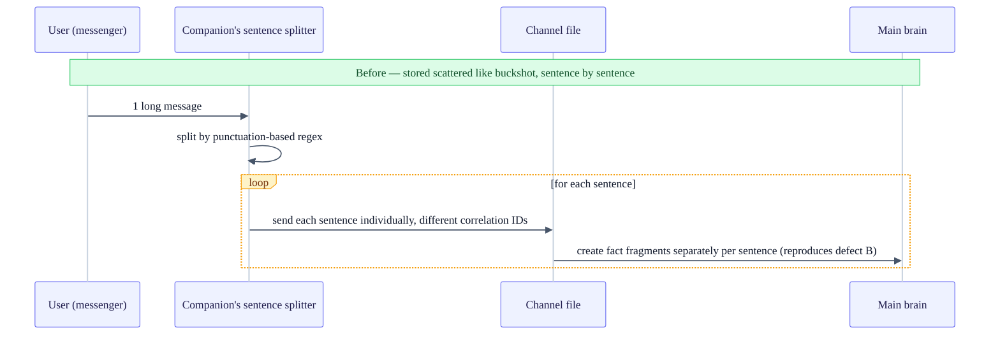
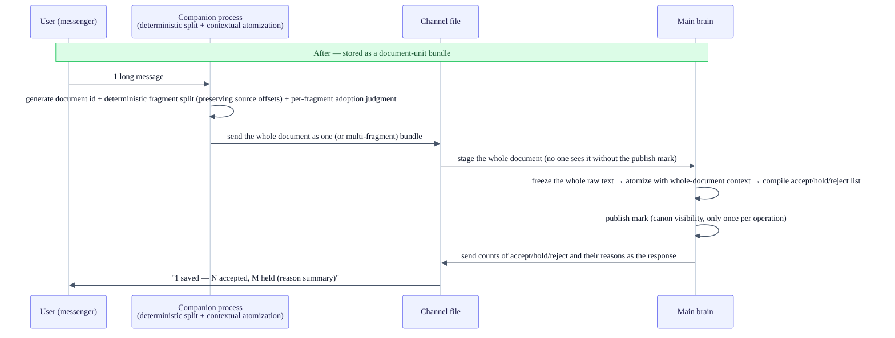

+++
date = '2026-07-18T21:00:00+09:00'
draft = false
title = '[2026-07-18] Three Defects and One Inefficiency the Canary Caught, and From Sentence to Document'
summary = "The canary gate, where the whole test suite was green yet real use failed. Catching three defects — including one where personal memory was never queried — plus one inefficiency, and going all the way to redesigning the storage unit from the sentence to the document."
tags = ['Second Brain']
+++

This system is a personal, local knowledge-management tool. A main brain stores and indexes memories, and a companion process handles communication through a messenger. After finishing the stabilization work of re-fixing the canonical store to the filesystem and tidying the structure, one last gate remained before finally crossing into real use — the gate decided in an earlier meeting, that "a core feature merely working is not enough; it must pass a separate real-use validation gate to open trust mode."

## The suite was all green, yet real use failed

Finishing stabilization didn't mean it was OK to use day-to-day right away. As per the policy fixed earlier, before opening the core memory features widely, it had to pass one more separate real-use validation gate.

## What the canary gate is

This gate is named the canary gate. Like the canary that used to detect toxic gas first in a coal mine, the idea is to run a single real user scenario under conditions identical to the real thing, so that if there's a problem it gets caught first. It checks five conditions — whether it's actually recorded to the canon, whether that record is reflected in search, whether the same result comes out after a restart (restart consistency), whether background jobs run without exception, and whether the frozen feature flags stay intact.

An experiment to verify these five conditions by manually entering one piece of real data was run. But the first result was a failure. The input itself (recording to the canon) succeeded, but when I actually asked about the stored fact, in 4 out of 4 tries it failed to meet the final criterion of "an answer containing the stored fact" — twice it outright refused to answer, and twice it passed the grounding-verification procedure yet put out a product with no actual content. This failure retracted the conclusion to "expand general manual use."

The full automated test suite was all passing (green) at this point. That is, not one of the tests I'd written caught this failure path — a case demonstrating that no matter how green the suite is, verification that runs a real scenario through the actually-living system is needed separately.

## Three defects and one inefficiency — what was leaking, and why

Digging into the cause, four problems of different characters surfaced. Three were clear defects, and one was an inefficiency that doesn't make the result wrong but makes the work happen twice.

**Defect A — when it can't read intent, it doesn't look at personal memory at all.** When it found no clear signal in the question, the intent-classification logic split the score evenly across six intent candidates. But the next-stage logic that picks the top-scoring candidate always chose the first item in the list (the "fact check" intent) in a tie, and that "fact check" intent happened to be set to look only at the public-material layer, not personal memory. So even a question with high enough relevance to stored memory, like "what should I do this weekend," produced an answer without looking into the personal-memory layer at all.

**Defect B — the deterministic splitter chops one message into several fragments.** The regex rule that judges sentence boundaries chopped a single user message into two separate questions. As a result, the part carrying intent, like "what do you think," and the actual question content were separated into different fragments and stored.

**Defect C — search succeeds, but the body isn't re-read.** When the prompt-assembly logic that generates the answer passed the search results to the LLM, it was passing only the content fingerprint and the rank score. There was nowhere any logic to re-read the raw text corresponding to that fingerprint from the canon and fill it in as the body. Coupled with this, there was also a wiring omission where the derived index that links fingerprint to body was itself being passed in an empty state at execution time.

**Observation D (inefficiency) — it searched twice, but the results are thrown away.** The query logic searched the personal-memory layer and the public-material layer separately up front, yet overwrote those results wholesale at the final fusion stage, making the initial search pointless. This was naturally resolved in the course of fixing defect A — because it was enough to change it to reuse the pre-searched results rather than discard them.

All the fixes were made within the existing principle (boundaries by deterministic rule, the LLM used only within them). When there's no signal or a tie, it now explicitly says "I don't know" and merges both layers to look at together; it filters by setting a minimum relevance floor per document (layer); and if the anchor layer falls below the floor, it moves to the opposite layer by a fixed rule. The splitter was changed to label in one pass while preserving the source position info (offsets) and punctuation, so that a continuing question span can be reassembled into one. To the body-assembly logic I added lookup logic that re-reads the confirmed fingerprint directly from the canon, and made it fail before calling the LLM if it can't find the body. I also fixed the wiring so that the derived index linking fingerprint and body is rebuilt at boot and updated whenever input comes in.

## Re-verification: all five conditions passed

After applying the fixes, I ran the canary experiment again, and this time all five conditions passed. Even for a question with no clear signal ("what do I do every weekend?"), an actual body answer containing the stored fact came out together with two grounding markers; after a restart, the same answer came out with the same fingerprint as before the restart, confirming the consistency of canon reconstruction; background-job exceptions were zero; and the frozen feature flags were intact. With this, "expanding general manual use" was approved.

Right before opening the gate, three system auto-start settings that had been registered so that the relevant processes automatically turn back on at reboot (installed early in stabilization) were physically removed — the setting templates themselves were left in the repository so they can be reinstalled if needed. That said, always-on operation (staying up even across reboots) remained on hold, separate from this gate.

## The more fundamental problem: the storage boundary was the sentence, not the document

Defect B (chopping sentences wrong) looked, on the surface, like a problem that would end with fixing a single regex. But the deeper I dug, the more a more fundamental design problem surfaced. The minimal unit of storage was hung on "a sentence fragment transmitted by messenger" rather than "one document the user sent." A single long message was, from the start, structured to be chopped into several independent storage units, and that boundary depended on the shallow signal of punctuation.

## Why I switched to the document unit

After a meeting that went back and forth several times between two AIs (Claude and Codex), the user decided to redesign the ingest unit itself. This came with the decision that it was fine to erase all existing data and start over from scratch.

There were three purposes. To have one long message receive a single storage-confirmation response at the document level ("N accepted, M held, reasons included"); to make fact-unit fragments while keeping the whole document's context, so that fragments incomprehensible without context — like "capability #2" — don't arise; and to make even held or rejected parts retrievable later, along with their reasons.

Consistency with the previously fixed principles was kept intact too. The way boundaries are divided is still a deterministic rule, and the LLM is used only to label by looking at the whole document's context, within a scope that doesn't change those boundaries. The budget of paid LLM calls used for a query was still fixed at two — switching to the document unit doesn't increase the number of calls. The principle "one record per user operation" was also re-implemented this time on top of the filesystem canon — instead of a physical git commit, it mimics atomic visibility by leaving a publish mark only after preparation is finished in a staging state. This approach was possible because the canon had already been fixed to the filesystem.

## The ingest pipeline, before and after

## Status as of 2026-07-19 and next steps

As of the canary re-verification, about 900 tests on the main-brain side and about 400 on the companion-process side passed, and all six checks of the integrated verification command returned exit code 0. The document-unit switch implementation was reflected right after that, but the final test numbers after this switch have not yet been separately confirmed as of this point.

In terms of the execution plan set earlier, the batch that firms up the operational groundwork has passed its gate and stays complete. The batch that was to re-lay the canonical structure was canceled entirely by the migration teardown, and many of the user-experience tasks that depended on it remain inactive until re-planning. That said, among them, the command-parsing and deterministic-splitter-type work was effectively absorbed and re-implemented by this document-unit redesign.

The operational freeze also holds. Automatic features like research, reorg, and publishing stay off — what the canary gate opened is only expanding real use "manually, for personal use only," and the features that run on their own automatically stay locked exactly as first decided. The always-on state that stays up even across reboots is also not yet approved.

The clearest lesson this incident leaves is that no matter how green the test suite is, that doesn't immediately mean "it's safe for real use." All four defects surfaced only in an actual input→query round-trip experiment, not in unit or integration tests. And that tracking the root cause of one defect (sentence splitting) led to the bigger work of redesigning the storage unit itself also showed how a single surface bug sometimes makes you re-question the premises of the design.
