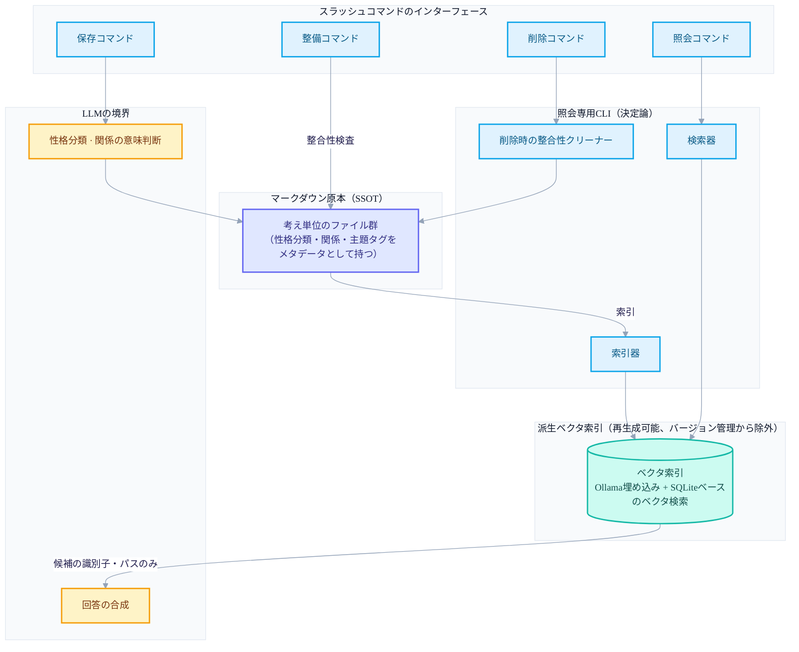
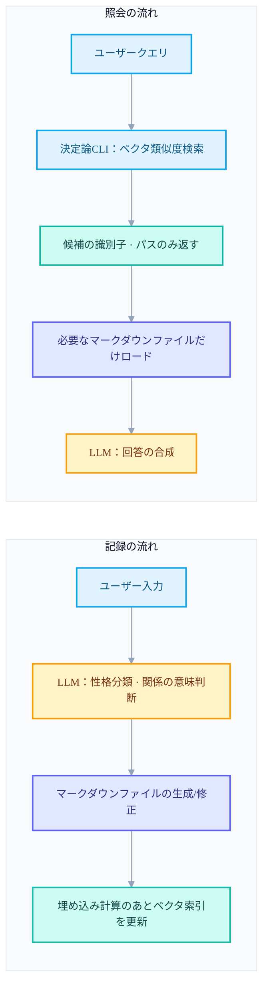
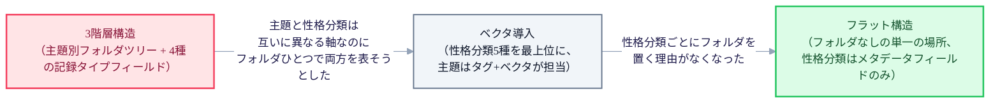
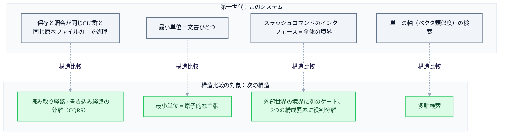

+++
date = '2026-05-30T21:00:00+09:00'
draft = false
title = '[2026-05-30] マークダウンを原本に据えた、最初のセカンドブレイン'
summary = "マークダウンを唯一の正本（SSOT）に、ベクタ索引を派生物に据えた第一世代PKMシステムの設計記録。v5の3階層 → v6のベクタ導入 → v6.1のフラット構造という三度の構造転換と、LLMの役割を判断と合成に絞った原則を振り返る。"
tags = ['Second Brain']
+++

2026年5月末、個人が書く考え・経験・知識をマークダウンファイルに積み上げ、それをAIエージェントが保存・照会・整理してくれる個人知識管理システムを作りはじめた。この記事は、その最初のシステムを作りながら、何を悩み、どんな決定を下し、どんな構造に行き着いたかについての記録だ。

先に断っておくことがひとつある。このシステムは、いまこの記事を書いている時点から見ても、のちに作った別のセカンドブレインシステムと、コードもデータも共有しない完全に別のプロジェクトだ。二つのシステムのあいだに直接的な継承関係——コードを引き継いだとか、データを移したとか——は確認されていない。だからこの記事は「その次に何になったか」を語るものではなく、「そのときこの問題をどう解こうとしたか」を正直に振り返るものだ。ただし記事の最後の部分で、いまの時点に残る別の構造と並べて、何が違うかの分析はしてみる——それもあくまで構造の比較であって、このシステムがなぜ畳まれたかの説明ではない。（実のところ、このシステムは畳まれたこともない。後でまた扱う。）

## 1. あのときの状況と悩み

個人の知識管理、よく言うPKMをやりたかった。問題は単純だった——思いついたことをどこかに書き留めはするのだが、あとでそれをまた探して使うのが難しい、ということ。検索はできても意味では見つからず、分類はしておいても分類の基準そのものが曖昧になり、積もるほど整理は後回しになる。

この問題をコードで解いてみようと決めたときに立てた原則は二つだった。

第一に、保存の形式はマークダウンにする。特別な理由はなかった——テキストファイルなのでどこでも読め、バージョン管理ツール（git）で履歴を残せ、ツールに依存しない。知識管理ツールを作りながら、そのツールがなければデータも読めない、という状況は避けたかった。

第二に、整理と照会はAIエージェントが担う。人が毎回タグをつけてフォルダを決める代わりに、対話型のインターフェースで「こんな考えをした」と言えば、エージェントが自ら分類して保存するようにしたかった。

この二つの原則を合わせると、すぐ次の問いが出てくる——マークダウンファイルの山から「意味で探す」をどう実装するのか、そしてその過程でAIエージェントは正確にどこまで関与すべきなのか。このシステムの設計は、事実上この一つの問いへの答えだった。

## 2. 核心的な決定とその理由

### マークダウンが原本、検索索引は派生物

まっさきに定めた原則は、「マークダウンファイルが唯一の原本（SSOT）であり、それ以外のすべては原本から作り直せる派生物でなければならない」ということだった。

意味ベースの検索をするには、ベクタ埋め込みと、それを収めるベクタ検索索引が必要だ。だが、この索引を原本のように扱うと問題が起きる——索引が壊れたり形式が変わったりすれば、知識そのものを失うことになるからだ。そこでベクタ索引は最初から「いつでもマークダウンファイル全体を読み直して再生成できるキャッシュ」として設計し、バージョン管理の対象からも外した。原本が壊れないかぎり、索引は何度でも作り直せる、というのが肝だった。

### LLMの役割を意図的に絞る

二つめの決定は、LLM（大規模言語モデル）がやることと、やらないことを分けることだった。最初は「AIエージェントに全部任せてしまいたい」という誘惑があったが、実際にやってみると、照会候補を探すことまでLLMに任せると結果が毎回変わり、なぜこの候補が選ばれたのかを説明するのも難しくなった。

そこで役割をこう分けた。

- **決定論的に処理すべきこと**：どの記録がいまのクエリと意味的に近いかを探し出すこと（照会候補の発見）。これは埋め込みベクタ間の距離計算なので、同じ入力には常に同じ結果が出なければならない。だからこの仕事は、ローカルで決定論的に動く照会専用のCLIツールに任せ、LLMは関与しない。
- **LLMが担うべきこと**：新しく入ってきた考えがどんな性格（経験か、概念か、手順か、洞察か、主張か）を持つかを判断すること、記録どうしの関係がどんな意味か（たとえば一方が他方を拡張するのか、反駁するのか）を判断すること、そして照会候補を読んでユーザーの質問に合う答えへ合成すること。こういうものは文脈と意味の理解が要るので、決定論的な規則では代替できない。

まとめると、「候補を探すことは機械に、意味を判断して答えを作ることはモデルに」という境界線だった。こう分けてみると照会結果が再現可能になり、LLMはすでに絞り込まれた少数の候補だけを見て判断すればよくなった。

### トークンを節約する二つの戦略

三つめの悩みはコストだった。リクエストのたびにシステム全体の規則と知識全体をモデルに読ませれば、遅くて高くつく。ここで使った戦略は二つだ。

ひとつは、必要な瞬間に必要な分だけ読み込むことだ。照会するときにすべてのマークダウンファイルを読むのではなく、ベクタ検索が候補の識別子とパスだけを返せば、そのうち本当に必要なファイルだけをそのとき読む。重い運用規則のドキュメントも同様に、本当にその作業をするときにだけロードする。

もうひとつは、作業を小さなモデルへ委任することだ。保存・照会・削除・整理といった定型化された四つの作業をそれぞれスラッシュコマンドにし、そのコマンドが呼び出す別の下位実行単位が重い規則を持つようにした。この下位実行は相対的に軽いモデル（例：ClaudeのHaiku系）に任せ、メインの対話セッションはコマンドをひとつ呼んで結果の要約だけを受け取る、というやり方で負担を減らした。

## 3. 作ろうとした構造

上の決定をひとつの図に合わせると、こうなる。マークダウンの原本、その原本から派生したベクタ索引、その索引を扱う決定論的な照会CLI、ユーザーが直接向き合うスラッシュコマンドのインターフェース、そしてこれらすべてのあいだで判断と合成だけを担うLLMの境界。

この構造で目を留めるべき点は、矢印がベクタ索引からLLMへ行くとき「候補の識別子とパスだけ」が渡ることだ。ベクタ索引は方向を教えるだけで、実際の内容を読んで意味を解釈するのは、常に原本のマークダウンファイルへ戻って行われる。

これを時間順にもう一度描くと、記録の流れと照会の流れ、二つの別々の経路が見えてくる。

二つの流れが出会う地点はちょうどひとつだ——ベクタ索引。記録の流れが索引を満たし、照会の流れが索引を読む。それ以外はまったく独立に動く。保存するときに照会のロジックを気にする必要がなく、照会するときに保存のロジックを気にする必要がない、というのがこの分離の実質的な利点だった。

## 4. 内部の変遷——三度の構造転換

このシステムは一度でいまの形になったわけではない。作る過程で構造を三度大きく変え、その変遷そのものが、このシステムが何と格闘したかを見せてくれる。

**最初の形（3階層構造）**では、「主題別の情報アーカイブ」というアイデンティティで始めた。生活、学習のような大きな主題の下に、さらに何層ものフォルダを置き、その中に記録を入れた。記録の性格（概念的な知識か、手順か、経験か、省察か）も別のフィールドで示した。照会は、キーワードマッチング、タグマッチング、意味の類似度を順に絞り込む3段階の方式に、時間の重みづけと順位の再組み合わせのロジックを載せた形だった。フォルダごとに一覧ファイルを置き、項目数が一定の基準を超えると再び分ける規則もあった。

問題は、フォルダツリーひとつで「何の主題か」と「どんな性格の記録か」という二つの異なる軸を同時に表現しようとした点だった。同じ主題でも性格の違う記録が複数のフォルダに散らばり、照会するときに複数の経路を同時にたどらねばならない状況が起きた。フォルダでは一つの軸しか盛れないのに二つの軸を盛ろうとして、無理が生じたのだ。

**二つめの形（ベクタ導入）**では、アイデンティティを「性格別の思考記録」に変えた。最上位の分類を主題ではなく記録の性格（経験・概念・手順・洞察・主張の五つ）とし、主題はタグとベクタ埋め込みが担うよう役割を渡した。この転換の核心的な洞察は、「ベクタ検索が照会のルーティングを代わってくれるなら、性格別の最上位分類を保ちながらも、照会の時点で複数の経路を巡る必要がなくなる」ということだった。実際、この転換のあと、以前の多段カスケードの照会ロジック、時間の重みづけ、順位の再組み合わせのロジックが丸ごと消えた——ベクタ類似度検索ひとつに置き換わったからだ。

**三つめの形（フラット構造）**では、もう一歩進んでフォルダ構造そのものをなくした。すべての記録をひとつの場所に並べて置き、性格の分類はメタデータのフィールドひとつだけで識別する。フォルダごとにあった個別の一覧ファイルも、全体をまとめる単一の統計ドキュメントに合わせた。ベクタ検索がすでにルーティングを代わっている状況では、フォルダで性格を分けること自体が、もはや照会に必要ないという判断だった。

三つの転換を貫く流れはひとつだ——フォルダという物理的な構造にだんだん依存しなくなり、その座をメタデータとベクタ検索へ移していったこと。

## 5. いまの時点で並べて見ると——構造の比較

このシステムを作ったあと、私は完全に別のプロジェクトとして、別のセカンドブレイン構造を作った。先に述べたとおり、二つのシステムはコードもデータも共有せず、一方が他方へつながったという記録もない。だから以下の比較は「なぜこのシステムを畳んだか」への答えではない——そもそもこのシステムは畳まれたことがない。ただ、いまの時点に存在する別の構造とこのシステムの設計を並べてみると、このシステムが原理的に扱えない地点が見えてくる。純粋な構造分析として読んでもらえるとうれしい。

次の構造が導入した四つの概念と、このシステムの対応を表にまとめると、こうなる。

| 比較の軸 | このシステム（第一世代）の構造 | 次の構造が導入したもの |
|---|---|---|
| 読み取り/書き込みの経路 | 保存と照会が結局、同じCLIツール群と同じ原本ファイルを経て処理される | 読み取り経路と書き込み経路を、はじめから分離して設計（CQRS） |
| 記憶の最小単位 | ファイルひとつ（考えひとつを収めたマークダウン文書）が最小単位 | 文書単位ではなく、その中の個別の主張を原子的な最小単位とする |
| 外部世界との境界 | スラッシュコマンドのインターフェースが、そのままシステム全体の入口であり境界 | 外部世界と接する地点に別のゲートを置き、それを含めて三つの構成要素に役割を分離 |
| 検索の方式 | ベクタ類似度という単一の軸の検索（＋メタデータフィルタ） | 複数の軸を同時に使う多軸検索 |

図で見るとこうなる。

この表が言うのは、このシステムが「間違っている」ということではなく、そもそも扱おうとした問題の範囲が違った、ということに近い。このシステムは「マークダウンファイルの山から意味で探す」という問題を解こうとし、その中では、文書ひとつを最小単位とすることも、ベクタ類似度ひとつに検索の軸を統一することも、十分に合理的な選択だった。ただ、記憶を文書よりさらに細かく割った主張の単位で扱ったり、書き込みと読み取りを完全に分離した最適化の対象として扱ったり、外部世界とのやり取りに別の検証地点を置こうとする問題なら、この構造にはそうした要求を原理的に収める場所がない。繰り返すが、これはこのシステムを畳んだ理由の記録ではなく、いまの時点で二つの構造を並べてみた観察にすぎない。

## 6. おわりに

このシステムは2026年5月末から十日ほど集中的に作られ、それ以降は保守モードに入った——大きな構造変更なく、あるがままに使われているという意味だ。そして興味深いことに、このシステムはいまも廃棄されず、独立して残っている。保存・照会・削除・整備のためのスラッシュコマンドのインターフェースはいまだ生きており、実際に積もった記録もそのまま存在する。のちに完全に別の構造で新しいセカンドブレインを作ったからといって、このシステムを取り払ったわけではなかった——ただ別のタイムラインで、別のツールとして存在しつづけてきただけだ。

振り返ると、このシステムでいちばん長く残った決定は、「原本と派生物を分離する」と「LLMの役割を判断と合成に絞る」の二つだった。構造は三度も変わったが、この二つの原則だけは、最初の形から最後の形まで一度も揺らがなかった。もしかすると、それがこのシステムがいまなお大した手入れもなく回りつづけている理由なのかもしれない。
