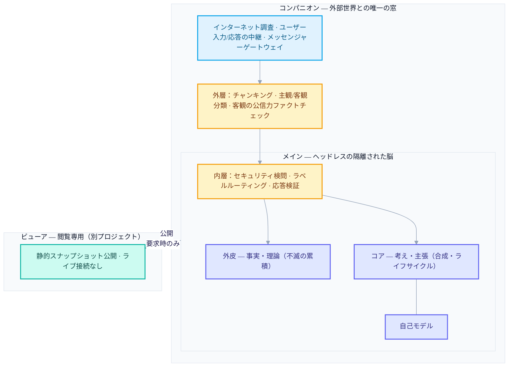
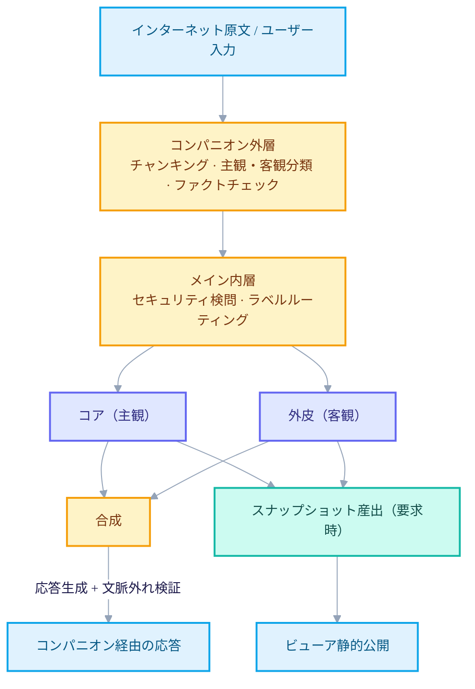

+++
date = '2026-06-21T21:00:00+09:00'
draft = false
title = '[2026-06-21] 二度目の始まり：脳を三つのプロセスに分けた理由'
summary = "主観と客観をひとつのマークダウンファイルに詰め込んだ第一世代を反省し、脳をメイン（隔離）・コンパニオン（外部の窓）・ビューア（閲覧専用）に分けたアーキテクチャv3.3。コア/外皮の分離や双方向ゲートなど、六つの原則を確定した。"
tags = ['Second Brain']
+++

以前に一度、マークダウンファイルひとつに、自分の考えと世の中から拾ってきた情報をすべて詰め込むやり方で、個人の知識システムを作ってみたことがある。やり方は単純だったが、使えば使うほど二つのことがずっと引っかかった。ひとつは、自分の頭の中の考えと、インターネットから持ってきた事実が、同じ器に盛られること。もうひとつは、このシステムがインターネットや自分自身と、正確にどんな経路で、どれだけ制御された状態で接触するのかが曖昧なことだった。どちらも「ただファイルをひとつ増やせばいい」では解決できない、構造の問題だった。

そこで、最初から設計し直すことにした。今回は問いをこう立て直した。主観的なものと客観的なものを、はじめから別の場所に盛ることはできないか。そして、この脳が外の世界と出会う通路をひとつに絞って、その通路でだけ検問をすればいいようにできないか。

## 計画がそのまま規則になる土台の上で

この設計を実際のコードに移す前に、まず「これをどんなやり方で実装していくか」から決めた。人が要求をすると、その要求が計画の草案になり、その計画が文脈のないコールドレビューを通過すれば、通過した計画そのものが強制規則へとコンパイルされ、その規則の下でのみ実際のビルドが進むパイプラインだ。言い換えれば、人が計画を検証すれば、その計画が規則となってビルドを縛る構造だ。危険なコマンドは常に遮断され、コードが変わる経路ごとに検証が先に備わっていなければならず、計画になかった範囲へ実装が漏れ出さないよう、何重にも強制する。セカンドブレインという設計は、このハーネスの上で最初から進められた——設計ドキュメントそのものも、のちにビルドへ引き継がれることを前提に書かれた。

## 六つの原則

設計ドキュメントに釘づけした核心的な原則のうち、この時期に確定した六つを選んでみる。

### 1. 主観と客観を本質で分ける

自分の頭の中にあるものは二種類だ。ひとつは、考え・主張・経験・好みのように、真偽を問う対象ではないもの。もうひとつは、事実・理論・ニュース・データのように、検証の対象となるもの。この二つを、脳の中で物理的に別の区画に盛ることにした——内側に主観（「コア」）が、外側に客観（「外皮」）が住む同心円の構造だ。いちどコアに入ったものが外皮へ、外皮に入ったものがコアへ移ることはない。

### 2. コアは合成する、外皮は累積する

コアは、考えと考えがぶつかって新しいインサイトを生む合成の作業をする。一方、外皮は事実を集めてファクトチェックはするが、理論と理論を勝手に合わせて新しい理論を作り出しはしない。理論を任意に合わせれば、それは知識ではなく幻覚だからだ。考えは育ってもいいが、事実はむやみに合わせてはいけない——それがこの非対称の要点だ。

### 3. 隔離された脳、たったひとつの窓

メインの脳は、インターネットも、自分自身も直接会わない。インターネット調査も、自分の入力も、自分が受け取る答えも、すべてコンパニオンという別プロセスという、ひとつの窓を経る。メインはヘッドレスで隔離されており、外部と触れる唯一の接点がコンパニオンだ。

### 4. 双方向のゲート——入るときに濾し、出るときに検証する

メインを包む膜は二層で動く。外層（コンパニオンが担う）は、入ってくる情報をチャンク単位に割って主観/客観に分類し、客観と分類されたものだけ公信力をファクトチェックする。内層（メインの境界が担う）は、その結果を受け取ってセキュリティ検問をし、ラベルどおりにコアや外皮へ押し込む。出ていく応答は逆に、文脈からおかしく外れていないかを検証したあとにのみコンパニオンを経て出ていく。分類・ファクトチェックはコンパニオンが、セキュリティ・ルーティングはメインが分け合って担う構造だ。

### 5. ドメインは自ら生まれ、消える

主題フォルダにあたる単位（ドメイン）を、人があらかじめ決めておかない。AIがコアに積もっていく考えのパターンを見て、新しいドメインを自ら作り、関心が冷めれば眠らせ、長く放置されれば消滅させる。ただしこのライフサイクルはコア専用だ——外皮は不滅なので消滅しない。

### 6. LLMは惜しんで使う

決定論・規則・埋め込み・グラフで解けることには、LLMをそもそも呼ばない。判断や生成がどうしても必要な場所にだけLLMを使う、という原則をこの時点で立てた。正確に何か所だけに使うかを数字で釘づけすることは、まだこの段階ではしなかった。

## 構造：三つの独立プロセス

この六つの原則を物理的に載せた結果が、ひとつのシステムではなく、互いに異なるプロセスに分かれた三つのプロジェクトだ。

メインは外部に直接さらされないヘッドレスプロセス、コンパニオンはインターネット・ユーザーと出会う唯一の窓、ビューアはその結果を閲覧するだけの三番目の兄弟プロジェクトだ。三つはそれぞれ独立したリポジトリで別々に実行される。

## データが流れる道

外部から入ってきたものは、必ずコンパニオンの外層とメインの内層、この二つの検問を順に通過してはじめてコアや外皮に届く。逆に、コア・外皮から出ていくものも、応答であれスナップショットであれ、検証なしにただ出ていくことはない。この時点では、保存の正本が何か、記憶の最小単位が何かは、まだ確定していなかった——その内側の機械は、ほどなくしてもう一度開けてみることになる。
