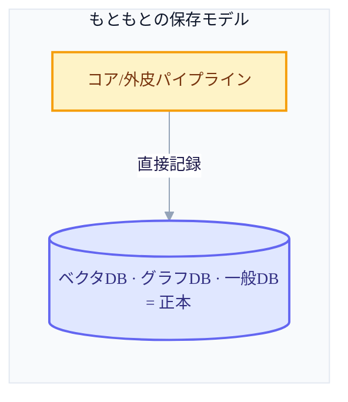
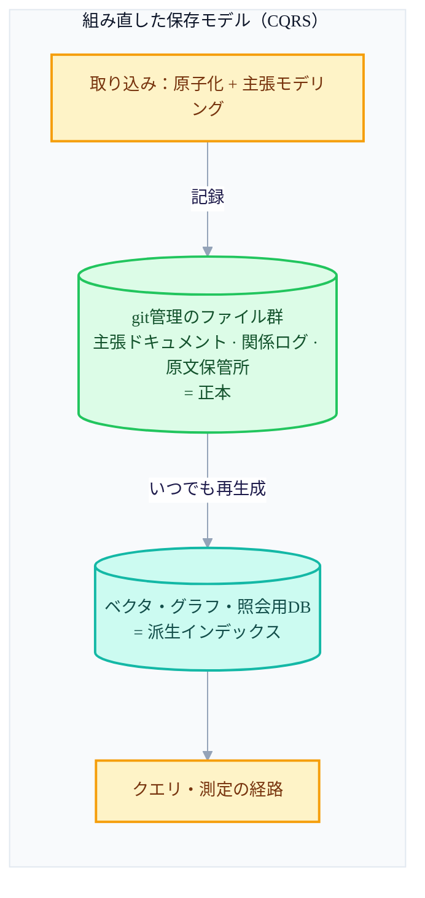
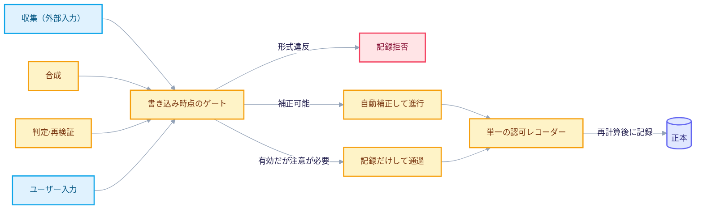

+++
date = '2026-06-28T21:00:00+09:00'
draft = false
title = '[2026-06-28] 保存モデルを刷新する：記憶の最小単位とは何か'
summary = "大きな骨格はそのままに、内側の保存機械を再び開いたv3.7デルタ。保存の正本をDBからgitのファイルへ、記憶の最小単位をチャンクから原子的な主張へ、検証を書き込み時点のゲートへと移した五つの改訂。"
tags = ['Second Brain']
+++

以前、セカンドブレインを設計し直しながら、脳をコア（主観）と外皮（客観）に分け、メインというヘッドレスプロセスを置いてコンパニオンというたったひとつの窓だけで外部と接するようにし、決定論で解けることにはLLMを使わないという原則まで立てておいた。ところが、この大きな骨組みをそのままにして実際の実装に入る前に、内側の機械をもう一度開けてみることにした。大きな骨格はそのまま受け継ぎつつ、保存・記憶の単位・検証・検索・ガバナンスという内部の機械だけを改めて点検した改訂だ。

## 何を再点検したか

設計図の上で「これを実際にどう保存し、何をひとつの記憶単位とみなし、いつ検証するのか」をひとつずつ当たってみると、五か所が引っかかった。

### ① 保存の正本をDBからファイルへ移す

もともとの計画は、ベクタDBとグラフDB、一般のDBが正本だった。真実はDBの中にあり、そのDBが壊れれば記憶も一緒に壊れる構造だった。これをひっくり返した。いまや正本はgitでバージョン管理されるファイル群——一枚ずつの主張ドキュメント、関係を事象単位で追記だけしていくログ、総合的な論旨を集めた区画、原文を丸ごと凍らせておく保管所——であり、ベクタ・グラフ・照会用のDBは、いつでもファイルから作り直せる派生物へと格下げされた。書き込みと監査の真実はファイルにあり、読み取りとサービングの速度はDBが担う、という役割分担だ。こうすれば、記憶を戻す作業がただのバージョン巻き戻しひとつで終わり、監査や移植も別のツールなしで可能になり、ファイルがそのままグラフなので、記録の時点で統合的な整合性検査をかけられるようになる。よく言うCQRS（書き込みモデルと読み取りモデルを分離するパターン）そのものだ。

### ② 記憶の最小単位を、ドキュメントのチャンクから原子的な主張へ

もともとは意味単位で割ったチャンクをそのまま保存していた。これを変えて、入ってくるチャンクをもう一度LLMで原子化し、それ自体で完結したひとつの主張としてモデリングするようにした。「あれはいまいちだった」のような未解決の指示語が残った文は保存できず、「XのアプローチはYの理由でいまいちだ」のように、その文だけ切り離しても意味が通らなければならない。この単位ごとに、内容の指紋値（同じ意味が別の表現で再び入ってきても見分ける識別キー）、表現が変わってきた履歴、どこから来たか、どの原文を根拠にするかを一緒に記録する。チャンキング（コンパニオンが行う、分類のための分割）と原子化（メインが行う、保存のための分割）は別の作業だ、ということをこのとき明確にした——ひとつのチャンクが複数の原子的主張を生みうる。

### ③ 事後監査だった検証を、書き込み時点のゲートへ移す

もともとは、とにかく何でも受け取り、あとで合成の過程が事後に監査するやり方だった。これをひっくり返して、収集であれ合成であれユーザー入力であれ、正本に実際に記録される前に必ず通過しなければならない単一のゲートを立てた。形が間違っていれば記録そのものを止め（自己完結性の違反、指紋の重複、循環する関係など）、既定値が間違っていれば自動的に補正して通し（例：公開範囲の既定値）、まだ有効だがあとで問題になりうるものは止めずに記録だけしておく（矛盾する主張など）。このゲートが必要だった理由は、合成の過程そのものも内部で新しい記録を作り出す主体であり、外側の境界の検問だけではふるい落とせないからだ——外側の境界が見えない内部の記録主体を捕まえる場所が、まさにこの書き込み時点のゲートだ。

### ④ 検索を、意味の単一軸から多軸融合へ

もともとはコアと外皮の埋め込みを合わせて、意味の類似度ひとつで探していた。これを、時間・キーワード・意味・関係という四つの軸でそれぞれ別々に探したうえで順位だけを合わせる方式（RRF、スコアを混ぜずに順位を融合する手法）に変えた。最新性を問うクエリは最近のもの中心に強く絞り込み、固有名詞があればキーワード軸が、関係を問うクエリは関係軸がより大きく反映される。四つの軸すべてが決定論なので、以後、本当に正解に近いものを探せているかを数値で測定してチューニングできるようになった、というのがこの変更の核心的な根拠だった。

### ⑤ 記録の権限を、単一の認可レコーダーへ集める

正本の状態が変わるすべての経路（収集・合成・判定・ユーザー入力）を一か所へ直列化した。正本に実際に記録できる唯一の認可レコーダーを置き、そのレコーダーは提出された主張をそのまま信じず、毎回自ら計算し直して確認したうえでのみ記録する。たとえば重複を併合するか否かや、関係が撤回されたか否かは、提出者の判断ではなく、レコーダーが再測定した値で決まる。一度の作業はひとつの構造化された記録として残り、その記録が一列につながった順序をなす。興味深いことに、この構造は、この設計を進めていた強制ビルドハーネス側の「計画をそのまま検証なしには完了扱いしない唯一の記録者」モデルと形が同じだった——別の問題を解いていたのに、同じ答えにたどり着いたわけだ。

## 保存モデル、前と後

## 書き込み経路：何であれこの門を通らねばならない

何を受け入れるかは依然として開けておくが（主観であれ客観であれ何でも受け取るという原則はそのままだ）、受け入れたものをどんな形で保存するかは、この門で強制する——それが今回の改訂全体を貫く言葉だ。

この改訂で「gitでバージョン管理されるファイルが正本」と釘づけした決定は、以後、実際にシステムを運用してみるなかで、もう一度挑戦を受けることになる。
