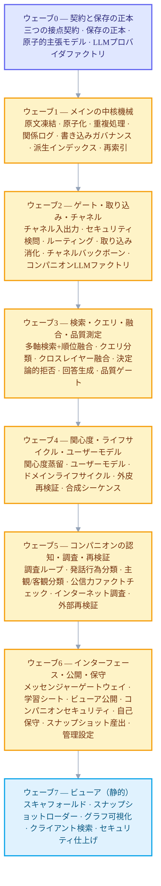
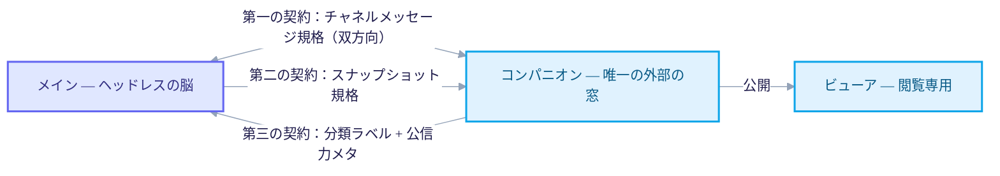

+++
date = '2026-07-02T21:00:00+09:00'
draft = false
title = '[2026-07-02] 設計を実行計画へ：51のユニット、18のパーティション、3つの契約'
summary = "5編の設計ドキュメントを、並列でビルドできる実行計画へと落とし込んだ記録——51のユニット、18のパーティション、8つのウェーブに切り分けた。コードを書く前に、三つのプロセスが噛み合う接点の三つの契約を凍結した。"
tags = ['Second Brain']
+++

先に、脳をメイン（ヘッドレスで隔離された脳）・コンパニオン（外部世界と出会う唯一の窓）・ビューア（閲覧専用）の三つの独立プロセスに分ける設計を終えた。その内側の機械も一度手を入れ直し、保存の正本をファイルに、記憶の最小単位を原子的な主張に、検証を書き込み時点のゲートに変えておいた。いま残った問題は、この設計を実際にどう作るか、だった。

## 設計ドキュメントだけではビルドさせられない

5編の設計ドキュメント——メイン本編とその改訂版、コンパニオン設計、ビューア設計、そしてLLM予算戦略を横断するドキュメント——がすべて揃ったからといって、すぐに複数の作業者に分けて同時にビルドさせられるわけではなかった。設計ドキュメントは*何を*作るかを教えてくれるだけで、どの順序で、どの境界に分けて同時に作るかは教えてくれない。この順序と境界を切る作業を始めた。

## 51のユニット、18のパーティション

まず、5編の設計ドキュメントに散らばっていた機能をすべて作業の最小単位（ユニット）に割った。メイン側に29個、コンパニオン側に13個、ビューア側に5個、そして計画を検討する過程で遅れて明らかになった補正ユニット4個まで合わせて、計51個のユニットが出た。

この51個を、それぞれが触れるファイルが重ならないように18個のパーティションにまとめた——メイン10個、コンパニオン7個、ビューア1個。パーティションは、同時に別々の作業者へ任せても互いのファイルを触れない単位だ。たとえば、保存の正本と原子的主張のモデル、その周辺の中核機械を扱うユニットはひとつのパーティションに、検索の四つの軸とクエリ処理を扱うユニットはまた別のパーティションにまとめられた。

## 8つのウェーブで依存を整列する

パーティションに分けたからといって、すべて同時に始められるわけではない。保存の正本がなければその上に書き込みゲートは作れないし、ゲートがなければ取り込みを検証できない。そこで、パーティションを8つのウェーブに依存順で並べた。同じウェーブの中ではおおむね並列で進め、ウェーブとウェーブのあいだは順次で進める。

## 接点ごとに契約を先に釘づけする

三つのプロセスが独立したリポジトリでそれぞれ進む以上、互いに噛み合う地点はちょうど三か所だけだ。この三つの接点の規格を、各パーティションが実際にコードを書く前に先に凍結した。

- **第一の契約** — メインとコンパニオンがやり取りする、二つのプロセスが共有するたったひとつのチャネルファイルがどんなメッセージ形式を使うかについての規格。双方向だ。
- **第二の契約** — メインが作り、コンパニオンを経てビューアまで届けられる、閲覧用に公開されるスナップショットの形式規格。
- **第三の契約** — コンパニオンの外層が分類とファクトチェックを終えたあとメインに渡す、分類ラベルと公信力メタデータの規格。

この三つの契約を並列ビルドの着手前に先に確定した理由は単純だ。各パーティションが自分の検証をすべて通しても、互いに噛み合う接点の規格がずれていれば、合わせたときに統合が壊れる。契約を契約として先に凍らせておけば、各パーティションはその契約さえ守れば、互いを知らなくても同時に進められる。

## ところが論理規格だけでは足りなかった

パーティションと契約をすべて決めて実際のビルドが始まったあとも、契約の論理的な形だけを決めておいただけで、物理的にどんな型、どんな値でやり取りするかまでは釘づけできていない地点が残っていた。この穴は、実際にビルドが進んでいた数日のあいだにひとつずつ埋められた。

- 最初はローカルの無料の小型モデルだけで回そうとしていた判断地点のひとつが、実測で調査ループを回してみたら収穫が0件と出て、商用APIプロバイダの小型モデルへ切り替えることに確定した。
- 埋め込みモデルも、当初候補に挙げておいたモデルの代わりに、自分で実測比較したうえで1024次元の別モデルへ変えて確定した。
- 第一の契約（チャネルメッセージ規格）で、メッセージ識別子が正確にどんな物理型なのか（文字列UUIDで）、署名はどちら側が先にするのかまで、詳細規格として釘づけした。
- 第三の契約（対話関連のメタデータ）でも、ユーザーの質問を運ぶフィールドの名前をひとつに正本化した——それまでは候補が二つあった。

論理スキーマ、つまり「何をやり取りするか」だけでは、並列に組まれたコードは実際には噛み合わなかった。型が文字列か数値か、フィールド名が正確に何か、といった物理規格まで釘づけしてはじめて、別々のリポジトリで別々に組んだコードが実際にくっつく——それを、契約を先に凍らせたと思っていたあとでも、もう一度学んだわけだ。
