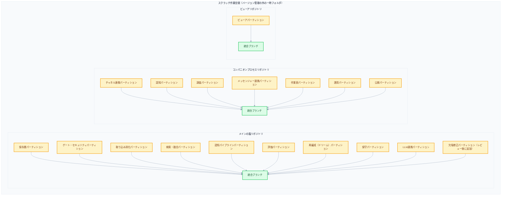
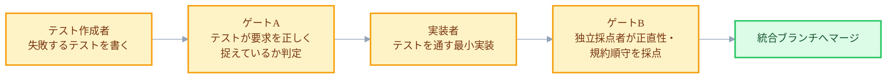
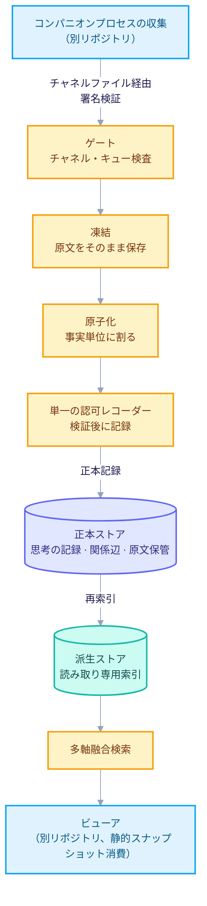

+++
date = '2026-07-04T21:00:00+09:00'
draft = false
title = '[2026-07-04] AIエージェントの艦隊で、四日でシステムをビルドする'
summary = "多数のAIエージェントを同時に走らせる「艦隊」方式で、メイン・コンパニオン・ビューアの三コンポーネントを四日でビルドした過程。重ならないパーティション、三役割の分離（テスト・検証・実装）、共通規約の凍結という三つの前提を押さえる。"
tags = ['Second Brain']
+++

このシステムは個人用のローカル知識管理ツールだ。メインの脳が記憶を保存・索引し、コンパニオンプロセスがメッセンジャーのような外部世界とのやり取りを処理し、ビューアがその記憶をグラフと検索の画面で見せる。三つのコンポーネントを合わせて51個の作業単位に割った実装計画は、すでに用意されていた。問題は、その計画を誰が、どうやってコードに移すか、だった。

## 一人で順番に作ると計画が古くなる

51個の単位を一人（あるいは一つのエージェント）が順番に実装すると、二つのことがずれる。ひとつは時間だ。保存層から検索、認知パイプライン、メッセンジャー連携まで順次で組むと、完了まで長くかかり、その間に先に立てた設計の前提が古くなってしまう。もうひとつは検証だ。作った本人が自ら「できた」と判断すると、自分の作業を有利に採点する偏りが入り込みやすい。

そこで今回のビルドは、複数のAIエージェントを同時に走らせる「艦隊」方式で進めた。ところが並列で走らせるには、まず解いておくべき前提条件が三つあった。

**第一に、重ならない境界。** 51個の単位を、互いのファイルを触れないパーティションにまとめる必要がある。二つのパーティションが同じファイルを同時にいじれば、並列化は意味を失う。保存層、ゲート・セキュリティ、取り込み消化、検索・融合、認知パイプライン、評価、再編成（ドリーム）バッチ、保守、LLM連携——こういった形で、コンポーネントごとの責任領域を先に割った。

**第二に、三役割の分離。** ひとつのパーティションの中でも、「テストを先に書く人」「そのテストが失敗するか・意味があるかを確認する人」「テストを通す実装者」を、それぞれ別のエージェントセッションに分けた。実装者がテストに手を出せないようにすれば、少なくとも「テストに合わせて実装したか」は物理的に保証される。そして完成した成果物は、作った本人ではなく独立した採点者が改めて確認する。

**第三に、共通規約の凍結。** コードスタイル、コミットメッセージの規則、ゲート通過の基準といった共通規約を、パーティション着手の前に短いドキュメント（約55行）ひとつで確定しておいた。最初のパーティションが通過したあと一度だけ更新し、その後は触れなかった。規約がパーティションごとに違えば、あとで合わせるたびに衝突が起きる。

## スクラッチ作業空間の構造

実際の並列ビルドは、バージョン管理の外の一時的な作業空間で進めた。コンポーネントごとに独立したリポジトリを作り、その中でパーティションブランチが枝分かれし、統合ブランチへひとつずつ合流していく構造だ。

メインの脳側9個、コンパニオンプロセス側7個、ビューア側1個、合わせて17個のパーティションが、この構造の上で並列に進んだ。ここに、あとでレビューを経て見つかった欠陥を一度にまとめて直すパーティションが、もうひとつ追加で並列実行された。

## 役割分離のパイプライン

ひとつのパーティションが統合ブランチへ合流するまでには、定められた流れを経る。

肝心なのは、実装者がテストを絶対に直せないことと、採点が実装者本人ではなく別のセッションで行われることだ。この二つを守るだけで、「テストを通すためにテストそのものを緩く変える」というよくある失敗を、構造的に防げる。

## 四日の記録：パーティションがひとつずつ合流する

作業空間ができた初日、三つのリポジトリが同時に最初のコミットを打った。その後、四日にわたってパーティションが順次合流した。

| 時期 | 進行 |
|---|---|
| 1日目 | 三コンポーネントのリポジトリが最初のコミット。メインの脳の保存層、第一波に着手——正本レイアウト、原子単位の事実モデル、原文凍結、関係辺ログ、書き込み前の形式検査ゲート |
| 1〜2日目 | コンパニオンプロセスのチャネル連携パーティションとビューア全体が先に統合完了（採点90点台） |
| 2〜3日目 | 派生インデックス生成、重複除去、原子化、増分再索引まで仕上がり、保存層パーティション全体を統合 |
| 3〜4日目 | チャネル・セキュリティゲート、スナップショット契約パーティションを統合。四つの軸を合わせて順位をつける検索・融合パーティションを統合。取り込み消化パーティションを統合——すべて90〜100点台の採点 |
| 4日目 | 評価パーティション、認知パイプライン（関心蒸留・自己モデル・ライフサイクル・再検証）、11段階の再編成（ドリーム）バッチ、保守・形式検査の規則まで順次統合 |
| 4日目 | レビューで確定した欠陥31件を一度に直すパーティションがマージされ、複数のバックグラウンド作業（タスク分配器・定期確認ワーカー・再編成スケジューラ）をひとつにまとめる組み立てルートが新設される——このマージを最後に最終統合が完了 |

四日のあいだに17個のパーティションが順次統合ブランチへ合流し、最後にレビューが捕らえた欠陥31件を直す作業まで終わって、ビルドが締めくくられた。各パーティションのマージ時点ごとに独立採点が行われ、採点は概ね90点台後半から100点のあいだだった。

## 四日後に完成したアーキテクチャ

この時点で確立された構造はCQRS（コマンドとクエリを分離する設計）の形だ。書き込みは正本だけへ行き、読み取りは正本から派生した別の索引の上でだけ行われる。コンパニオンプロセスとメインの脳は、ただひとつのチャネルファイルを通じてのみ互いにデータをやり取りする——ほかのいかなる経路でも、二つのプロセスは直接通信しない。

書き込み経路は、取り込み → 凍結 → 原子化 → 検証・記録の4段階を必ず順に経る。まず原文をそのまま凍らせ（凍結）、そのあとではじめて事実単位に割り（原子化）、最後に単一に認可されたレコーダーだけが正本へ記録する。こうすれば「誰が正本に書いたか」を、常にひとつの地点に絞り込める。読み取りは正本を直接読まず、正本から周期的に再構成した派生索引の上でだけ検索が動く。

## おわりに：スクラッチの履歴が、そのまま本リポジトリになる

並列ビルドが進んだ一時的な作業空間は、廃棄されたのではなかった。その中で進んだメインの脳リポジトリの最初のコミットと、いまこのシステムのメインの脳リポジトリの最初のコミットは完全に同一で、四日目の最後の統合コミットも、いまのリポジトリのログの中にそのまま残っている。つまりスクラッチ作業空間は「捨てられた実験」ではなく、いまのシステムの出生の履歴そのものだった。

ビルドが終わった時点で、メインの脳リポジトリは100ほどのコミットを持っていた。以後、このリポジトリの上で、実行計画の策定、完成した機能の全面撤去、保存正本の再定義、実運用関門の検証と取り込み方式の再設計まで、十日あまりの履歴がさらに積み重なり、コミット数は1.5倍ほどに増えた。一方、並列ビルドが進んだ一時的な作業空間そのものは、最終マージのあと追加のコミットなく静かに休眠状態のまま残った——自分の役割を果たしたのち、本リポジトリに履歴を渡して止まった、というわけだ。
