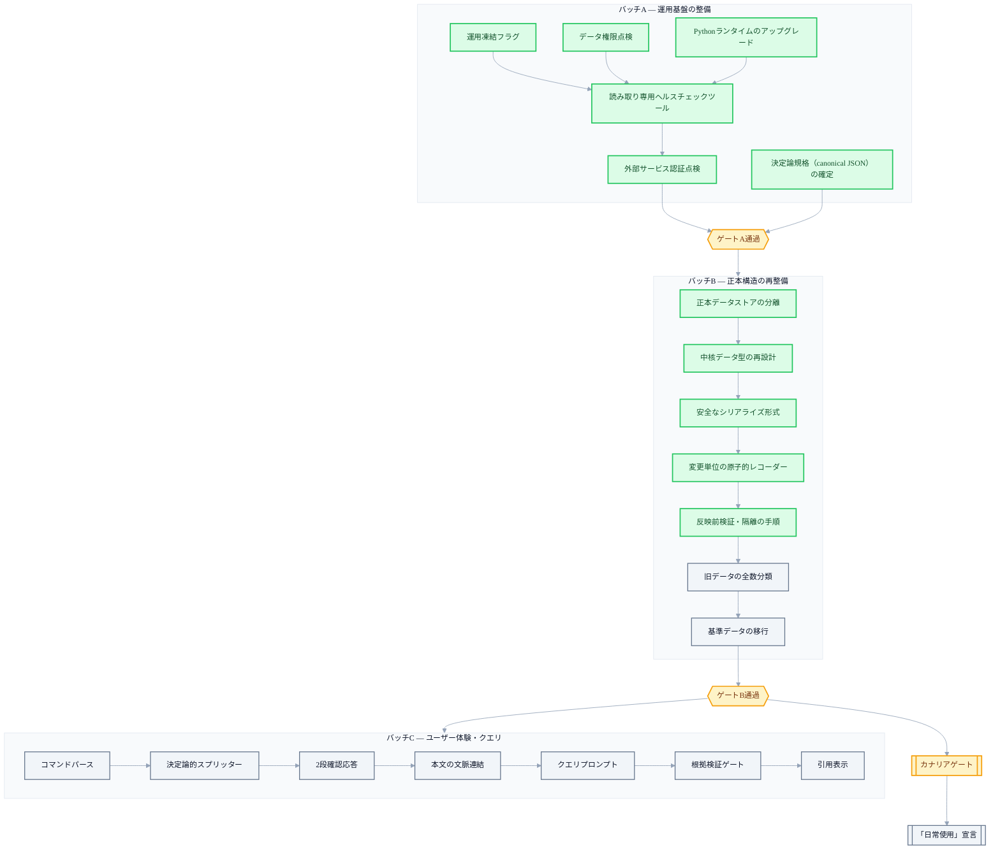

+++
date = '2026-07-11T21:00:00+09:00'
draft = false
title = '[2026-07-11] 二つのAIの相互レビュー：11の決定で運用計画を確定する'
summary = "異なる二つのAI（ClaudeとCodex）に同じ論点を相互レビューさせ、11の決定を確定した記録。決定論を最優先に、信頼を等級で分け、削除にも契約を定め、実行バッチA/B/Cとその間のゲートを整理した。"
tags = ['Second Brain']
+++

このシステムは個人用のローカル知識管理ツールで、メインの脳が記憶を保存・索引し、コンパニオンプロセスがメッセンジャーのような外部世界とのやり取りを担う。四日間の並列ビルドで三つのコンポーネントの骨組みが整ったあと、次の関門は「これを実際に運用に載せてよいか」だった。ところが運用へ移る前に、まず閉じておくべき未解決の論点が残っていた。

## ビルドは終わったが、運用へは移れない

ビルド段階では「テストを通るか」だけを問えばよかった。運用段階へ移るには別の問いが必要だった。検索結果が曖昧なとき、どこまでLLMに任せるのか。信頼が揺らぐ状況をどう等級で分けるのか。ユーザーが削除を要求したとき、システムは実際に何を消すと「約束」するのか。こうした問いはコード一行では解けず、トレードオフを認識したうえで人が確定すべき決定だった。

これらの決定を確定するやり方も変わっていた。異なる二つのAI（ひとつはClaude系、ひとつはCodex系）に同じ論点を相互レビューさせたのだ。理由は単純だ——ひとつのモデルが出した結論は、そのモデルの盲点をそのまま抱えている可能性がある。二つのモデルが別々の根拠で同じ結論に達すれば、その決定はより信頼でき、別々の結論を出せば、その地点こそ本当のトレードオフがある場所だという合図になる。この相互レビューを通じて、11件の決定が確定した。

## 決定論を最優先に置いたもの

三つの決定がひとつの原則に束ねられる——「曖昧な判断が必要な場所にはできるだけ規則を、どうしても必要な場所にだけLLMを使う」。

文をどこで切るかを決めるロジックは、LLMではなく決定論的な規則で書いた。URLや小数点、マークダウン文法、コードブロック、リスト、略語といったパターンを規則で保護して境界を誤って切らないようにし、LLMはそうして定めた境界の内側で分類（ラベリング）にだけ使うことにした。コスト予算とも噛み合う選択で——何より、同じ入力なら常に同じ出力が出るという再現性を得られた。

クエリに答えるときの有料LLM呼び出しは、合計2回に予算を釘づけした——1回目は構造化と引用マッピング、2回目はその答えが根拠を外れていないかを検証する含意確認だ。もしこの過程が失敗したら、3回目の呼び出しで作り直すのではなく、規則に従って決定論的に切り詰めた応答を出すことにした。「だめならもう一度試す」ではなく、「だめなら定められたやり方で退く」という態度だ。

そして、あとで作る指紋（fingerprint）とスナップショットのハッシュが別々のやり方で計算される事故を防ぐため、値を標準化された順序に並べてハッシュする方式（国際標準規格）を、プロジェクトの初期からあらかじめ釘づけした。この種の規格は後で決めるほど、すでに保存されたデータとの整合を合わせる費用が大きくなるので、後回しにせず前倒しした。

## 信頼を等級で分けたもの

ビルドした機能が「動く」ということと、「日常的に使ってよい」ということは別の話だ。この区別を明文化したのが三つめの決定だった。核となる記憶を扱う機能は、coreバッチが完了したという事実だけで信頼モードを自動的に開かず、再起動しても同じ結果が出るか、命令が実際に反映されたと確認できるか、バックアップから復元が実際にできるか、答えが原文を正確に引用するか、偽の成功がひとつもないかを実測する別の関門（カナリアゲート）を通過してはじめて、手動で、しかも個人用途に限って点けられるようにした。自動で回る調査・公開・再編成の機能は、この関門とは無関係にずっと切ったままにすることにした。

信頼が揺らぐ状況にも等級を分けた。ファイルひとつが隔離された程度なら読み取り専用のクエリは許すが、スキーマや指紋の規格、全体の整合性そのものが崩れれば完全に遮断する、という原則だ。そして「ユーザーがそう言った」という事実と「その内容が客観的に検証された」という事実を、同じ信頼等級で混ぜないことにした——ユーザーの発話を事実として確定保存することと、その発話があったということだけを記録することは、別の作業だ。

## 消すことにも契約が必要だった

新しい分類体系（taxonomy）を初めて組む作業は、間違いの費用が大きい。旧ドメインデータ26件を全量マイグレーション候補として置き、明白なものはまとめて人が承認し、曖昧なものは隔離しておくことにした。全数検収の費用より、誤分類が広がったときに元へ戻す費用のほうがはるかに大きいと判断したからだ。

削除要求も三つの異なる契約に分けた。通常削除はアクティブなデータと派生索引だけを消し、履歴ストア内の原文は残りうることを認める。完全削除は履歴そのものを書き直す、より重い手順だ。バックアップは一定期間（約30日）保管したのち自動的に消滅する。もともと計画していた「複製が完全に0になる」というサービス水準の目標は、append-only（追記のみ可能な）履歴ストアと変更不可能なバックアップが共存する現実とは両立できない、ということがこの議論の過程で明らかになり、そこで「残存本文0」という基準を、アクティブなデータと派生索引だけに限定する妥協へと調整した。

## 順序を組み直したもの

残りの決定は、アーキテクチャというより「いつ、どの単位でやるか」に関するものだった。ビューアに載る公開テキストの埋め込みは、汎用モデルではなく専用の小型多言語モデルで再計算し、そのモデル・バージョン・次元をスナップショットのメタデータとして固定することにした——ただしこの決定は、ずっとあとに実行される順番だった。

記録の単位を何とみなすかも決めた。「書き込み1件 = 記録1件」という不変式を、個別の事実（claim）単位ではなく、ユーザーの操作（メッセージ）単位で解釈することに釘づけした。この原則を実装した最初のやり方はのちに丸ごと消えるが、「ユーザーの操作ひとつにつき記録ひとつ」という原則そのものは、以後、別の保存方式の上で再び実装された。

そして、実行環境の言語ランタイムを最新版へ上げる作業を、もともとの予定よりずっと前倒しした——あとでデータ移行の作業まで終えてからランタイムを変えると、すでに検証しておいたものを再び検証しなければならない費用が倍かかる、という理由だった。

## 実行計画：バッチA → ゲート → バッチB → バッチC

11件の決定は、三つの実行バッチと、その間を分けるゲートへと具体化された。ゲートとは「人が目で見て大丈夫だと感じれば通過」ではなく、定められた検査を自動で回し、その結果が特定の条件を満たしてはじめて次の段階へ進めるようにした関門だ。判断を、人の勘ではなく再現可能な検証へ移そうとする仕掛けだった。

バッチAはすぐ着手してよい8件、バッチBは正本構造を組み直す11件、バッチCはユーザー体験とクエリの流れを扱う13件で組まれ、全体の予想規模は一人あたり一か月から一か月半ほどだった。バッチAは計画を確定した当日にすべて完了し、ゲートを通過した。続いて正本構造の再整備の前半（正本データストアの分離から反映前検証・隔離の手順まで）も、一〜二日のうちに素早く走り切った。しかし旧データの全数分類に着手する直前、方向を揺るがす一件が持ち上がる——その話は別に扱うだけの大きさがある。

## 同じ時期、コンパニオンプロセスはすでに実戦に入っていた

この会議が開かれる数日前から、コンパニオンプロセスはすでに、スタブで真似だけしていたLLM呼び出しを実際のサービスAPI呼び出しに変え、メッセンジャーのボットにも実際のユーザーアカウントが連携されていた。つまりこの会議で決めた「運用凍結フラグ」は、空っぽのシステムをロックするのではなく、すでに実際の言語モデルを呼び、実際のメッセンジャーとつながっているシステムの上で、自動化の経路（調査・再編成・公開）だけを選択的にロックする作業だった。システム全体ではなく、人が介入しなくても自ら回る経路だけを選んで止めた、というわけだ。

## おわりに

この会議は新しいアーキテクチャを発明した場ではなく、範囲と順序と関門を釘づけしたプロジェクト管理の決定だった。11件のうち、実際に今日までそのまま生き残ったのは、決定論の原則三つ（チャンカー・クエリ予算・JCS規格）、カナリアゲート、Pythonランタイムの前倒しくらいだ。残りは、以後の出来事のなかで実装のやり方が変わったり、実行の対象そのものが消えたり、まだ到達していない段階として残ったりした。決定を下すことと、その決定が生き残ることは別の問題だ——それを、このプロジェクトは数週間のうちに再び確認することになる。
