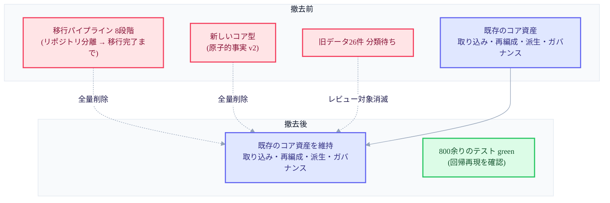

+++
date = '2026-07-13T21:00:00+09:00'
draft = false
title = '[2026-07-13] 作り上げた機能を丸ごと撤去する'
summary = "移行する実データが存在しないと分かり、半分ほど完成していた移行パイプラインを丸ごと撤去した記録。判断基準は「完成度ではなく必要性」であり、削除は元に戻せる形で行うべきだという教訓。"
tags = ['Second Brain']
+++

このシステムは個人用のローカル知識管理ツールだ。メインの脳が記憶を保存・索引し、コンパニオンプロセスが外部世界とのやり取りを担う。運用計画を確定した会議のあと、正本構造を組み直す作業の一環として、旧データを新しい正本形式へ移す移行（マイグレーション）パイプラインを作っていた。ところが、このパイプラインが半分ほど完成したとき、丸ごと消してしまう決定が下された。

## 何を作っていたのか

旧形式で保存されていたデータを新しい正本構造へ移すには、いくつもの段階を踏む必要がある。データ専用のリポジトリを分離し、新しいコア型（原子単位の事実と、その操作記録）を定義し、安全なシリアライズ形式を作り、変更ひとつを原子的に記録するレコーダーを書き、実際に反映する前にあらかじめ点検して曖昧な件を隔離する手順まで——全8段階のパイプラインだった。

この作業は順調だった。二日のあいだに何度ものテストファースト開発サイクルを経て、前半の五段階（リポジトリ分離から反映前検証・隔離まで）がすべて通過した。そのうちの一段階では並行性の問題（同じ資源を二つのプロセスが同時に触れたときに生じる欠陥）まで見つけて直したほどで、工程・手順のうえでは完成度の高い成果物だった。次の段階は、旧ドメインデータ26件をすべて人が検討して分類する作業だった。

## データを開けてみたら、移すものがなかった

まさにその段階に着手する直前、移行対象と想定していたデータを実際に開けてみた。すると、その26件がすべてテスト用に作っておいたダミーデータだったことが判明した。実際に移すべき本物のデータは、そもそも存在していなかったのだ。

この発見は、判断の基準そのものを変えてしまった。「このパイプラインがどれだけよく作られているか」は、もはや重要な問いではなかった。本当の問いは「これを作り続ける必要があるのか」であり、答えは明らかに「ない」だった。

## 「完成度ではなく必要性」——決定とその波及

方向はすぐに定まった。移行パイプラインの全8段階、関連する新しい型、関連するテストとビルド成果物をすべて撤去することにした。判断したのはその会話があった日で、実際にコードを消してコミットしたのは翌日だった。

撤去は二つの筋道で行われた。コード自体は通常のgitコミットで削除された——「この機能を丸ごと削除する」という趣旨のコミットひとつで、57ファイルにわたって6,700行を超えて消した。これは元に戻せる形の削除だ。gitの履歴にはその前の状態がそのまま残っているので、必要ならいつでもその時点のコードを取り出せる。一方、別に一時隔離フォルダへまとめておいたファイルの束は、その後完全に消され、これは復旧不可能だ——この二つを混同して「隔離しておいたものを後で復旧できる」という趣旨で誤って書いておいた文言があったのだが、この誤りは再開の会議で見つかり、後で正された。

影響評価も行った。別のAI（Codex）が三度にわたって収束レビューをし、撤去後に全回帰テストスイートを回して、800を超えるテストがすべて通過することを実測で確認した。撤去ではなく生き残ったものがあることも重要だ——移行と無関係の基盤コード、すなわち四日間の並列ビルドで作られた取り込み消化・再編成（ドリーム）・派生プロジェクション・ガバナンスといったコア資産は、そのまま維持された。

この決定は、先立つ二つのものに連鎖的な影響を及ぼした。ひとつは実行計画そのものだ——正本構造の再整備バッチが全体的に中止となり、このバッチの後に予定されていたいくつものユーザー体験の作業も、再企画までは実行の根拠を失った。もうひとつは、先に確定していた決定のひとつだ——「旧ドメインデータ26件を全数、人が検討して分類する」という決定は、検討すべき実際の対象そのものが消えたことで、自然に無効となった。

## 撤去前後のシステム表面の比較

## 残ったものと消えたもの

正本をファイルシステムではなくgitコミットそのものにしようとしたこの試みは、実運用の検証以前に折れた。そもそも「正本をどこに置くのか」というより根本的な問いがまだ解決されていない状態で、その上に載せる移行ツールから先に建てていたわけだ。この一件のあと、ユーザーは「ゼロベースで企画し直し、別のAIと改めて会議せよ」と指示し、その会議で、正本をどこに置くのかという問いが再び正面から扱われることになる。

## 教訓：元に戻せるやり方で、大胆に

この一件から残る教訓は二つだ。ひとつは判断基準の優先順位だ——どれほど精緻な手順（テストファースト開発、独立採点、別のAIによる再検証）を経て完成度を積み上げても、「なぜこれを作っているのか」という問いに答えがなければ、その完成度は消すか否かを決める根拠にはならない。完成度と必要性は別の軸であり、後者が優先する。

もうひとつは削除のやり方だ。コードを消すとき通常のコミットで消せば、その判断が誤りだと後で分かっても、履歴をたどって元に戻す道が残る。逆に、一時隔離フォルダへまとめておいて手で消すやり方は、その道を永遠に断ち切る。今回は二つのやり方が同じ一件の中に共にあり、結果も分かれた——ひとつは今も履歴の中に残り、ひとつは完全に消えた。
