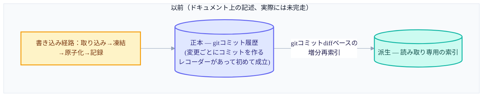
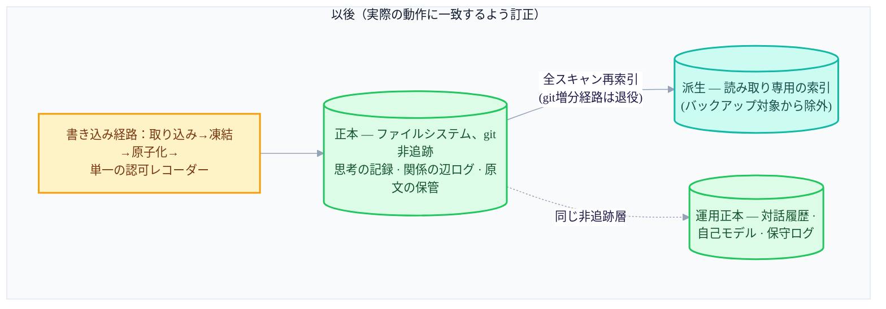

+++
date = '2026-07-14T21:00:00+09:00'
draft = false
title = '[2026-07-14] 正本はgitではなくファイルシステムだった：運用が設計を直す'
summary = "P1安定化：「正本はgit」と謳っていた設計が、実際にはすでにファイルシステムだったことを認め、コードに合わせてドキュメントを直した話。記憶データはバージョン管理する対象ではなく、外へ漏れないよう保護する対象だという視点の転換。"
tags = ['Second Brain']
+++

このシステムは個人用のローカル知識管理ツールだ。メインの脳が記憶を保存・索引し、コンパニオンプロセスが外部世界とのやり取りを担い、ビューアがそれを画面で見せる。少し前、完成したばかりの移行（マイグレーション）機能を丸ごと撤去する一件があり、その余波でユーザーは「ゼロベースで企画し直せ」と指示した。その再企画で、もっとも根本的な問いが再び開かれた——このシステムの記憶は、いったいどこに本当に保存されているのか。

## 「正本はgitだ」と宣言していた

設計の初期、このシステムはデータをただDBに入れるのではなく、「git正本 + 派生DB」という構造で行くことにしていた。正本をgitのコミット履歴にすれば、あらゆる変更が自動的に監査可能な記録となり、必要ならいつでも過去の時点に戻れる、というのがその魅力だった。実際にこの設計をコードで実現しようとした試みが、まさに先ほど撤去した移行パイプラインだった——正本専用のデータリポジトリをgitで分離し、変更ひとつごとにコミットひとつを作る原子的なレコーダーを書くのが、その中核部品だった。

## 運用を始めて浮かび上がった矛盾

ところが、その移行機能が丸ごと消えたあと、再企画の会議で二つの事実がともに浮かび上がった。ひとつは手続き上の問題だった——移行の撤去を反映するコミットが、まだ別ブランチにだけあり、本リポジトリのデフォルトブランチにはマージされていない状態だった。そのため「移行機能は死んだ」というのがドキュメント上だけに存在し、実際には生きているように見えていた。これはすぐにマージして公式化すれば済むことだった。

より根本的なのは二つめだった。**データ正本は、実際にはすでにファイルシステムだった。** 正本に実際にデータを記録する唯一のコード（単一の認可レコーダー）をのぞいてみると、このコードはファイルを書くだけで、gitコミットを作っていなかった。一方、設計ドキュメントや組み立てコードの側の記述は、依然として「正本はgit」と言っていた。ドキュメントと実際の動作が、互いに違うことを言っていたのだ。

## なぜ覆したのか——記憶データは保護すべき対象だ

この矛盾を解くにあたって投げた問いは、「git正本を最後まで完成させるのか、それとも実際の動作に合わせてドキュメントを直すのか」だった。答えは後者で、根拠は明確だった。

gitを本当の正本にするには、変更ごとにコミットひとつを作るレコーダーが要る——それはまさに、少し前に丸ごと撤去した新規機能だった。作り直すのは「安定化」という今回の作業の目的に反する。さらに、ファイルシステムを正本に据えれば、その正本を`.gitignore`でバージョン管理から完全に外せるという利点があった——コードはリモートリポジトリへいくらでも押し上げても、個人の実際の記憶データはそこに載らない。gitを正本にするなら、コードとは完全に切り離した非公開のデータストアが別途必要になるが、その複雑さを引き受ける理由はなかった。

この転換の核心は、視点の変化だった。記憶データは「バージョン管理して履歴を追う対象」ではなく、「誤ってでも外へ漏れないよう保護する対象」だ、ということだ。この訂正を反映するドキュメント修正のコミットが、その日のうちに上がった。

## 確立した三つの原則

この決定を機に三つの原則が確立され、以後、システムの基準ドキュメントがこれを固定した。

1. 記憶データ（思考の記録、原文の保管、関係の辺ログ、運用状態）はgitに載せない。
2. バックアップはgitではなく、ファイルバンドルのスナップショットで行う。復元したあとは派生索引を作り直せばよい。
3. 作り直せるもの（派生索引）は守らない——バックアップ対象から除外する。

正本と派生の境界そのものが、そのまま保存ポリシーになった。正本は保護し、派生はいつでも捨てて作り直せるという前提のうえで、軽い扱いを許す。

## 保存構造の前後比較

バックアップの境界も、この原則に沿って引き直された。バックアップは正本（思考の記録・原文の保管・関係の辺・運用状態）だけをファイルバンドルにまとめてスナップショットを取り、派生索引はそもそもスナップショットに含めない——復元時に正本から計算し直せばよいからだ。

## 派生の保存場所の整理と、実行状態の場所の確定

原則を立ててみると、これまで放置されていた構造的なノイズも同時に目についた。派生索引を組み立てるコードが、保存パスを二重に入れ子にして作っていた——正常な思考記録のストアは一重なのに、派生索引だけが誤って二重のパスを持っていたのだ。実際のデータは空のマーカーファイルだけだったので、損失のリスクなく一重に整理できた。

実行状態（いま進行中の作業の状態）をどこに置くかも整理の対象だった。実際に運用コードが参照する実行状態のパスは、最初から正しい場所を指していたのだが、昔の設計の痕跡として残っていた空ディレクトリが混乱を与えていた。正本はこの「運用状態ストア」の場所だと明示的に確定し、正本・派生・運用状態のすべてをバージョン管理の外に置くことで契約を明文化した。同じ整理の流れで、並列ビルド時代にだけ使われていたパーティション専用の安全装置いくつかと、配線されないまま構想段階で止まっていた残滓もいくつか一緒に片づけられた。

gitコミットのdiffをもとに派生索引を増分更新していた経路も、この時点で完全に退役した。gitがもはや正本でなくなった以上、git diffベースの増分再索引は、運用ではまったく使われないテスト専用のコードにすぎなかった。全体を再スキャンする再索引と、ファイルシステムの指紋を基準にずれを検知するコードは実用コードなので、そのまま残した。

## ヘルスチェックツールに「安定化」プロファイルを新設する

既存のヘルスチェックツールは、生きているプロセス、発行済みのAPIキー、直近のバックアップ成果物といったものまで確認するように作られていた。ところが今は、自動機能（調査・再編成・公開）を意図的にすべて切ってある「安定化中」の状態だ。この状態で既存の点検方式をそのまま回すと、本来は問題ではないもの（止めてあるサービス、まだないバックアップ）まで失敗として拾ってしまう。

そこで、核となる構造・設定の整合性だけを確認する別プロファイルを新しく作った——運用状態フラグ、権限設定、派生状態の三つだけを判定し、サービスの起動可否やDBの整合性、認証キーの登録といった運用まわりの検査はこのプロファイルから外した。このプロファイルの通過は「構造と設定が整合している」ことだけを意味し、「安定して眠っていても安全だ」とか「実運用の関門を通過した」という意味には使わない、ということも明文で釘を刺した。

## 検証コマンドのハードニング

複数のコンポーネントに散らばっていた単体テストと共通規約の検査、コンポーネント間の契約検査（計6種）を、ひとつの統合コマンドにまとめ、そのコマンドの終了コードひとつで「すべて通ったか」を判断できるようにした。このコマンド自体も何度かハードニングを経た——誤った引数や実行位置で、静かに成功したように見えることがないよう防御コードを加え、例外が起きたら明確な失敗コードを返すようにし、再現可能な検証のためのロックオプションも追加した。

## 運用凍結は続いた

この安定化期間のあいだ、調査・再編成・公開の機能はずっと切ったままだった——先の会議で確定した運用凍結の方針がそのまま維持されたのだ。今回の作業は新機能を足すのではなく、「いまあるものを整理し、ドキュメントと実際の動作を一致させる」ことに範囲を絞り、自動機能を再び入れるのは別途の実運用関門を通過したあとに先送りした。バックアップ・復元の手順をスクリプト化し、その手順をハードニングする作業も、この安定化の延長線上で一緒に行われた。

## おわりに

この時期の最大の転換は、「設計ドキュメントが正しく、コードがまだ追いついていない」ではなく、「コードはすでに正しく、設計ドキュメントが間違っていた」と認めたことだった。正本をgitにしようとする試みは新規機能を必要とし、安定化の局面ではその新規機能を作る理由がなかった。代わりに、すでによく動いていたファイルシステム正本を公式の正本へ昇格させ、その上で構造を整理した。この正本の確定は、以後の実運用検証と取り込み方式の再設計の局面で、ずっと前提として使われていくことになる——正本が物理的なトランザクションを持たないファイルシステムだという事実が、その後の設計判断の出発点になる。
