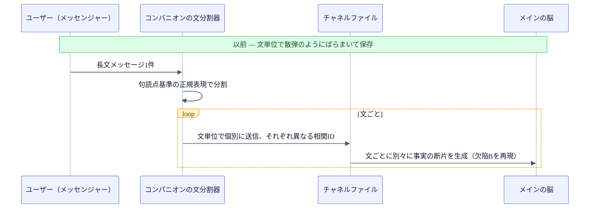
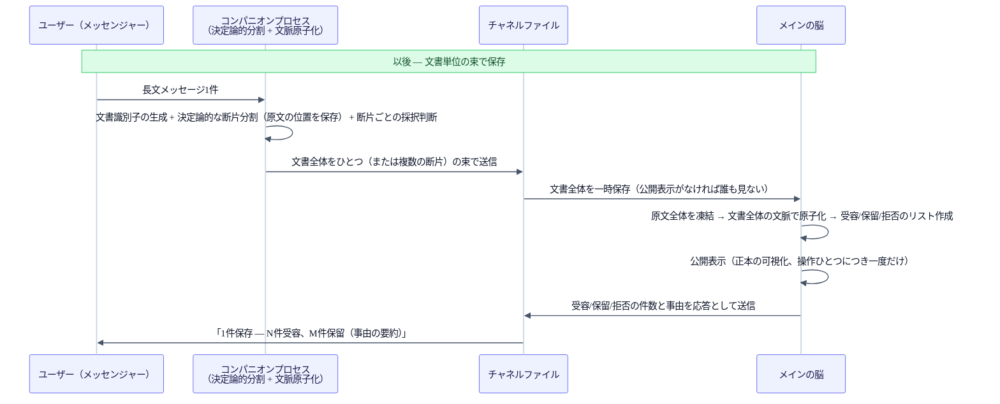

+++
date = '2026-07-18T21:00:00+09:00'
draft = false
title = '[2026-07-18] カナリアが捕らえた三つの欠陥と一つの非効率、そして文から文書へ'
summary = "テストスイートはすべてグリーンなのに、実運用では失敗したカナリアゲート。個人記憶をまったく照会しない欠陥をはじめ三つの欠陥＋一つの非効率をつぶし、保存の単位を文から文書へ再設計するまでの記録。"
tags = ['Second Brain']
+++

このシステムは個人用のローカル知識管理ツールだ。メインの脳が記憶を保存・索引し、コンパニオンプロセスがメッセンジャーを通じたやり取りを担う。先に、保存の正本をファイルシステムへ再確定し、構造を整理する安定化の作業を終えたあと、いよいよ実運用へ移るための最後の関門が残っていた——以前の会議で「核となる機能が動くというだけでは足りず、別途の実運用検証の関門を通過してはじめて信頼モードを開く」と定めておいた、あの関門だ。

## スイートはすべてグリーンだった、なのに実運用は失敗した

安定化を終えたからといって、すぐ日常的に使ってよいわけではなかった。先に確定しておいた方針どおり、核となる記憶機能を広く開ける前に、別途の実運用検証の関門をもうひとつ通過しなければならなかった。

## カナリアゲートとは何か

この関門の名はカナリアゲートだ。炭鉱で有毒ガスを先に感知したカナリアのように、実際のユーザーシナリオを一件、本番とまったく同じ条件で流してみて、問題があれば先に引っかかるようにしよう、という発想だ。五つの条件を確認する——正本に実際に記録されるか、その記録が検索に反映されるか、再起動しても同じ結果が出るか（再起動の整合性）、バックグラウンド作業が例外なく回るか、凍結しておいた機能フラグがそのまま維持されるか。

手動で実際のデータを一件入力し、この五つの条件を確認する実験が実行された。ところが一次の結果は失敗だった。入力そのもの（正本記録）は成功したが、保存された事実を実際に質問したとき、4回中4回すべて「保存された事実を含む答え」という最終基準を満たせなかった——二回はそもそも答えを拒否し、二回は根拠検証の手続きは通過したのに、肝心の中身のない生成物を出した。この失敗により、「一般の手動使用を広げよう」という結論は撤回された。

自動テストスイート全体は、この時点ですべて通過（グリーン）の状態だった。つまり、これまで書いておいたテストのうち、この失敗の経路を捕らえる検査はひとつもなかった、という意味だ——どれだけスイートがグリーンでも、実際に生きているシステムに実際のシナリオを流す検証は別途必要だ、ということを実証した事例だった。

## 三つの欠陥と一つの非効率——何が、なぜ漏れていたか

原因を掘り下げると、性格の異なる四つの問題が現れた。三つは明白な欠陥で、ひとつは結果を誤らせはしないが、仕事を二度させる非効率だった。

**欠陥A——意図を読めないと、個人記憶をまったく照会しない問題。** 質問からはっきりした信号を見つけられないと、意図分類のロジックが六つの意図候補に均等に点数を分けた。ところが次の段階で最高点の候補を選ぶロジックが、同点のとき常にリストの最初の項目（「事実確認」の意図）を選び、その「事実確認」の意図は、よりによって個人記憶ではなく公開資料のレイヤーだけを見るように設定されていた。そのため「週末に何をしようか」のような、保存された記憶との関連性が十分に高い質問でさえ、個人記憶のレイヤーをまったくのぞかずに答えを出した。

**欠陥B——決定論的スプリッターが、一つのメッセージを複数の断片に割る問題。** 文の境界を判断する正規表現の規則が、ユーザーのメッセージ一件を二つの別々の質問に割ってしまった。その結果、「どう思う」のように意図を含む部分と、実際の質問の中身が、互いに別の断片に分離されて保存された。

**欠陥C——検索はできたのに、本文を読み直さない問題。** 答えを生成するプロンプト組み立てのロジックが、検索結果をLLMに渡すとき、内容の指紋（fingerprint）と順位スコアだけを渡していた。肝心の、その指紋に対応する原文を正本から読み直して本文として埋め込むロジックが、どこにもなかった。これと噛み合って、指紋と本文をつなぐ派生インデックスそのものが、実行の時点で空の状態で渡されていた配線の抜けも一緒にあった。

**観察D（非効率）——検索は二度したのに、結果が捨てられる無駄。** クエリのロジックが個人記憶のレイヤーと公開資料のレイヤーをそれぞれ先に検索しておきながら、その結果を最終の融合の段階で丸ごと上書きしてしまい、そもそも検索したことが無意味になる構造だった。これは欠陥Aを直す過程で自然に一緒に解消された——先に検索しておいた結果を捨てず再利用するように変えればよかったからだ。

修正はすべて既存の原則（境界は決定論的な規則、LLMはその中でだけ使う）の中で行われた。信号がないか同点なら「わからない」と明示し、二つのレイヤーを一緒に併合して見るようにし、文書（レイヤー）ごとに関連性の最小基準（floor）を置いてフィルタリングし、アンカーのレイヤーが基準に満たなければ、定められた規則に従って反対のレイヤーへ移るようにした。スプリッターは、原文の位置情報（オフセット）と句読点を保存したまま一度にラベリングするように変え、続く質問の区間を再びひとつに組み立てられるようにした。本文組み立てのロジックには、確定した指紋を正本から直接読み戻す照会ロジックを追加し、本文が見つからなければLLMを呼ぶ前に失敗処理するようにした。指紋と本文をつなぐ派生インデックスも、起動時に再構築し、入力が入るたびに更新するよう配線を直した。

## 再検証：五つの条件すべて通過

修正を反映したあと、再びカナリア実験を回し、今度は五つの条件すべてを通過した。信号のはっきりしない質問（「私は毎週末に何をしているか？」）にも、保存された事実を含む実際の本文の答えと、根拠の表示2件が一緒に出て、再起動後も再起動前と同一の指紋で同じ答えが出て、正本再構築の整合性が確認され、バックグラウンド作業の例外は0件、凍結しておいた機能フラグもそのままだった。これにより「一般の手動使用の拡大」が承認された。

関門を開ける直前、再起動時に関連プロセスが自動的に再び立ち上がるよう登録されていたシステム自動起動の設定三件（安定化の初期に設置しておいたもの）が物理的に除去された——設定テンプレートそのものはリポジトリに残し、必要なら再インストールできるようにした。ただし常時稼働（再起動しても常に立ち上がっている状態）は、この関門とは別に依然として保留のまま残った。

## より根本的な問題：保存の境界が文書ではなく文だった

欠陥B（文を誤って割る問題）は、表面的には正規表現をひとつ手直しすれば終わる問題のように見えた。ところが掘り下げるほど、より根本的な設計の問題が現れた。保存の最小単位が「ユーザーが送った文書一件」ではなく「メッセンジャーで送信される文の断片」に掛かっていたのだ。長文のメッセージ一件が、そもそも複数の独立した保存単位に割られて入る構造で、その境界が句読点という浅い信号に依存していた。

## なぜ文書単位に変えたか

二つのAI（ClaudeとCodex）が何度も行き来した会議の末に、ユーザーは取り込みの単位そのものを再設計することに確定した。既存のデータはすべて消して最初からやり直してよい、という決定とともにだった。

目的は三つだった。長文のメッセージ一件が、文書単位で一度に保存確認の応答を受け取るようにし（「N件受容、M件保留、事由を含む」）、文書全体の文脈を保ったまま事実単位の断片を作って「能力2番」のような文脈なしには理解できない断片が生じないようにし、保留または拒否された部分も事由とともにあとで照会できるようにすること。

既存に確定しておいた原則との整合もそのまま守った。境界を分ける方式は依然として決定論的な規則であり、LLMはその境界を変えない範囲で、文書全体の文脈を見てラベリングするのにだけ使う。クエリに使う有料LLM呼び出しの予算も、依然として2回に固定した——文書単位に変わっても呼び出し数は増えない。「ユーザーの操作ひとつにつき記録ひとつ」という原則も、今回ファイルシステム正本の上で再び実装された——物理的なgitコミットの代わりに、ステージング（一時保存）の状態で準備を終えたあとにのみ公開表示を残す方式で、原子的な可視性を模した。この方式が可能だったのは、正本がすでにファイルシステムへ確定されていたからだ。

## 取り込みパイプラインの前後比較

## 2026-07-19 現在の状態と次のステップ

カナリア再検証の時点で、メインの脳側のテスト900余り、コンパニオンプロセス側のテスト約400件が通過し、統合検証コマンドの6つの検査はすべて終了コード0だった。文書単位への転換の実装がその直後に反映されたが、この転換以降の最終的なテストの数値は、この時点ではまだ別途確定していない。

先に立てた実行計画で見ると、運用基盤を固めるバッチは関門を通過し、完了した状態を保っている。正本構造を再整備しようとしたバッチは移行機能の撤去で全体が中止となり、そこに依存していたユーザー体験の作業の多くは、再企画までは依然として非アクティブだ。ただしそのうち、コマンドパースと決定論的スプリッターの性格の作業は、今回の文書単位の再設計で事実上吸収され、再び実装された格好だ。

運用凍結も依然として続く。調査・再編成・公開のような自動機能はずっと切ったままだ——カナリアゲートが開いたのは「手動で、個人用途に限って」実運用を広げることだけで、自動で自ら回る機能は、最初に定めた方針そのままにロックされている。再起動しても常に立ち上がっている常時稼働の状態も、まだ承認されていない。

今回の一件が残した最も明確な教訓は、テストスイートがどれだけグリーンでも、それがそのまま「実運用しても安全だ」という意味ではない、ということだ。四つの欠陥はすべて、単体テストや統合テストではなく、実際の入力→クエリの往復実験でのみ現れた。そして欠陥ひとつ（文の分割）の根本原因を追ううちに、保存の単位そのものを再設計する、より大きな作業へつながったことも、表面のバグひとつが、ときに設計の前提を問い直させるということを見せた事例だった。
