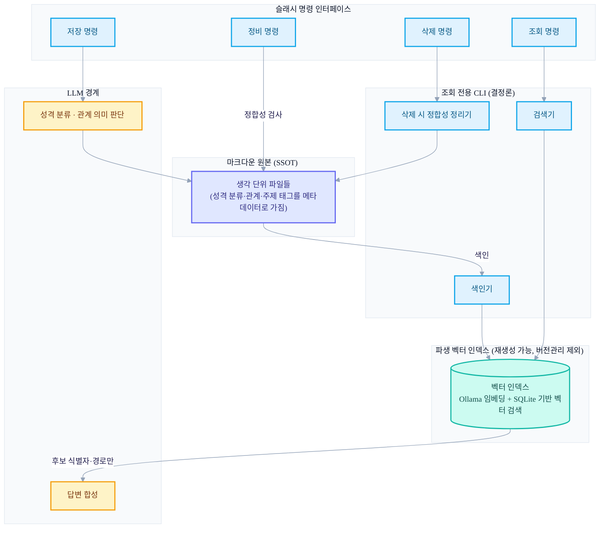
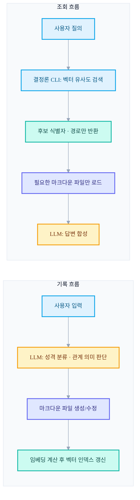
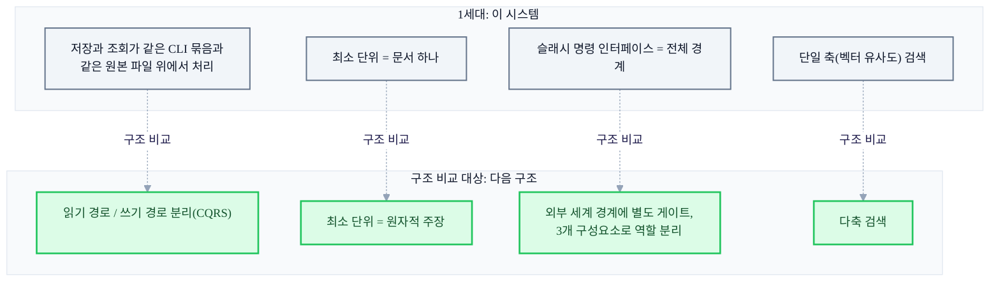

+++
date = '2026-05-30T21:00:00+09:00'
draft = false
title = '[2026-05-30] 마크다운을 원본으로 둔 첫 번째 세컨드 브레인'
summary = "마크다운을 유일한 원본(SSOT)으로, 벡터 인덱스를 파생물로 둔 1세대 개인 지식 관리 시스템의 설계 기록. v5 3계층 → v6 벡터 도입 → v6.1 플랫 구조로 이어진 세 번의 구조 전환과, LLM의 역할을 판단·합성으로 좁힌 원칙을 복기한다."
tags = ['Second Brain']
+++

2026년 5월 말, 개인이 쓰는 생각·경험·지식을 마크다운 파일로 쌓아두고, 그걸 AI 에이전트가 저장·조회·정리해주는 개인 지식 관리 시스템을 만들기 시작했다. 이 글은 그 첫 번째 시스템을 만들면서 무엇을 고민했고, 어떤 결정을 내렸고, 어떤 구조로 귀결됐는지에 대한 기록이다.

미리 밝혀둘 게 하나 있다. 이 시스템은 지금 이 글을 쓰고 있는 시점 기준으로 봐도, 이후에 만든 다른 세컨드 브레인 시스템과 **코드도 데이터도 공유하지 않는 완전히 별도의 프로젝트**다. 두 시스템 사이에 직접적인 계승 관계 — 코드를 이어받았다거나 데이터를 옮겼다거나 하는 — 는 확인된 바가 없다. 그래서 이 글은 "그다음에 무엇이 됐는가"를 말하는 글이 아니라, "그때 이 문제를 어떻게 풀려고 했는가"를 정직하게 복기하는 글이다. 다만 글의 마지막 부분에서, 지금 시점에 남아 있는 다른 구조와 나란히 놓고 무엇이 다른지 분석은 해볼 것이다 — 그것도 어디까지나 구조 비교이지, 이 시스템이 왜 접혔는지에 대한 설명은 아니다. (사실 이 시스템은 접힌 적도 없다. 뒤에서 다시 다룬다.)

## 1. 그때의 상황과 고민

개인 지식 관리, 흔히 말하는 PKM을 하고 싶었다. 문제는 단순했다 — 생각나는 걸 어딘가에 적어두긴 하는데, 나중에 그걸 다시 찾아 쓰기가 어렵다는 것. 검색은 되지만 의미로 찾아지진 않고, 분류는 해두지만 분류 기준 자체가 애매해지고, 쌓일수록 정리는 뒤로 밀린다.

이 문제를 코드로 풀어보기로 하면서 세운 원칙은 두 가지였다.

첫째, 저장 형식은 마크다운으로 한다. 특별한 이유는 없었다 — 텍스트 파일이라 어디서든 읽히고, 버전 관리 도구(git)로 이력을 남길 수 있고, 도구에 종속되지 않는다. 지식 관리 도구를 만들면서 그 도구가 없으면 데이터도 못 읽는 상황은 피하고 싶었다.

둘째, 정리와 조회는 AI 에이전트가 맡는다. 사람이 매번 태그를 달고 폴더를 정하는 대신, 대화형 인터페이스로 "이런 생각을 했다"고 말하면 에이전트가 알아서 분류하고 저장하게 하고 싶었다.

이 두 원칙을 합치면 바로 다음 질문이 나온다 — 마크다운 파일 더미에서 "의미로 찾기"를 어떻게 구현할 것인가, 그리고 그 과정에서 AI 에이전트가 정확히 어디까지 관여해야 하는가. 이 시스템의 설계는 사실상 이 질문 하나에 대한 답이었다.

## 2. 핵심 결정과 이유

### 마크다운이 원본, 검색 인덱스는 파생물

가장 먼저 정한 원칙은 "마크다운 파일이 유일한 원본(SSOT)이고, 그 외의 모든 것은 원본에서 다시 만들어낼 수 있는 파생물이어야 한다"는 것이었다.

의미 기반 검색을 하려면 벡터 임베딩과 그걸 담을 벡터 검색 인덱스가 필요하다. 하지만 이 인덱스를 원본처럼 다루면 문제가 생긴다 — 인덱스가 깨지거나 포맷이 바뀌면 지식 자체를 잃어버리는 셈이 되기 때문이다. 그래서 벡터 인덱스는 처음부터 "언제든 마크다운 파일 전체를 다시 읽어서 재생성할 수 있는 캐시"로 설계했고, 버전 관리 대상에서도 제외했다. 원본이 망가지지 않는 한 인덱스는 몇 번이고 새로 만들 수 있다는 게 핵심이었다.

### LLM의 역할을 의도적으로 좁힌다

두 번째 결정은 LLM(대형 언어 모델)이 할 일과 하지 않을 일을 나누는 것이었다. 처음엔 "AI 에이전트가 다 알아서 하게" 하고 싶은 유혹이 있었지만, 실제로 해보니 조회 후보를 찾는 일까지 LLM에게 맡기면 결과가 매번 달라지고, 왜 이 후보가 뽑혔는지 설명하기도 어려워졌다.

그래서 역할을 이렇게 나눴다.

- **결정론적으로 처리해야 할 것**: 어떤 기록이 지금 질의와 의미상 가까운지 찾아내는 일(조회 후보 발견). 이건 임베딩 벡터 간 거리 계산이라 같은 입력엔 항상 같은 결과가 나와야 한다. 그래서 이 일은 로컬에서 결정론적으로 동작하는 조회 전용 CLI 도구에 맡기고, LLM은 관여하지 않는다.
- **LLM이 맡아야 할 것**: 새로 들어온 생각이 어떤 성격(경험인지, 개념인지, 절차인지, 통찰인지, 주장인지)을 갖는지 판단하는 일, 기록 사이의 관계가 어떤 의미인지(예를 들어 한쪽이 다른 쪽을 확장하는지, 반박하는지) 판단하는 일, 그리고 조회 후보들을 읽고 사용자 질문에 맞는 답으로 합성하는 일. 이런 건 문맥과 의미 이해가 필요하므로 결정론적 규칙으로 대체할 수 없다.

정리하면 "후보를 찾는 일은 기계에게, 의미를 판단하고 답을 만드는 일은 모델에게"라는 경계선이었다. 이렇게 나누고 나니 조회 결과가 재현 가능해졌고, LLM은 이미 좁혀진 소수의 후보만 놓고 판단하면 됐다.

### 토큰을 아끼는 두 가지 전략

세 번째 고민은 비용이었다. 매 요청마다 시스템 전체 규칙과 지식 전체를 모델에게 읽히면 느리고 비싸진다. 여기서 쓴 전략은 두 가지다.

하나는 필요한 순간에만 필요한 만큼만 읽어들이는 것이다. 조회할 때 모든 마크다운 파일을 다 읽는 게 아니라, 벡터 검색이 후보의 식별자와 경로만 돌려주면 그중 정말 필요한 파일만 그때 가서 읽는다. 무거운 운영 규칙 문서들도 마찬가지로, 정말 그 작업을 할 때만 로드한다.

다른 하나는 작업을 작은 모델에게 위임하는 것이다. 저장·조회·삭제·정리 같은 정형화된 네 가지 작업을 각각 슬래시 명령으로 만들고, 그 명령이 호출하는 별도의 하위 실행 단위가 무거운 규칙을 들고 있게 했다. 이 하위 실행은 상대적으로 가벼운 모델(예: Claude의 Haiku 계열)에게 맡기고, 메인 대화 세션은 명령 하나를 부르고 결과 요약만 받는 식으로 부담을 줄였다.

## 3. 만들고자 한 구조

위 결정들을 하나의 그림으로 합치면 이렇게 된다. 마크다운 원본, 그 원본에서 파생된 벡터 인덱스, 그 인덱스를 다루는 결정론적 조회 CLI, 사용자가 직접 마주하는 슬래시 명령 인터페이스, 그리고 이 모든 것 사이에서 판단과 합성만 담당하는 LLM 경계.

이 구조에서 눈여겨볼 지점은, 화살표가 벡터 인덱스에서 LLM으로 갈 때 "후보 식별자와 경로만" 넘어간다는 것이다. 벡터 인덱스는 방향을 알려줄 뿐이고, 실제 내용을 읽고 뜻을 해석하는 건 항상 원본 마크다운 파일로 되돌아가서 이루어진다.

이걸 시간 순서로 다시 그리면 기록 흐름과 조회 흐름, 두 개의 별도 경로가 보인다.

두 흐름은 만나는 지점이 딱 하나다 — 벡터 인덱스. 기록 흐름이 인덱스를 채우고, 조회 흐름이 인덱스를 읽는다. 그 외에는 완전히 독립적으로 동작한다. 저장할 때 조회 로직을 신경 쓸 필요가 없고, 조회할 때 저장 로직을 신경 쓸 필요가 없다는 게 이 분리의 실질적인 이점이었다.

## 4. 내부 변천 — 세 번의 구조 전환

이 시스템은 한 번에 지금 형태로 만들어지지 않았다. 만드는 과정에서 구조를 세 번 크게 바꿨고, 그 변천 자체가 이 시스템이 무엇과 씨름했는지를 보여준다.

**첫 번째 형태(3계층 구조)**에서는 "주제별 정보 아카이브"라는 정체성으로 시작했다. 생활, 학습 같은 대주제 아래 다시 여러 층의 폴더를 두고, 그 안에 기록을 넣었다. 기록의 성격(개념적 지식인지, 절차인지, 경험인지, 성찰인지)도 별도 필드로 표시했다. 조회는 키워드 매칭, 태그 매칭, 의미 유사도를 순차적으로 좁혀가는 3단계 방식에 시간 가중치와 순위 재조합 로직을 얹은 형태였다. 폴더마다 목록 파일을 두고 항목 수가 일정 기준을 넘으면 다시 나누는 규칙도 있었다.

문제는 폴더 트리 하나로 "무슨 주제인가"와 "어떤 성격의 기록인가"라는 두 개의 서로 다른 축을 동시에 표현하려 했다는 점이었다. 같은 주제라도 성격이 다른 기록이 여러 폴더에 흩어지면서 조회할 때 여러 경로를 동시에 뒤져야 하는 상황이 발생했다. 폴더로는 한 축밖에 못 담는데 두 축을 담으려 하니 무리가 생긴 것이다.

**두 번째 형태(벡터 도입)**에서 정체성을 "성격별 사고 기록"으로 바꿨다. 최상위 분류를 주제가 아니라 기록의 성격(경험·개념·절차·통찰·주장, 다섯 가지)으로 삼고, 주제는 태그와 벡터 임베딩이 담당하도록 역할을 넘겼다. 이 전환의 핵심 통찰은 "벡터 검색이 조회 라우팅을 대신해줄 수 있다면, 성격별 최상위 분류를 유지하면서도 조회 시점에 여러 경로를 순회할 필요가 없어진다"는 것이었다. 실제로 이 전환 이후 이전의 다단계 캐스케이드 조회 로직, 시간 가중치, 순위 재조합 로직이 통째로 사라졌다 — 벡터 유사도 검색 하나로 대체됐기 때문이다.

**세 번째 형태(플랫 구조)**에서는 한 걸음 더 나아가 폴더 구조 자체를 없앴다. 모든 기록을 한 위치에 나란히 두고, 성격 분류는 메타데이터 필드 하나로만 식별한다. 폴더마다 있던 개별 목록 파일도 전체를 아우르는 단일 통계 문서로 합쳤다. 벡터 검색이 이미 라우팅을 대신하고 있는 상황에서, 폴더로 성격을 나누는 것 자체가 더 이상 조회에 필요하지 않다는 판단이었다.

세 전환을 관통하는 흐름은 하나다 — 폴더라는 물리적 구조에 점점 덜 의존하고, 그 자리를 메타데이터와 벡터 검색으로 옮겨간 것.

## 5. 지금 시점에서 나란히 놓고 보면 — 구조 비교

이 시스템을 만든 뒤로, 나는 완전히 별도의 프로젝트로 다른 세컨드 브레인 구조를 만들었다. 앞서 밝혔듯 두 시스템은 코드도 데이터도 공유하지 않고, 하나가 다른 하나로 이어졌다는 기록도 없다. 그래서 아래 비교는 "왜 이 시스템을 접었는가"에 대한 답이 아니다 — 애초에 이 시스템은 접힌 적이 없다. 다만 지금 시점에 존재하는 다른 구조와 이 시스템의 설계를 나란히 놓아보면, 이 시스템이 원리적으로 다루지 못하는 지점들이 보인다. 순수한 구조 분석으로 읽어주면 좋겠다.

다음 구조가 도입한 네 가지 개념과 이 시스템의 대응을 표로 정리하면 이렇다.

| 비교 축 | 이 시스템(1세대)의 구조 | 다음 구조가 도입한 것 |
|---|---|---|
| 읽기/쓰기 경로 | 저장과 조회가 결국 같은 CLI 도구 묶음과 같은 원본 파일을 거쳐 처리됨 | 읽기 경로와 쓰기 경로를 애초에 분리해서 설계(CQRS) |
| 기억의 최소 단위 | 파일 하나(생각 하나를 담은 마크다운 문서)가 최소 단위 | 문서 단위가 아니라, 그 안의 개별 주장을 원자적 최소 단위로 삼음 |
| 외부 세계와의 경계 | 슬래시 명령 인터페이스가 곧 시스템 전체의 입구이자 경계 | 외부 세계와 맞닿는 지점에 별도의 게이트를 두고, 그걸 포함해 세 개의 구성요소로 역할을 분리 |
| 검색 방식 | 벡터 유사도라는 단일 축 검색(+ 메타데이터 필터) | 여러 축을 동시에 쓰는 다축 검색 |

그림으로 보면 이렇다.

이 표가 말하는 건 이 시스템이 "틀렸다"는 게 아니라, 애초에 다루려던 문제의 범위가 달랐다는 것에 가깝다. 이 시스템은 "마크다운 파일 더미에서 의미로 찾기"라는 문제를 풀려고 했고, 그 안에서는 문서 하나를 최소 단위로 삼는 것도, 벡터 유사도 하나로 검색축을 통일하는 것도 충분히 합리적인 선택이었다. 다만 기억을 문서보다 더 잘게 쪼갠 주장 단위로 다루거나, 쓰기와 읽기를 완전히 분리된 최적화 대상으로 다루거나, 외부 세계와의 상호작용에 별도의 검증 지점을 두려는 문제라면, 이 구조는 그런 요구를 원리적으로 담을 자리가 없다. 다시 말하지만 이건 이 시스템을 접은 이유에 대한 기록이 아니라, 지금 시점에서 두 구조를 나란히 놓아본 관찰일 뿐이다.

## 6. 마무리

이 시스템은 2026년 5월 말부터 약 열흘 남짓 집중적으로 만들어졌고, 그 이후로는 유지 모드로 들어갔다 — 큰 구조 변경 없이 있는 그대로 쓰이고 있다는 뜻이다. 그리고 흥미롭게도, 이 시스템은 지금도 폐기되지 않고 독립적으로 남아 있다. 저장·조회·삭제·정비를 위한 슬래시 명령 인터페이스가 여전히 살아 있고, 실제로 쌓인 기록도 그대로 존재한다. 나중에 완전히 다른 구조로 새 세컨드 브레인을 만들었다고 해서 이 시스템을 걷어낸 것은 아니었다 — 그냥 별도의 타임라인으로, 별도의 도구로 계속 존재해왔을 뿐이다.

돌아보면 이 시스템에서 가장 오래 남은 결정은 "원본과 파생물을 분리한다"와 "LLM의 역할을 판단과 합성으로 좁힌다"는 두 가지였다. 구조는 세 번이나 바뀌었지만 이 두 원칙만큼은 첫 형태부터 마지막 형태까지 한 번도 흔들리지 않았다. 어쩌면 그게 이 시스템이 지금까지도 별다른 손질 없이 굴러가고 있는 이유일지도 모르겠다.
