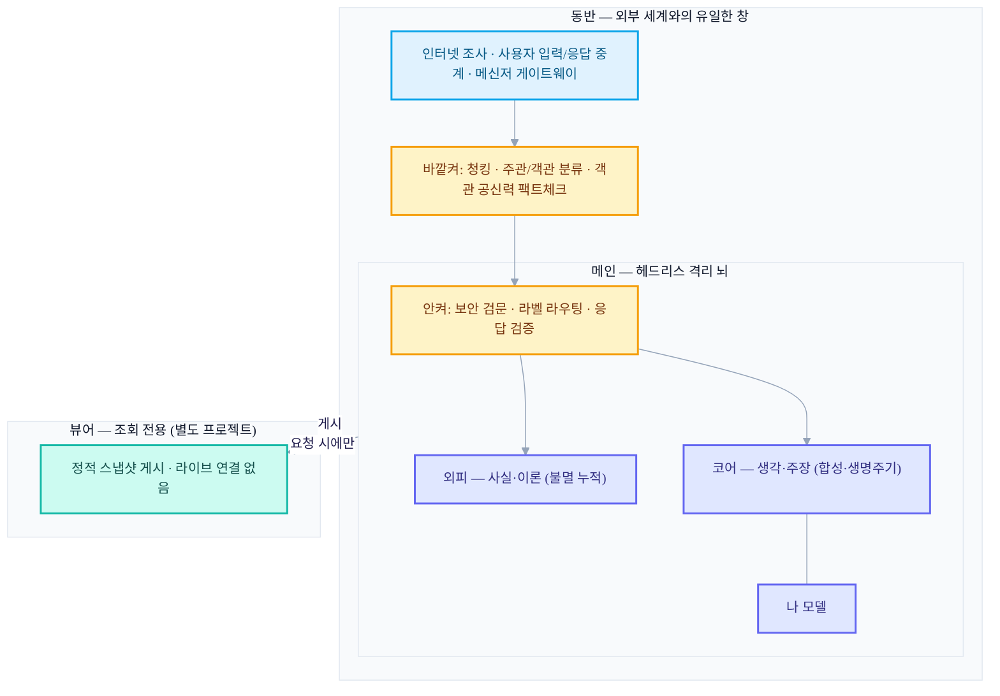
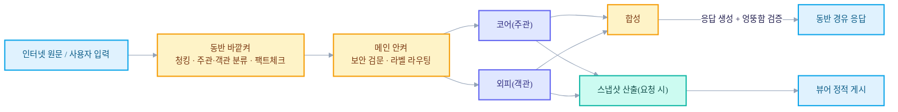

+++
date = '2026-06-21T21:00:00+09:00'
draft = false
title = '[2026-06-21] 두 번째 시작: 뇌를 세 개의 프로세스로 쪼갠 이유'
summary = "마크다운 하나에 주관과 객관을 뒤섞던 1세대를 반성하고, 뇌를 메인(격리)·동반(외부 창)·뷰어(조회)로 쪼갠 2세대 아키텍처 v3.3. 코어/외피 분리와 양방향 게이트 등 여섯 가지 원칙을 확정했다."
tags = ['Second Brain']
+++

전에 한 번, 마크다운 파일 하나에 내 생각과 세상에서 주워온 정보를 전부 욱여넣는 방식으로 개인 지식 시스템을 만들어본 적이 있다. 방식은 단순했지만 쓰면 쓸수록 두 가지가 계속 걸렸다. 하나는 내 머릿속 생각과 인터넷에서 가져온 사실이 같은 그릇에 담긴다는 것. 다른 하나는 이 시스템이 인터넷이나 나 자신과 정확히 어떤 경로로, 얼마나 통제된 채로 접촉하는지가 애매하다는 것이었다. 둘 다 "그냥 파일 하나 늘리면 되지"로는 해결이 안 되는, 구조의 문제였다.

그래서 처음부터 다시 설계하기로 했다. 이번에는 질문을 이렇게 바꿔 잡았다. 주관적인 것과 객관적인 것을 애초에 다른 곳에 담을 수는 없을까. 그리고 이 뇌가 바깥 세계와 만나는 통로를 하나로 좁혀서, 그 통로에서만 검문을 하면 되게 만들 수는 없을까.

## 계획이 곧 규칙이 되는 토대 위에서

이 설계를 실제 코드로 옮기기 전에, 먼저 "이걸 어떤 방식으로 구현해나갈 것인가"부터 정했다. 사람이 요청을 하면 그 요청이 계획 초안이 되고, 그 계획이 맥락 없는 콜드 검토를 통과하면, 통과된 계획 그 자체가 강제 규칙으로 컴파일되고, 그 규칙 아래에서만 실제 빌드가 진행되는 파이프라인이다. 말을 바꾸면 사람이 계획을 검증하면 그 계획이 규칙이 되어 빌드를 구속하는 구조다. 위험한 명령은 항상 차단되고, 코드가 바뀌는 경로마다 검증이 먼저 갖춰져 있어야 하며, 계획에 없던 범위로 구현이 새 나가지 못하게 여러 겹으로 강제한다. 세컨드 브레인이라는 설계는 이 하네스 위에서 처음부터 진행됐다 — 설계 문서 자체도 나중에 빌드로 넘어갈 것을 전제로 쓰였다.

## 여섯 가지 원칙

설계 문서에 못박은 핵심 원칙 중 이 시기에 확정된 여섯 가지를 추려본다.

### 1. 주관과 객관을 본질로 가른다

내 머릿속에 있는 것은 두 종류다. 하나는 생각·주장·경험·취향처럼 참/거짓을 따질 대상이 아닌 것. 다른 하나는 사실·이론·뉴스·데이터처럼 검증의 대상인 것. 이 둘을 뇌 안에서 물리적으로 다른 구획에 담기로 했다 — 안쪽엔 주관("코어")이, 바깥쪽엔 객관("외피")이 사는 동심원 구조다. 한 번 코어에 들어간 것이 외피로, 외피에 들어간 것이 코어로 넘어가는 일은 없다.

### 2. 코어는 합성한다, 외피는 누적한다

코어는 생각과 생각이 부딪혀 새 인사이트를 낳는 합성 작업을 한다. 반면 외피는 사실을 모으고 팩트체크는 하지만, 이론과 이론을 멋대로 합쳐 새 이론을 지어내지는 않는다. 이론을 임의로 합치면 그건 지식이 아니라 환각이기 때문이다. 생각은 자라도 되지만 사실은 함부로 합쳐지면 안 된다는 게 이 비대칭의 요지다.

### 3. 격리된 뇌, 단 하나의 창

메인 뇌는 인터넷도, 나 자신도 직접 만나지 않는다. 인터넷 조사도, 내 입력도, 내가 받는 답변도 전부 동반이라는 별도 프로세스라는 하나의 창을 거친다. 메인은 헤드리스로 격리되어 있고, 외부와 닿는 유일한 접점이 동반이다.

### 4. 양방향 게이트 — 들어올 때 거르고 나갈 때 검증한다

메인을 감싼 막은 두 켜로 동작한다. 바깥켜(동반이 맡는다)는 들어오는 정보를 청크 단위로 쪼개 주관/객관으로 분류하고, 객관으로 분류된 것만 공신력을 팩트체크한다. 안켜(메인 경계가 맡는다)는 그 결과를 받아 보안 검문을 하고 라벨대로 코어나 외피에 밀어 넣는다. 나가는 응답은 반대로, 맥락에서 엉뚱하게 벗어나지 않았는지 검증한 뒤에만 동반을 거쳐 나간다. 분류·팩트체크는 동반이, 보안·라우팅은 메인이 나눠 맡는 구조다.

### 5. 도메인은 스스로 태어나고 사라진다

주제 폴더에 해당하는 단위(도메인)를 사람이 미리 정해두지 않는다. AI가 코어에 쌓이는 생각의 패턴을 보고 새 도메인을 스스로 만들고, 관심이 식으면 잠재우고, 오래 방치되면 소멸시킨다. 다만 이 생명주기는 코어 전용이다 — 외피는 불멸이라 소멸하지 않는다.

### 6. LLM은 아껴 쓴다

결정론·규칙·임베딩·그래프로 풀 수 있는 일에는 LLM을 아예 부르지 않는다. 판단이나 생성이 꼭 필요한 자리에만 LLM을 쓴다는 원칙을 이 시점에 세웠다. 정확히 몇 곳에만 쓸 것인지 숫자로 못박는 일은 아직 이 단계에서는 하지 않았다.

## 구조: 세 개의 독립 프로세스

이 여섯 원칙을 물리적으로 얹은 결과가, 하나의 시스템이 아니라 서로 다른 프로세스로 쪼개진 세 개의 프로젝트다.

메인은 외부에 직접 노출되지 않는 헤드리스 프로세스, 동반은 인터넷·사용자와 만나는 유일한 창, 뷰어는 그 결과를 조회만 하는 세 번째 형제 프로젝트다. 셋은 각자 독립된 저장소에서 따로 실행된다.

## 데이터가 흐르는 길

외부에서 들어온 것은 반드시 동반의 바깥켜와 메인의 안켜, 이 두 검문을 순서대로 통과해야 코어나 외피에 닿는다. 반대로 코어·외피에서 나가는 것도 응답이든 스냅샷이든 검증 없이 그냥 나가는 법이 없다. 이 시점에는 아직 저장의 정본이 무엇인지, 기억의 최소 단위가 무엇인지는 확정하지 않은 채였다 — 그 안쪽 기계는 얼마 지나지 않아 다시 한 번 뜯어보게 된다.
