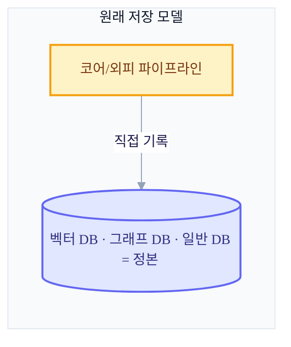
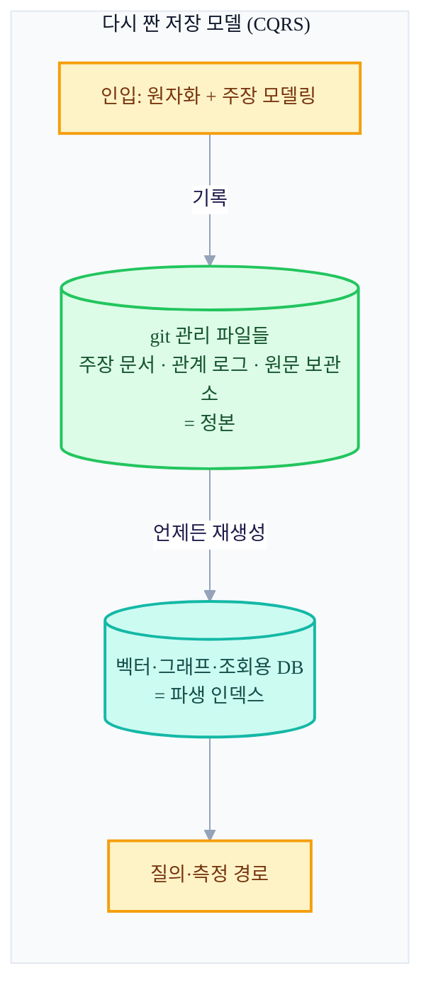
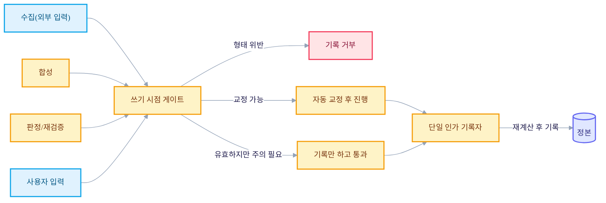

+++
date = '2026-06-28T21:00:00+09:00'
draft = false
title = '[2026-06-28] 저장 모델을 갈아엎다: 기억의 최소 단위는 무엇인가'
summary = "큰 골격은 유지한 채 내부 저장 기계를 다시 연 v3.7 델타. 저장 정본을 DB에서 git 파일로, 기억의 최소 단위를 청크에서 원자적 주장으로 바꾸고, 검증을 쓰기 시점의 게이트로 옮긴 다섯 가지 개정."
tags = ['Second Brain']
+++

전에 세컨드 브레인을 다시 설계하면서, 뇌를 코어(주관)와 외피(객관)로 나누고, 메인이라는 헤드리스 프로세스를 두어 동반이라는 단 하나의 창으로만 외부와 접촉하게 하고, 결정론으로 풀리는 일에는 LLM을 쓰지 않는다는 원칙까지 세워뒀다. 그런데 이 큰 뼈대를 그대로 둔 채 실제 구현에 들어가기 전에, 안쪽 기계를 한 번 더 열어보기로 했다. 큰 골격은 그대로 상속하되 저장·기억의 단위·검증·검색·거버넌스라는 내부 기계만 다시 점검한 개정이다.

## 무엇을 재점검했나

설계도 위에서 "이걸 실제로 어떻게 저장하고, 무엇을 하나의 기억 단위로 볼 것이며, 언제 검증할 것인가"를 하나씩 짚어보니 다섯 군데가 걸렸다.

### ① 저장 정본을 DB에서 파일로 옮기다

원래 계획은 벡터 DB와 그래프 DB, 일반 DB가 정본이었다. 진실은 DB 안에 있고, 그 DB가 망가지면 기억도 같이 망가지는 구조였다. 이걸 뒤집었다. 이제 정본은 git으로 버전 관리되는 파일들 — 낱장 주장 문서, 관계를 사건 단위로 추가만 하는 로그, 종합 논지를 모은 구획, 원문을 통째로 얼려두는 보관소 — 이고, 벡터·그래프·조회용 DB는 언제든 파일에서 다시 만들어낼 수 있는 파생물로 격하됐다. 쓰기와 감사의 진실은 파일에 있고, 읽기와 서빙의 속도는 DB가 담당한다는 역할 분리다. 이렇게 하면 기억을 되돌리는 일이 그냥 버전 되돌리기 하나로 끝나고, 감사나 이식도 별도 도구 없이 가능해지며, 파일이 곧 그래프이므로 기록 시점에 통합 정합성 검사를 걸 수 있게 된다. 흔히 말하는 CQRS(쓰기 모델과 읽기 모델을 분리하는 패턴) 그대로다.

### ② 기억의 최소 단위를 문서 청크에서 원자적 주장으로

원래는 의미 단위로 쪼갠 청크를 그대로 저장했다. 이걸 바꿔서, 들어오는 청크를 한 번 더 LLM으로 원자화해 그 자체로 완결된 하나의 주장으로 모델링하게 했다. "그건 별로였어" 같은 미해결 지시어가 남은 문장은 저장할 수 없고, "X 접근은 Y 이유로 별로다"처럼 그 문장만 떼어놓아도 뜻이 통해야 한다. 이 단위마다 내용의 지문값(같은 뜻이 다른 표현으로 다시 들어와도 알아보는 식별키), 표현이 바뀌어온 이력, 어디서 왔는지, 어떤 원문을 근거로 하는지를 함께 기록한다. 청킹(동반이 하는, 분류를 위한 쪼개기)과 원자화(메인이 하는, 저장을 위한 쪼개기)는 다른 작업이라는 걸 이때 명확히 했다 — 청크 하나가 여러 개의 원자적 주장을 낳을 수 있다.

### ③ 사후 감사이던 검증을 쓰기 시점의 게이트로 옮기다

원래는 일단 뭐든 받고, 나중에 합성 과정이 사후에 감사하는 방식이었다. 이걸 뒤집어서, 수집이든 합성이든 사용자 입력이든 정본에 실제로 기록되기 전에 반드시 통과해야 하는 단일 게이트를 세웠다. 형태가 틀렸으면 기록 자체를 막고(자기완결성 위반, 지문 중복, 순환 관계 등), 기본값이 틀렸으면 자동으로 교정해 통과시키고(예: 공개 범위 기본값), 아직은 유효하지만 나중에 문제될 수 있는 것은 막지 않고 기록만 해둔다(모순되는 주장 등). 이 게이트가 필요했던 이유는, 합성 과정 자체도 내부에서 새 기록을 만들어내는 주체라서 바깥 경계의 검문만으로는 걸러지지 않기 때문이다 — 바깥 경계가 못 보는 내부 기록 주체를 잡는 자리가 바로 이 쓰기 시점 게이트다.

### ④ 검색을 의미 단일축에서 다축 융합으로

원래는 코어와 외피의 임베딩을 합쳐 의미 유사도 하나로 찾았다. 이걸 시간·키워드·의미·관계, 네 개의 축으로 각각 따로 찾은 뒤 순위만 합치는 방식(RRF, 점수를 섞지 않고 순위를 융합하는 기법)으로 바꿨다. 최신성을 묻는 질의는 최근 것 위주로 강하게 걸러내고, 고유명사가 있으면 키워드 축이, 관계를 묻는 질의는 관계 축이 더 크게 반영된다. 네 축 모두 결정론이라 이후에 정말 정답에 가까운 것을 찾고 있는지 수치로 측정하고 튜닝할 수 있게 됐다는 게 이 변경의 핵심 근거였다.

### ⑤ 기록 권한을 단일 인가 기록자로 모으다

정본 상태가 바뀌는 모든 경로(수집·합성·판정·사용자 입력)를 한 곳으로 직렬화했다. 정본을 실제로 기록할 수 있는 유일한 인가 기록자를 두고, 그 기록자는 제출된 주장을 그대로 믿지 않고 매번 스스로 다시 계산해서 확인한 뒤에만 기록한다. 예를 들어 중복 병합 여부나 관계의 철회 여부는 제출자의 판단이 아니라 기록자가 재측정한 값으로 결정된다. 한 번의 작업은 하나의 구조화된 기록으로 남고, 그 기록들이 한 줄로 이어진 순서를 이룬다. 흥미롭게도 이 구조는, 이 설계를 진행하던 강제 빌드 하네스 쪽의 "계획을 그대로 검증 없이는 완료 처리하지 않는 유일한 기록자" 모델과 형태가 같았다 — 다른 문제를 풀고 있었는데 같은 답에 도달한 셈이다.

## 저장 모델, 전과 후

## 쓰기 경로: 무엇이든 이 문을 지나야 한다

무엇을 받아들일지는 여전히 열어두되(주관이든 객관이든 무엇이든 받는다는 원칙은 그대로다), 받아들인 것을 어떤 모양으로 저장할지는 이 문에서 강제한다는 게 이번 개정 전체를 관통하는 말이다.

이 개정에서 "git으로 버전 관리되는 파일이 정본"이라고 못박은 결정은, 이후 실제로 시스템을 운영해보면서 다시 한 번 도전받게 된다.
