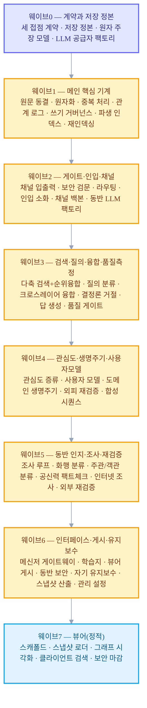
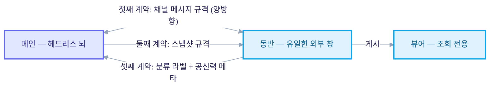

+++
date = '2026-07-02T21:00:00+09:00'
draft = false
title = '[2026-07-02] 설계를 실행 계획으로: 51개 유닛, 18개 파티션, 3개의 계약'
summary = "다섯 편의 설계 문서를 51개 유닛·18개 파티션·8개 웨이브로 쪼개 병렬 빌드가 가능한 실행 계획으로 만든 기록. 세 프로세스가 맞물리는 세 접점의 계약을 코드 착수 전에 먼저 동결했다."
tags = ['Second Brain']
+++

앞서 뇌를 메인(헤드리스로 격리된 뇌)·동반(외부 세계와 만나는 유일한 창)·뷰어(조회 전용) 세 개의 독립 프로세스로 나누는 설계를 마쳤다. 그 안쪽 기계도 한 번 다시 손봐서, 저장 정본을 파일로, 기억의 최소 단위를 원자적 주장으로, 검증을 쓰기 시점의 게이트로 바꿔뒀다. 이제 남은 문제는 이 설계를 실제로 어떻게 만들 것인가였다.

## 설계 문서만으로는 빌드를 못 시킨다

다섯 편의 설계 문서 — 메인 본편과 그 개정판, 동반 설계, 뷰어 설계, 그리고 LLM 예산 전략을 가로지르는 문서 — 가 다 갖춰졌다고 해서 곧바로 여러 작업자에게 나눠서 동시에 빌드를 시킬 수 있는 건 아니었다. 설계 문서는 무엇을 만들 것인가를 말해줄 뿐, 어떤 순서로 어떤 경계를 나눠 동시에 만들 것인가는 말해주지 않는다. 이 순서와 경계를 자르는 작업을 시작했다.

## 51개 유닛, 18개 파티션

먼저 다섯 편의 설계 문서에 흩어져 있던 기능을 전부 작업 최소 단위(유닛)로 쪼갰다. 메인 쪽에 29개, 동반 쪽에 13개, 뷰어 쪽에 5개, 그리고 계획을 검토하는 과정에서 뒤늦게 드러난 보정 유닛 4개까지 합쳐 총 51개 유닛이 나왔다.

이 51개를 각자 건드리는 파일이 겹치지 않도록 18개의 파티션으로 묶었다 — 메인 10개, 동반 7개, 뷰어 1개. 파티션은 동시에 서로 다른 작업자에게 맡겨도 서로의 파일을 건드리지 않는 단위다. 예를 들어 저장 정본과 원자 주장 모델, 그 주변의 핵심 기계를 다루는 유닛들은 하나의 파티션으로, 검색의 네 개 축과 질의 처리를 다루는 유닛들은 또 다른 파티션으로 묶였다.

## 8개의 웨이브로 의존 정렬

파티션을 나눴다고 다 동시에 시작할 수 있는 건 아니다. 저장 정본이 없으면 그 위에 쓰기 게이트를 만들 수 없고, 게이트가 없으면 인입을 검증할 수 없다. 그래서 파티션들을 8개의 웨이브로 의존 순서를 매겼다. 같은 웨이브 안에서는 대체로 병렬로 진행하고, 웨이브와 웨이브 사이는 순차로 진행한다.

## 접점마다 계약을 먼저 못박다

세 프로세스가 독립된 저장소에서 각자 진행되는 이상, 서로 맞물리는 지점은 딱 세 군데뿐이다. 이 세 접점의 규격을, 각 파티션이 실제로 코드를 짜기 전에 먼저 동결했다.

- **첫째 계약** — 메인과 동반이 주고받는, 두 프로세스가 공유하는 단 하나의 채널 파일이 어떤 메시지 형식을 쓸지에 대한 규격. 양방향이다.
- **둘째 계약** — 메인이 만들어 동반을 거쳐 뷰어까지 전달되는, 조회용으로 게시되는 스냅샷의 형식 규격.
- **셋째 계약** — 동반의 바깥켜가 분류와 팩트체크를 마친 뒤 메인에 넘기는 분류 라벨과 공신력 메타데이터의 규격.

이 세 계약을 병렬 빌드 착수 전에 먼저 확정한 이유는 단순하다. 각 파티션이 자기 검증을 전부 통과시켜도(각자 통과여도), 서로 맞물리는 접점의 규격이 어긋나 있으면 합쳤을 때 통합이 깨진다. 계약을 계약대로 먼저 얼려두면, 각 파티션은 그 계약만 지키면서 서로 몰라도 동시에 진행할 수 있다.

## 그런데 논리 규격만으로는 부족했다

파티션과 계약을 다 정하고 실제 빌드가 시작된 뒤에도, 계약의 논리적인 모양만 정해뒀을 뿐 물리적으로 어떤 타입, 어떤 값으로 주고받을지까지는 못박지 못한 지점들이 남아 있었다. 이 구멍은 실제로 빌드가 진행되던 며칠 사이에 하나씩 메워졌다.

- 처음에는 로컬의 무료 소형 모델로만 돌리려 했던 판단 지점 중 하나가, 실측으로 조사 루프를 돌려보니 수확이 0건으로 나오면서 상용 API 공급자의 소형 모델로 전환하기로 확정됐다.
- 임베딩 모델도 애초 후보로 잡아둔 모델 대신, 직접 실측 비교한 뒤 1024차원짜리 다른 모델로 바꿔 확정했다.
- 첫째 계약(채널 메시지 규격)에서 메시지 식별자가 정확히 어떤 물리 타입인지(문자열 UUID로), 서명은 어느 쪽이 먼저 하는지까지 세부 규격으로 못박았다.
- 셋째 계약(대화 관련 메타데이터)에서도 사용자의 질문을 나르는 필드의 이름을 하나로 정본화했다 — 그전까지는 후보가 둘이었다.

논리 스키마, 즉 "무엇을 주고받을지"만으로는 병렬로 짜인 코드가 실제로 맞물리지 않았다. 타입이 문자열인지 숫자인지, 필드 이름이 정확히 무엇인지 같은 물리 규격까지 못박아야 서로 다른 저장소에서 따로 짠 코드가 실제로 붙는다는 걸, 계약을 먼저 얼렸다고 생각했던 이후에도 다시 한 번 배운 셈이다.
