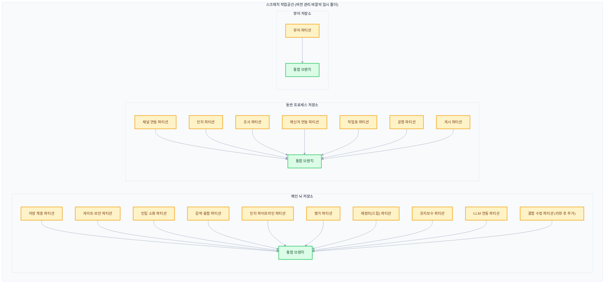
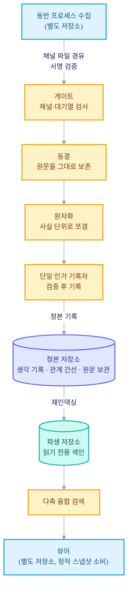

+++
date = '2026-07-04T21:00:00+09:00'
draft = false
title = '[2026-07-04] AI 에이전트 함대로 나흘 만에 시스템을 빌드하다'
summary = "여러 AI 에이전트를 동시에 굴리는 「함대」 방식으로 나흘 만에 메인·동반·뷰어 세 컴포넌트를 빌드한 과정. 겹치지 않는 파티션, 3역할 분리(테스트·검증·구현), 공통 규약 동결이라는 세 전제를 짚는다."
tags = ['Second Brain']
+++

이 시스템은 개인용 로컬 지식 관리 도구다. 메인 뇌가 기억을 저장하고 색인하고, 동반 프로세스가 메신저 같은 외부 세계와의 소통을 처리하고, 뷰어가 그 기억을 그래프와 검색 화면으로 보여준다. 세 컴포넌트를 합쳐 51개 작업 단위로 쪼갠 구현 계획이 이미 준비돼 있었다. 문제는 그 계획을 누가, 어떻게 코드로 옮기느냐였다.

## 혼자 순서대로 만들면 계획이 낡는다

51개 단위를 한 사람(또는 한 에이전트)이 순서대로 구현하면 두 가지가 어긋난다. 하나는 시간이다. 저장 계층부터 검색, 인지 파이프라인, 메신저 연동까지 순차로 짜면 완료까지 오래 걸리고, 그 사이 앞서 세운 설계 가정이 낡아버린다. 다른 하나는 검증이다. 만든 사람이 스스로 "됐다"고 판단하면 자기 작업을 유리하게 채점하는 편향이 끼어들기 쉽다.

그래서 이번 빌드는 여러 AI 에이전트를 동시에 굴리는 "함대" 방식으로 진행됐다. 그런데 병렬로 굴리려면 먼저 풀어야 할 전제조건이 셋 있었다.

**첫째, 겹치지 않는 경계.** 51개 단위를 서로 파일을 건드리지 않는 파티션으로 묶어야 한다. 두 파티션이 같은 파일을 동시에 고치면 병렬화는 의미가 없어진다. 저장 계층, 게이트·보안, 인입 소화, 검색·융합, 인지 파이프라인, 평가, 재정리(드림) 배치, 유지보수, LLM 연동 — 이런 식으로 컴포넌트별 책임 영역을 먼저 쪼갰다.

**둘째, 3역할 분리.** 한 파티션 안에서도 "테스트를 먼저 쓰는 사람", "그 테스트가 실패하는지·의미 있는지 확인하는 사람", "테스트를 통과시키는 구현자"를 서로 다른 에이전트 세션으로 나눴다. 구현자가 테스트를 손대지 못하게 막으면, 최소한 "테스트에 맞춰 구현했는가"는 물리적으로 보장된다. 그리고 완료된 결과물은 만든 사람이 아닌 독립된 채점자가 다시 확인한다.

**셋째, 공통 규약의 동결.** 코드 스타일, 커밋 메시지 규칙, 게이트 통과 기준 같은 공통 규약을 파티션 착수 전에 짧은 문서(약 55줄) 하나로 확정해뒀다. 첫 파티션이 통과한 뒤 한 번만 갱신하고 그 뒤로는 건드리지 않았다. 규약이 파티션마다 다르면 나중에 합칠 때마다 충돌이 난다.

## 스크래치 작업공간의 구조

실제 병렬 빌드는 버전 관리 바깥의 임시 작업공간에서 진행됐다. 컴포넌트마다 독립된 저장소를 만들고, 그 안에 파티션 브랜치들이 갈라져 나갔다가 통합 브랜치로 하나씩 합류하는 구조다.

메인 뇌 쪽 9개, 동반 프로세스 쪽 7개, 뷰어 쪽 1개, 도합 17개 파티션이 이 구조 위에서 병렬로 진행됐다. 여기에 나중에 리뷰를 거쳐 발견된 결함을 한 번에 몰아 고치는 파티션이 하나 더 추가로 병렬 실행됐다.

## 역할 분리 파이프라인

파티션 하나가 통합 브랜치로 합류하기까지는 정해진 흐름을 거친다.

핵심은 구현자가 테스트를 절대 고치지 못한다는 것과, 채점이 구현자 본인이 아닌 별도 세션에서 이뤄진다는 것이다. 이 두 가지만 지켜도 "테스트를 통과하기 위해 테스트 자체를 느슨하게 바꾸는" 흔한 실수를 구조적으로 막을 수 있다.

## 나흘의 기록: 파티션이 하나씩 합류하다

작업공간이 만들어진 첫날, 세 저장소가 동시에 최초 커밋을 찍었다. 이후 나흘에 걸쳐 파티션들이 순차적으로 합류했다.

| 시기 | 진행 |
|---|---|
| 1일차 | 세 컴포넌트 저장소 최초 커밋. 메인 뇌 저장 계층 1차 파도 착수 — 정본 레이아웃, 원자 단위 사실 모델, 원문 동결, 관계 간선 로그, 쓰기 전 형식 검사 게이트 |
| 1~2일차 | 동반 프로세스의 채널 연동 파티션과 뷰어 전체가 먼저 통합 완료 (채점 90점대) |
| 2~3일차 | 파생 인덱스 생성, 중복 제거, 원자화, 증분 재인덱싱까지 마무리되며 저장 계층 파티션 전체 통합 |
| 3~4일차 | 채널·보안 게이트, 스냅샷 계약 파티션 통합. 4개 축을 합쳐 순위를 매기는 검색·융합 파티션 통합. 인입 소화 파티션 통합 — 모두 90~100점대 채점 |
| 4일차 | 평가 파티션, 인지 파이프라인(관심 증류·자기 모델·생명주기·재검증), 11단계 재정리(드림) 배치, 유지보수·형식 검사 규칙까지 순차 통합 |
| 4일차 | 리뷰에서 확정된 결함 31건을 한 번에 고치는 파티션이 병합되며, 여러 백그라운드 작업(작업 분배기·주기적 확인 워커·재정리 일정 관리자)을 하나로 묶는 조립 루트가 신설됨 — 이 병합을 끝으로 최종 통합 완료 |

나흘 동안 17개 파티션이 순차적으로 통합 브랜치에 합류했고, 마지막에 리뷰가 잡아낸 결함 31건을 고치는 작업까지 끝나면서 빌드가 마무리됐다. 각 파티션 병합 시점마다 독립 채점이 이뤄졌고, 채점 점수는 대체로 90점대 후반에서 100점 사이였다.

## 나흘 뒤 완성된 아키텍처

이 시점에 확립된 구조는 CQRS(명령과 조회를 분리하는 설계) 형태다. 쓰기는 정본에만 가고, 읽기는 정본에서 파생된 별도의 색인 위에서만 이뤄진다. 동반 프로세스와 메인 뇌는 오직 하나의 채널 파일을 통해서만 서로 데이터를 주고받는다 — 다른 어떤 경로로도 두 프로세스는 직접 통신하지 않는다.

쓰기 경로는 수집 → 동결 → 원자화 → 검증·기록의 4단계를 반드시 순서대로 거친다. 원문을 먼저 그대로 얼려두고(동결), 그 다음에야 사실 단위로 쪼개고(원자화), 마지막에 단일하게 인가된 기록자만 정본에 기록한다. 이렇게 하면 "누가 정본에 썼는가"를 항상 하나의 지점으로 좁힐 수 있다. 읽기는 정본을 직접 읽지 않고, 정본에서 주기적으로 재구성한 파생 색인 위에서만 검색이 동작한다.

## 마무리: 스크래치의 이력이 그대로 본 저장소가 되다

병렬 빌드가 진행됐던 임시 작업공간은 폐기된 게 아니었다. 그 안에서 진행된 메인 뇌 저장소의 첫 커밋과 지금 이 시스템의 메인 뇌 저장소의 첫 커밋은 완전히 동일했고, 나흘째 마지막 통합 커밋도 지금 저장소의 로그 안에 그대로 남아 있다. 즉 스크래치 작업공간은 "버려진 실험"이 아니라 지금 시스템의 출생 이력 그 자체였다.

빌드가 끝난 시점에 메인 뇌 저장소는 100여 개 커밋을 갖고 있었다. 이후 이 저장소 위에서 실행 계획 수립, 완성된 기능의 전면 철거, 저장 정본의 재정의, 실사용 관문 검증과 인입 방식 재설계까지 열흘 남짓의 히스토리가 더 쌓이며 커밋 수는 1.5배가량으로 늘었다. 반면 병렬 빌드가 진행됐던 임시 작업공간 자체는 최종 병합 이후 추가 커밋 없이 조용히 휴면 상태로 남았다 — 제 역할을 다한 뒤 본 저장소에 이력을 넘기고 멈춘 셈이다.
