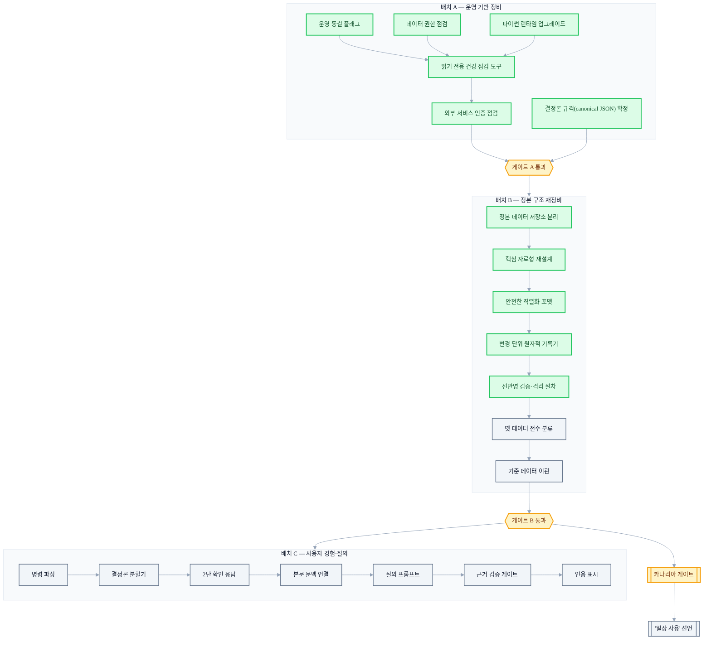

+++
date = '2026-07-11T21:00:00+09:00'
draft = false
title = '[2026-07-11] 두 AI의 교차검토: 11가지 결정으로 운영 계획을 확정하다'
summary = "서로 다른 두 AI(Claude·Codex)에게 같은 쟁점을 교차검토시켜 운영 계획을 확정한 11건의 결정. 결정론 우선, 신뢰 등급화, 삭제 계약, 그리고 실행 배치 A/B/C와 그 사이의 게이트를 정리했다."
tags = ['Second Brain']
+++

이 시스템은 개인용 로컬 지식 관리 도구로, 메인 뇌가 기억을 저장·색인하고 동반 프로세스가 메신저 같은 외부 세계와의 소통을 담당한다. 나흘간의 병렬 빌드로 세 컴포넌트의 뼈대가 갖춰진 뒤, 다음 관문은 "이걸 실제로 운영에 올려도 되는가"였다. 그런데 운영으로 넘어가기 전에 먼저 닫아야 할 열린 쟁점들이 남아 있었다.

## 빌드는 끝났지만 운영으로 못 넘어간다

빌드 단계에서는 "테스트를 통과하는가"만 물으면 됐다. 운영 단계로 넘어가려면 다른 질문들이 필요했다. 검색 결과가 애매할 때 어디까지 LLM에게 맡길 것인가. 신뢰가 흔들리는 상황을 어떻게 등급으로 나눌 것인가. 사용자가 삭제를 요청했을 때 시스템은 실제로 무엇을 지우겠다고 "약속"할 것인가. 이런 질문들은 코드 한 줄로 풀리지 않고, 트레이드오프를 인지한 채로 사람이 확정해야 하는 결정들이었다.

이 결정들을 확정하는 방식도 특이했다. 서로 다른 두 AI(하나는 Claude 계열, 하나는 Codex 계열)에게 같은 쟁점을 교차검토시켰다. 이유는 단순하다 — 하나의 모델이 낸 결론은 그 모델의 맹점을 그대로 갖고 있을 가능성이 있다. 두 모델이 서로 다른 근거로 같은 결론에 도달하면 그 결정은 더 신뢰할 만하고, 서로 다른 결론을 내면 그 지점이 바로 진짜 트레이드오프가 있는 곳이라는 신호가 된다. 이 교차검토를 통해 11건의 결정이 확정됐다.

## 결정론을 최우선에 둔 것들

세 가지 결정이 하나의 원칙으로 묶인다 — "모호한 판단이 필요한 자리에는 되도록 규칙을, 반드시 필요한 곳에만 LLM을 쓴다."

문장을 어디서 자를지 정하는 로직은 LLM이 아니라 결정론 규칙으로 짰다. URL이나 소수점, 마크다운 문법, 코드 블록, 목록, 약어 같은 패턴을 규칙으로 보호해 경계를 잘못 자르지 않게 하고, LLM은 그렇게 정해진 경계 안에서 분류(라벨링)에만 쓰기로 했다. 비용 예산과도 맞아떨어지는 선택이었고 — 무엇보다 같은 입력이면 항상 같은 출력이 나온다는 재현성을 얻을 수 있었다.

질의에 답할 때 유료 LLM 호출은 총 2번으로 예산을 못박았다 — 1차는 구조화와 인용 매핑, 2차는 그 답이 근거를 벗어나지 않는지 검증하는 함의 확인. 만약 이 과정이 실패하면 3번째 호출로 다시 생성하는 대신, 규칙에 따라 결정론적으로 축약한 응답을 내놓기로 했다. "안 되면 한 번 더 시도"가 아니라 "안 되면 정해진 방식으로 물러난다"는 태도다.

그리고 나중에 만들 지문(fingerprint)과 스냅샷 해시가 서로 다른 방식으로 계산되는 사고를 막기 위해, 값을 표준화된 순서로 정렬해 해시하는 방식(국제 표준 규격)을 프로젝트 초반부터 미리 못박았다. 이런 규격은 나중에 정할수록 이미 저장된 데이터와의 정합을 맞추는 비용이 커지기 때문에, 뒤로 미루지 않고 앞당겼다.

## 신뢰의 등급을 매긴 것들

빌드한 기능이 "동작한다"는 것과 "일상적으로 써도 된다"는 것은 다른 이야기다. 이 구분을 명문화한 것이 세 번째 결정이었다. 핵심 기억을 다루는 기능은 core 배치가 완료됐다는 사실만으로 신뢰 모드를 자동으로 열지 않고, 재시작 후에도 같은 결과가 나오는지, 명령이 실제로 반영됐다고 확인할 수 있는지, 백업에서 복원이 실제로 되는지, 답변이 원문을 정확히 인용하는지, 거짓 성공이 하나도 없는지를 실측하는 별도의 관문(카나리아 게이트)을 통과해야만 수동으로, 그것도 개인 용도로만 켤 수 있게 했다. 자동으로 돌아가는 조사·게시·재정리 기능은 이 관문과 무관하게 계속 꺼둔 채로 두기로 했다.

신뢰가 흔들리는 상황에도 등급을 나눴다. 파일 하나가 격리된 정도라면 읽기 전용 질의는 허용하지만, 스키마나 지문 규격, 전역 정합성 자체가 어긋나면 완전히 막는다는 원칙이다. 그리고 "사용자가 그렇게 말했다"는 사실과 "그 내용이 객관적으로 검증됐다"는 사실을 같은 신뢰 등급으로 섞지 않기로 했다 — 사용자 발화를 사실로 확정 저장하는 것과, 그 발화가 있었다는 것만 기록하는 것은 다른 일이다.

## 지우는 것에도 계약이 필요했다

새로운 분류 체계(taxonomy)를 처음 잡는 작업은 실수의 비용이 크다. 옛 도메인 데이터 26건을 전량 마이그레이션 후보로 놓고, 명백한 것은 묶어서 사람이 승인하고 애매한 것은 격리해두기로 했다. 전수 검수 비용보다 오분류가 퍼졌을 때 되돌리는 비용이 훨씬 크다고 판단했기 때문이다.

삭제 요청도 세 가지 서로 다른 계약으로 나눴다. 일반 삭제는 활성 데이터와 파생 색인만 지우고, 이력 저장소 안의 원문은 남을 수 있다는 것을 인정한다. 완전 삭제는 이력 자체를 다시 쓰는 더 무거운 절차다. 백업은 일정 기간(약 30일) 보관 뒤 자동으로 소멸한다. 원래 계획했던 "복제본이 완전히 0이 된다"는 서비스 수준 목표는, append-only(추가만 가능한) 이력 저장소와 변경 불가능한 백업이 공존하는 현실과 양립할 수 없다는 게 이 논의 과정에서 드러났고, 그래서 "잔존 본문 0"이라는 기준을 활성 데이터와 파생 색인으로만 한정하는 절충으로 조정됐다.

## 순서를 다시 짠 것들

나머지 결정들은 아키텍처보다는 "언제, 어떤 단위로 할 것인가"에 관한 것이었다. 뷰어에 올라가는 공개 텍스트의 임베딩은 범용 모델이 아니라 전용 소형 다국어 모델로 재계산하고, 그 모델·버전·차원을 스냅샷 메타데이터로 고정해두기로 했다 — 다만 이 결정은 훨씬 뒤에 실행될 순서였다.

기록 단위를 무엇으로 볼 것인가도 정했다. "쓰기 1건 = 기록 1건"이라는 불변식을, 개별 사실(claim) 단위가 아니라 사용자의 조작(메시지) 단위로 해석하기로 못박았다. 이 원칙을 구현하던 최초의 방식은 나중에 통째로 사라지지만, "사용자 조작 하나당 기록 하나"라는 원칙 자체는 이후 다른 저장 방식 위에서 다시 구현됐다.

그리고 실행 환경의 언어 런타임을 최신 버전으로 올리는 작업을 원래 예정보다 훨씬 앞당겼다 — 나중에 데이터 이관 작업까지 끝낸 뒤에 런타임을 바꾸면, 이미 검증해둔 것들을 다시 검증해야 하는 비용이 배로 든다는 이유였다.

## 실행 계획: 배치 A → 게이트 → 배치 B → 배치 C

11건의 결정은 세 개의 실행 배치와 그 사이를 가르는 게이트로 구체화됐다. 게이트란 "사람이 눈으로 보고 괜찮다고 느끼면 통과"가 아니라, 정해진 검사를 자동으로 돌려서 그 결과가 특정 조건을 만족해야만 다음 단계로 넘어갈 수 있게 만든 관문이다. 판단을 사람의 감(感)이 아니라 재현 가능한 검증으로 옮기려는 장치였다.

배치 A는 즉시 착수해도 되는 8건, 배치 B는 정본 구조를 다시 짜는 11건, 배치 C는 사용자 경험과 질의 흐름을 다루는 13건으로 짜였고, 전체 예상 규모는 한 사람 기준으로 한 달에서 한 달 반 정도였다. 배치 A는 계획을 확정한 당일 전부 완료되고 게이트를 통과했다. 이어서 정본 구조 재정비의 앞부분(정본 데이터 저장소 분리부터 선반영 검증·격리 절차까지)도 하루이틀 사이 빠르게 완주했다. 그러나 옛 데이터 전수 분류에 착수하기 직전, 방향을 뒤흔드는 사건이 하나 터진다 — 그 이야기는 별도로 다룰 만큼 크다.

## 같은 시기, 동반 프로세스는 이미 실전에 들어가 있었다

이 회의가 열리기 며칠 전부터, 동반 프로세스는 이미 스텁으로 흉내만 내던 LLM 호출을 실제 서비스 API 호출로 바꿨고, 메신저 봇에도 실제 사용자 계정이 연동됐다. 즉 이 회의에서 결정한 "운영 동결 플래그"는 텅 빈 시스템을 잠그는 게 아니라, 이미 실제 언어모델을 부르고 실제 메신저와 연결된 시스템 위에서 자동화 경로(조사·재정리·게시)만 선택적으로 잠그는 작업이었다. 시스템 전체가 아니라 사람이 개입하지 않아도 스스로 도는 경로만 골라서 멈춰 세운 셈이다.

## 마무리

이 회의는 새로운 아키텍처를 발명한 자리가 아니라, 범위와 순서와 관문을 못박은 프로젝트 관리 결정이었다. 11건 중 실제로 지금까지 그대로 살아남은 것은 결정론 원칙 셋(청커·질의 예산·JCS 규격), 카나리아 게이트, 파이썬 런타임 앞당김 정도다. 나머지는 이후 사건들 속에서 구현 방식이 바뀌거나, 실행 대상 자체가 사라지거나, 아직 도달하지 못한 단계로 남았다. 결정을 내리는 것과 그 결정이 살아남는 것은 별개의 문제라는 걸, 이 프로젝트는 몇 주 안에 다시 확인하게 된다.
