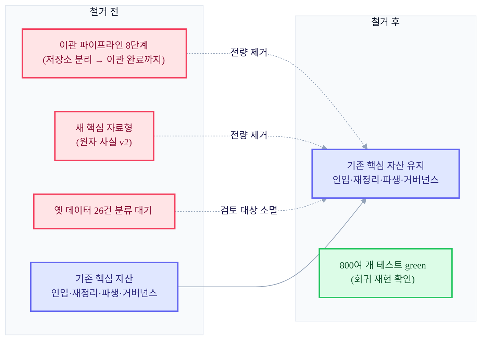

+++
date = '2026-07-13T21:00:00+09:00'
draft = false
title = '[2026-07-13] 만든 기능을 통째로 걷어내다'
summary = "절반쯤 완성한 이관(마이그레이션) 파이프라인을, 옮길 실제 데이터가 없다는 걸 확인하고 통째로 걷어낸 기록. 「완성도가 아니라 필요성」이 판단 기준이고, 삭제는 되돌릴 수 있는 방식으로 해야 한다는 교훈."
tags = ['Second Brain']
+++

이 시스템은 개인용 로컬 지식 관리 도구다. 메인 뇌가 기억을 저장하고 색인하며, 동반 프로세스가 외부 세계와의 소통을 담당한다. 운영 계획을 확정한 회의 이후, 정본 구조를 다시 짜는 작업의 일환으로 옛 데이터를 새 정본 형식으로 옮기는 이관(마이그레이션) 파이프라인을 만들고 있었다. 그런데 이 파이프라인이 절반쯤 완성됐을 때, 통째로 지워버리는 결정이 내려졌다.

## 무엇을 만들고 있었나

옛 형식으로 저장돼 있던 데이터를 새 정본 구조로 옮기려면 여러 단계를 거쳐야 한다. 데이터 전용 저장소를 분리하고, 새로운 핵심 자료형(원자 단위 사실과 그 조작 기록)을 정의하고, 안전한 직렬화 포맷을 만들고, 변경 하나를 원자적으로 기록하는 기록기를 짜고, 실제 반영 전에 미리 점검하고 애매한 건을 격리하는 절차까지 — 총 8단계짜리 파이프라인이었다.

이 작업은 순조로웠다. 이틀 사이 여러 차례의 테스트-우선 개발 사이클을 거치며 앞의 다섯 단계(저장소 분리부터 선반영 검증·격리까지)가 전부 통과했다. 그중 한 단계에서는 동시성 문제(같은 자원을 두 프로세스가 동시에 건드릴 때 생기는 결함)까지 발견해서 고쳤을 정도로, 공정 절차상으로는 완성도가 높은 산출물이었다. 다음 단계는 옛 도메인 데이터 26건을 전부 사람이 검토해 분류하는 작업이었다.

## 데이터를 열어보니, 옮길 게 없었다

바로 그 단계 착수 직전에, 이관 대상으로 상정했던 데이터를 실제로 열어봤다. 그런데 그 26건이 전부 테스트용으로 만들어둔 더미 데이터였다는 사실이 확인됐다. 실제로 옮겨야 할 진짜 데이터가 애초에 존재하지 않았던 것이다.

이 발견은 판단의 기준 자체를 바꿔놨다. "이 파이프라인이 얼마나 잘 만들어졌는가"는 더 이상 중요한 질문이 아니었다. 진짜 질문은 "이걸 계속 만들 필요가 있는가"였고, 답은 명백히 "없다"였다.

## "완성도가 아니라 필요성" — 결정과 그 파급

방향은 바로 정해졌다. 이관 파이프라인의 8단계 전체, 관련된 새 자료형, 관련 테스트와 빌드 산출물을 전부 걷어내기로 했다. 판단 시점은 그 대화가 있었던 날이었고, 실제로 코드를 지우고 커밋한 것은 그 다음 날이었다.

철거는 두 갈래로 이뤄졌다. 코드 자체는 일반적인 git 커밋으로 제거됐다 — "이 기능을 통째로 제거한다"는 취지의 커밋 하나로, 57개 파일에 걸쳐 6,700줄 넘게 지웠다. 이건 되돌릴 수 있는 형태의 삭제다. git 이력에는 그 이전 상태가 그대로 남아 있어서, 필요하면 언제든 그 시점의 코드를 다시 꺼내볼 수 있다. 반면 별도로 임시 격리 폴더에 모아뒀던 파일 뭉치는 이후 완전히 지워졌고, 이건 복구가 불가능하다 — 이 둘을 혼동해서 "격리해둔 걸 나중에 복구할 수 있다"는 취지로 잘못 적어둔 문구가 있었는데, 이 오류는 재개 회의에서 발견돼 나중에 바로잡혔다.

영향도 평가도 거쳤다. 다른 AI(Codex)가 세 차례에 걸쳐 수렴 검토를 했고, 철거 후 전체 회귀 테스트 스위트를 돌려 800개가 넘는 테스트가 전부 통과하는 것을 실측으로 확인했다. 철거가 아니라 살아남은 게 있다는 것도 중요하다 — 이관과 무관한 기반 코드, 즉 나흘간의 병렬 빌드로 만들어졌던 인입 소화·재정리(드림)·파생 프로젝션·거버넌스 같은 핵심 자산은 그대로 유지됐다.

이 결정은 앞선 두 가지에 연쇄 영향을 미쳤다. 하나는 실행 계획 자체다 — 정본 구조 재정비 배치 전체가 취소됐고, 이 배치 뒤에 예정돼 있던 여러 사용자 경험 작업들도 재기획 전까지 실행 근거를 잃었다. 다른 하나는 앞서 확정했던 결정 하나였다 — "옛 도메인 데이터 26건을 전수 사람이 검토해 분류한다"는 결정은, 검토할 실제 대상 자체가 사라지면서 자연스럽게 무효가 됐다.

## 철거 전후 시스템 표면 비교

## 남은 것과 사라진 것

정본을 filesystem이 아니라 git 커밋 자체로 삼으려던 이 시도는, 실사용 검증 이전에 접혔다. 애초에 "정본을 어디에 둘 것인가"라는 더 근본적인 질문이 아직 해결되지 않은 상태에서, 그 위에 얹을 이관 도구부터 짓고 있었던 셈이다. 이 사건 이후 사용자는 "제로베이스로 다시 기획하고, 다른 AI와 다시 회의하라"고 지시했고, 그 회의에서 정본을 어디에 둘 것인가라는 질문이 다시 정면으로 다뤄지게 된다.

## 교훈: 되돌릴 수 있는 방식으로 과감하게

이 사건에서 남는 교훈은 두 가지다. 하나는 판단 기준의 우선순위다 — 아무리 정교한 절차(테스트-우선 개발, 독립 채점, 다른 AI의 재검증)를 거쳐 완성도를 쌓아올렸어도, "이걸 왜 만들고 있는가"라는 질문에 답이 없으면 그 완성도는 지울지 말지를 결정하는 근거가 되지 못한다. 완성도와 필요성은 다른 축이고, 후자가 우선한다.

다른 하나는 삭제의 방식이다. 코드를 지울 때 일반적인 커밋으로 지우면, 그 판단이 잘못됐다는 게 나중에 밝혀지더라도 이력을 더듬어 되돌릴 길이 남는다. 반대로 임시 격리 폴더에 모아뒀다가 손으로 지우는 방식은 그 길을 영영 끊어버린다. 이번에 두 방식이 같은 사건 안에 함께 있었고, 결과도 갈렸다 — 하나는 여전히 이력 속에 남아 있고, 하나는 완전히 사라졌다.
