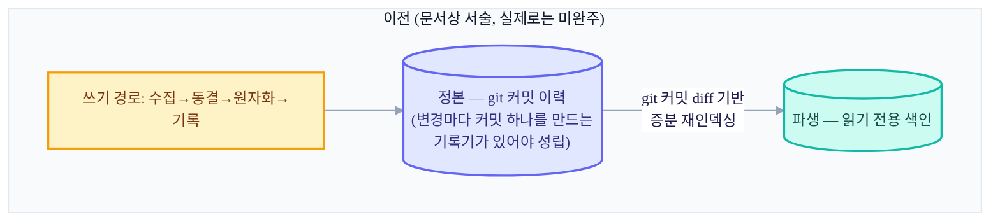
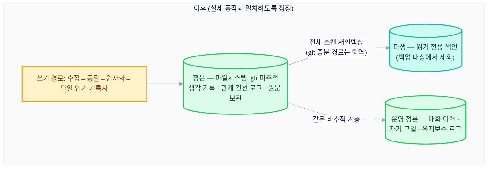

+++
date = '2026-07-14T21:00:00+09:00'
draft = false
title = '[2026-07-14] 정본은 git이 아니라 파일시스템이었다: 운영이 설계를 고치다'
summary = "「정본은 git」이라던 설계가 실제로는 이미 파일시스템이었음을 인정하고, 코드에 맞춰 문서를 고친 P1 안정화. 기억 데이터는 버전 관리 대상이 아니라 유출로부터 보호할 대상이라는 관점 전환."
tags = ['Second Brain']
+++

이 시스템은 개인용 로컬 지식 관리 도구다. 메인 뇌가 기억을 저장·색인하고, 동반 프로세스가 외부 세계와의 소통을 담당하며, 뷰어가 이를 화면으로 보여준다. 얼마 전 완성돼 있던 이관(마이그레이션) 기능을 통째로 걷어내는 사건이 있었고, 그 여파로 사용자는 "제로베이스로 다시 기획하라"고 지시했다. 그 재기획에서 가장 근본적인 질문이 다시 열렸다 — 이 시스템의 기억은 대체 어디에 진짜로 저장되는가.

## "정본은 git이다"라고 선언했었다

설계 초반, 이 시스템은 데이터를 그냥 DB에 넣는 대신 "git 정본 + 파생 DB" 구조로 가기로 했었다. 정본을 git 커밋 이력으로 삼으면 모든 변경이 자동으로 감사 가능한 기록이 되고, 필요하면 언제든 과거 시점으로 되돌아갈 수 있다는 게 그 매력이었다. 실제로 이 설계를 코드로 실현하려던 시도가 바로 앞서 걷어낸 이관 파이프라인이었다 — 정본 전용 데이터 저장소를 git으로 분리하고, 변경 하나마다 커밋 하나를 만드는 원자적 기록기를 짜는 게 그 핵심 부품이었다.

## 운영을 시작하며 드러난 모순

그런데 그 이관 기능이 통째로 사라진 뒤 재기획 회의에서 두 가지 사실이 함께 드러났다. 하나는 절차상의 문제였다 — 이관 철거를 반영하는 커밋이 아직 별도 브랜치에만 있고 본 저장소의 기본 브랜치에는 병합되지 않은 상태였다. 그래서 "이관 기능은 죽었다"는 게 문서로만 존재하고 실제로는 살아있는 것처럼 보였다. 이건 즉시 병합해서 공식화하면 그만이었다.

더 근본적인 건 두 번째였다. **데이터 정본이 실제로는 이미 파일시스템이었다.** 정본에 실제로 데이터를 기록하는 유일한 코드(단일 인가 기록자)를 들여다보니, 이 코드는 파일만 쓸 뿐 git 커밋을 만들지 않았다. 반면 설계 문서와 조립 코드 쪽 서술은 여전히 "정본은 git"이라고 말하고 있었다. 문서와 실제 동작이 서로 다른 말을 하고 있었던 것이다.

## 왜 뒤집었나 — 기억 데이터는 보호 대상이다

이 모순을 풀 때 던진 질문은 "git 정본을 마저 완성할 것인가, 아니면 실제 동작에 맞춰 문서를 고칠 것인가"였다. 답은 후자였고, 근거는 명확했다.

git을 진짜 정본으로 만들려면 변경마다 커밋 하나를 만드는 기록기가 있어야 하는데, 그건 바로 얼마 전 통째로 걷어낸 신규 기능이었다 — 다시 만드는 건 "안정화"라는 이번 작업의 목적과 어긋난다. 게다가 파일시스템을 정본으로 두면 그 정본을 `.gitignore`로 버전 관리에서 완전히 빼버릴 수 있다는 장점이 있었다 — 코드는 원격 저장소로 얼마든지 밀어 올려도, 개인의 실제 기억 데이터는 거기 실리지 않는다. git을 정본으로 삼으려면 코드와는 완전히 분리된 비공개 데이터 저장소가 따로 필요해지는데, 그 복잡도를 감수할 이유가 없었다.

이 전환의 핵심은 관점의 변화였다. 기억 데이터는 "버전 관리하며 이력을 추적할 대상"이 아니라 "실수로라도 밖으로 새 나가지 않도록 보호할 대상"이라는 것이다. 이 정정을 반영하는 문서 수정 커밋이 그날 바로 올라갔다.

## 확립한 세 원칙

이 결정을 계기로 세 가지 원칙이 확립됐고, 이후 시스템의 기준 문서가 이를 고정했다.

1. 기억 데이터(생각 기록, 원문 보관, 관계 간선 로그, 운영 상태)는 git에 올리지 않는다.
2. 백업은 git이 아니라 파일 번들 스냅샷으로 한다. 복원한 뒤에는 파생 색인을 다시 만들어내면 된다.
3. 다시 만들어낼 수 있는 것(파생 색인)은 지키지 않는다 — 백업 대상에서 제외한다.

정본과 파생의 경계 자체가 곧 저장 정책이 됐다. 정본은 보호하고, 파생은 언제든 버리고 다시 만들 수 있다는 전제 위에서 가벼운 취급을 허용한다.

## 저장 구조 전후 비교

백업 경계도 이 원칙을 따라 다시 그려졌다. 백업은 정본(생각 기록·원문 보관·관계 간선·운영 상태)만 파일 번들로 묶어 스냅샷을 뜨고, 파생 색인은 애초에 스냅샷에 포함시키지 않는다 — 복원 시점에 정본으로부터 다시 계산하면 되기 때문이다.

## 파생 저장 위치 정리와 실행 상태 위치 확정

원칙을 세우고 나니 그동안 방치돼 있던 구조적 잡음도 함께 눈에 띄었다. 파생 색인을 조립하는 코드가 저장 경로를 두 겹으로 중첩해서 만들고 있었다 — 정상적인 생각 기록 저장소는 한 겹인데 파생 색인만 실수로 두 겹 경로를 갖고 있었던 것이다. 실제 데이터는 빈 표식 파일뿐이라 손실 위험 없이 한 겹으로 정리할 수 있었다.

실행 상태(현재 진행 중인 작업의 상태)를 어디에 둘지도 정리 대상이었다. 실제로 운영 코드가 참조하는 실행 상태 경로는 처음부터 옳은 위치를 가리키고 있었는데, 예전 설계의 흔적으로 남아 있던 빈 디렉토리들이 혼란을 주고 있었다. 정본은 이 "운영 상태 저장소" 위치라고 명시적으로 확정하고, 정본·파생·운영 상태 전부를 버전 관리 바깥에 두는 것으로 계약을 명문화했다. 같은 정리 흐름에서 병렬 빌드 시절에만 쓰이던 파티션 전용 안전장치 여러 건과, 배선된 적 없이 구상 단계에서 멈춰 있던 잔재 몇 가지도 함께 정리됐다.

git 커밋 diff를 기반으로 파생 색인을 증분 갱신하던 경로도 이 시점에 완전히 퇴역했다. git이 더 이상 정본이 아니게 된 이상, git diff 기반 증분 재인덱싱은 운영에서 전혀 쓰이지 않는 테스트 전용 코드였을 뿐이다. 전체를 다시 스캔하는 재인덱싱과, 파일시스템 지문을 기준으로 어긋남을 감지하는 코드는 실사용 코드라 그대로 남았다.

## 건강 점검 도구에 "안정화" 프로파일을 신설하다

기존의 건강 점검 도구는 살아있는 프로세스, 발급된 API 키, 최근 백업 산출물 같은 것까지 확인하도록 짜여 있었다. 그런데 지금은 자동 기능(조사·재정리·게시)이 의도적으로 다 꺼져 있는 "안정화 중" 상태다. 이 상태에서 기존 점검 방식을 그대로 돌리면, 원래는 문제가 아닌 것들(꺼진 서비스, 아직 없는 백업)까지 실패로 잡아낸다.

그래서 핵심 구조·설정 정합성만 확인하는 별도 프로파일을 새로 만들었다 — 운영 상태 플래그, 권한 설정, 파생 상태 세 가지만 판정하고, 서비스 구동 여부나 DB 무결성, 인증 키 등록 같은 운영 관련 검사는 이 프로파일에서 뺐다. 이 프로파일의 통과는 "구조와 설정이 정합하다"만 의미할 뿐, "안정적으로 잠들어 있어도 안전하다"거나 "실사용 관문을 통과했다"는 뜻으로는 쓰지 않는다는 것도 명문으로 못박았다.

## 검증 명령 하드닝

여러 컴포넌트에 흩어져 있던 단위 테스트와 공통 규약 검사, 컴포넌트 간 계약 검사(총 6종)를 하나의 통합 명령으로 묶어, 그 명령의 종료 코드 하나로 "전부 통과했는가"를 판단할 수 있게 만들었다. 이 명령 자체도 몇 차례 하드닝을 거쳤다 — 잘못된 인자나 실행 위치에서 조용히 성공한 것처럼 보이는 일이 없도록 방어 코드를 추가했고, 예외가 발생하면 명확한 실패 코드를 반환하게 했으며, 재현 가능한 검증을 위한 잠금 옵션도 추가했다.

## 운영 동결은 계속됐다

이 안정화 기간 내내 조사·재정리·게시 기능은 계속 꺼진 채였다 — 앞선 회의에서 확정한 운영 동결 방침이 그대로 유지된 것이다. 이번 작업은 새 기능을 더하는 게 아니라 "지금 있는 것을 정리하고 문서와 실제 동작을 일치시키는" 것으로 범위를 좁혔고, 자동 기능을 다시 켜는 건 별도의 실사용 관문을 통과한 뒤로 미뤘다. 백업·복원 절차를 스크립트로 만들고 그 절차를 하드닝하는 작업도 이 안정화의 연장선에서 함께 이뤄졌다.

## 마무리

이 시기의 가장 큰 전환은 "설계 문서가 옳고 코드가 아직 못 따라갔다"가 아니라 "코드가 이미 옳았고 설계 문서가 틀렸다"는 걸 인정한 것이었다. 정본을 git으로 만들려던 시도는 신규 기능을 필요로 했고, 안정화 국면에서는 그 신규 기능을 만들 이유가 없었다. 대신 이미 잘 동작하고 있던 파일시스템 정본을 공식 정본으로 승격시키고, 그 위에서 구조를 정리했다. 이 정본 확정은 이후 실사용 검증과 인입 방식 재설계 국면에서 계속 전제로 쓰이게 된다 — 정본에 물리적인 트랜잭션이 없는 파일시스템이라는 사실이, 그 이후 설계 판단들의 출발점이 된다.
