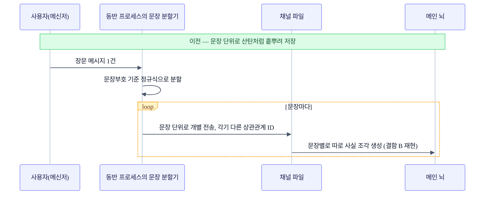
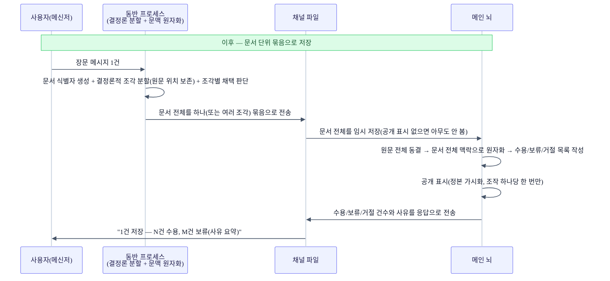

+++
date = '2026-07-18T21:00:00+09:00'
draft = false
title = '[2026-07-18] 카나리아가 잡아낸 결함 셋과 비효율 하나, 그리고 문장에서 문서로'
summary = "전체 테스트는 초록불인데 실사용은 실패한 카나리아 게이트. 개인 기억을 조회하지 않던 결함 등 셋 + 비효율 하나를 잡고, 저장 단위를 문장에서 문서로 재설계하기까지의 기록."
tags = ['Second Brain']
+++

이 시스템은 개인용 로컬 지식 관리 도구다. 메인 뇌가 기억을 저장·색인하고, 동반 프로세스가 메신저를 통한 소통을 담당한다. 앞서 저장 정본을 파일시스템으로 다시 확정하고 구조를 정리하는 안정화 작업을 마친 뒤, 드디어 실사용으로 넘어가기 위한 마지막 관문이 남아 있었다 — 이전 회의에서 "핵심 기능이 동작한다는 것만으로는 부족하고, 별도의 실사용 검증 관문을 통과해야 신뢰 모드를 열어준다"고 정해뒀던 그 관문이다.

## 스위트는 전부 초록불이었다, 그런데 실사용은 실패했다

안정화를 마쳤다고 해서 바로 일상적으로 써도 되는 건 아니었다. 앞서 확정해둔 방침대로, 핵심 기억 기능을 넓게 열어주기 전에 별도의 실사용 검증 관문을 하나 더 통과해야 했다.

## 카나리아 게이트란 무엇인가

이 관문의 이름은 카나리아 게이트다. 탄광에서 유독가스를 먼저 감지하던 카나리아처럼, 실제 사용자 시나리오 한 건을 실전과 똑같은 조건으로 흘려보내 문제가 있으면 먼저 걸리게 하자는 발상이다. 다섯 가지 조건을 확인한다 — 정본에 실제로 기록되는가, 그 기록이 검색에 반영되는가, 재시작해도 같은 결과가 나오는가(재시작 정합성), 배경 작업이 예외 없이 도는가, 동결해둔 기능 플래그가 그대로 유지되는가.

수동으로 실제 데이터 한 건을 입력해 이 다섯 조건을 확인하는 실험이 실행됐다. 그런데 1차 결과는 실패였다. 입력 자체(정본 기록)는 성공했지만, 저장된 사실을 실제로 질문했을 때 4번 중 4번 모두 "저장된 사실이 담긴 답변"이라는 최종 기준을 만족하지 못했다 — 두 번은 아예 답을 거절했고, 두 번은 근거 검증 절차는 통과했는데 정작 내용이 없는 생성물을 내놓았다. 이 실패로 "일반 수동 사용을 넓히자"는 결론은 철회됐다.

전체 자동 테스트 스위트는 이 시점에 전부 통과(초록불) 상태였다. 즉 기존에 짜둔 테스트 중 이 실패 경로를 잡아내는 검사는 하나도 없었다는 뜻이다 — 아무리 스위트가 초록불이어도, 실제로 살아있는 시스템에 실제 시나리오를 흘려보내는 검증은 별개로 필요하다는 걸 실증한 사례였다.

## 결함 셋과 비효율 하나 — 무엇이 왜 새고 있었나

원인을 파고들자 서로 다른 성격의 문제 네 가지가 드러났다. 셋은 명백한 결함이었고, 하나는 결과를 틀리게 하지는 않지만 일을 두 번 하게 만드는 비효율이었다.

**결함 A — 의도를 못 읽으면 개인 기억을 아예 조회하지 않는 문제.** 질문에서 뚜렷한 신호를 못 찾으면, 의도 분류 로직이 여섯 가지 의도 후보에 균등하게 점수를 나눠줬다. 그런데 그 다음 단계에서 최고점 후보를 고르는 로직이 동점 상황에서 항상 목록의 첫 번째 항목("사실 확인" 의도)을 골랐고, 그 "사실 확인" 의도는 하필 개인 기억이 아니라 공개 자료 레이어만 보도록 설정돼 있었다. 그래서 "내가 주말에 뭘 하지" 같은, 저장된 기억과 관련성이 충분히 높은 질문조차 개인 기억 레이어를 아예 들여다보지 않고 답을 냈다.

**결함 B — 결정론 분할기가 한 메시지를 여러 조각으로 쪼개는 문제.** 문장 경계를 판단하는 정규식 규칙이 사용자의 메시지 한 건을 두 개의 별도 질문으로 쪼개버렸다. 그 결과 "어떻게 생각해"처럼 의도를 담은 부분과 실제 질문 내용이 서로 다른 조각으로 분리돼 저장됐다.

**결함 C — 검색은 됐는데 본문을 다시 읽어오지 않는 문제.** 답을 생성하는 프롬프트 조립 로직이 검색 결과를 LLM에 넘길 때, 내용 지문(fingerprint)과 순위 점수만 넘기고 있었다. 정작 그 지문에 해당하는 원문을 정본에서 다시 읽어와 본문으로 채워 넣는 로직이 어디에도 없었다. 이와 맞물려, 지문과 본문을 연결하는 파생 인덱스 자체가 실행 시점에 빈 상태로 전달되고 있던 배선 누락도 함께 있었다.

**관찰 D(비효율) — 검색은 두 번 했는데 결과가 버려지는 낭비.** 질의 로직이 개인 기억 레이어와 공개 자료 레이어를 각각 먼저 검색해두고도, 그 결과를 최종 융합 단계에서 통째로 덮어써버려 애초에 검색한 게 의미가 없어지는 구조였다. 이건 결함 A를 고치는 과정에서 자연스럽게 함께 해소됐다 — 먼저 검색해둔 결과를 버리지 않고 재사용하도록 바꾸면 됐기 때문이다.

수정은 전부 기존 원칙(경계는 결정론 규칙, LLM은 그 안에서만 사용) 안에서 이뤄졌다. 신호가 없거나 동점이면 "모르겠다"로 명시하고 두 레이어를 함께 병합해서 보게 했고, 문서(레이어)별로 관련성 최소 기준(floor)을 두어 필터링했고, 앵커 레이어가 기준 미달이면 반대 레이어로 정해진 규칙에 따라 넘어가게 했다. 분할기는 원문의 위치 정보(오프셋)와 구두점을 보존한 채로 한 번에 라벨링하도록 바꿔서, 이어지는 질문 구간을 다시 하나로 조립할 수 있게 했다. 본문 조립 로직에는 확정된 지문을 정본에서 직접 되읽어오는 조회 로직을 추가했고, 본문을 못 찾으면 LLM을 부르기 전에 실패 처리하도록 했다. 지문과 본문을 잇는 파생 인덱스도 부팅 시 재구축하고 입력이 들어올 때마다 갱신하도록 배선을 고쳤다.

## 재검증: 5개 조건 전부 통과

수정을 반영한 뒤 다시 카나리아 실험을 돌렸고, 이번엔 다섯 조건 전부 통과했다. 신호가 뚜렷하지 않은 질문("내가 주말마다 뭘 하지?")에도 저장된 사실을 담은 실제 본문 답변과 근거 표시 2건이 함께 나왔고, 재시작 후에도 재시작 전과 동일한 지문으로 같은 답이 나와 정본 재구축의 정합성이 확인됐고, 배경 작업 예외는 0건, 동결해둔 기능 플래그도 그대로였다. 이로써 "일반 수동 사용 확대"가 승인됐다.

관문을 열기 직전, 재부팅 시 관련 프로세스가 자동으로 다시 켜지도록 등록돼 있던 시스템 자동 시작 설정 세 건(안정화 초반에 설치해둔 것)이 물리적으로 제거됐다 — 설정 템플릿 자체는 저장소에 남겨 필요하면 재설치할 수 있게 했다. 다만 상시 구동(재부팅해도 늘 떠 있는 상태)은 이번 관문과 별개로 여전히 보류 상태로 남았다.

## 더 근본적인 문제: 저장 경계가 문서가 아니라 문장이었다

결함 B(문장을 잘못 쪼개는 문제)는 표면적으로는 정규식 하나 손보면 끝날 문제처럼 보였다. 그런데 파고들수록 더 근본적인 설계 문제가 드러났다. 저장의 최소 단위가 "사용자가 보낸 문서 한 건"이 아니라 "메신저로 전송되는 문장 조각"에 걸려 있었던 것이다. 장문 메시지 하나가 애초에 여러 개의 독립적인 저장 단위로 쪼개져 들어가는 구조였고, 그 경계가 문장 부호라는 얕은 신호에 의존하고 있었다.

## 왜 문서 단위로 바꿨나

두 AI(Claude와 Codex)가 여러 차례 오간 회의 끝에, 사용자는 인입 단위 자체를 재설계하기로 확정했다. 기존 데이터는 모두 지우고 처음부터 다시 시작해도 된다는 결정과 함께였다.

목적은 세 가지였다. 장문 메시지 하나가 문서 단위로 한 번에 저장 확인 응답을 받도록 하고("N건 수용, M건 보류, 사유 포함"), 문서 전체의 맥락을 유지한 채로 사실 단위 조각을 만들어 "2번 역량" 같은 문맥 없이는 이해 안 되는 조각이 생기지 않게 하고, 보류되거나 거절된 부분도 사유와 함께 나중에 조회할 수 있게 하는 것.

기존에 확정해둔 원칙과의 정합도 그대로 지켰다. 경계를 나누는 방식은 여전히 결정론 규칙이고, LLM은 그 경계를 바꾸지 않는 범위에서 문서 전체 맥락을 보고 라벨링하는 데만 쓴다. 질의에 쓰는 유료 LLM 호출 예산도 여전히 2번으로 고정했다 — 문서 단위로 바뀐다고 호출 수가 늘지 않는다. "사용자의 조작 하나당 기록 하나"라는 원칙도 이번에 파일시스템 정본 위에서 다시 구현됐다 — 물리적인 git 커밋 대신, 임시 저장(staging) 상태에서 준비를 끝낸 뒤에만 공개 표시를 남기는 방식으로 원자적 가시성을 흉내냈다. 이 방식이 가능했던 건 정본이 이미 파일시스템으로 확정돼 있었기 때문이다.

## 인입 파이프라인 전후 비교

## 2026-07-19 현재 상태와 다음 단계

카나리아 재검증 시점 기준으로 메인 뇌 쪽 테스트 900여 개, 동반 프로세스 쪽 테스트 약 400개가 통과했고, 통합 검증 명령의 6개 검사 모두 종료 코드 0이었다. 문서 단위 전환 구현이 그 직후에 반영됐는데, 이 전환 이후의 최종 테스트 수치는 이 시점 기준으로 아직 별도로 확정되지 않았다.

앞서 세운 실행 계획으로 보면, 운영 기반을 다지는 배치는 관문을 통과하고 완료된 상태를 유지하고 있다. 정본 구조를 재정비하려던 배치는 이관 기능 철거로 전체가 취소됐고, 거기 의존하던 사용자 경험 작업 다수는 재기획 전까지 여전히 비활성이다. 다만 그중 명령 파싱과 결정론 분할기 성격의 작업은 이번 문서 단위 재설계로 사실상 흡수돼 다시 구현된 셈이다.

운영 동결도 여전하다. 조사·재정리·게시 같은 자동 기능은 계속 꺼져 있다 — 카나리아 게이트가 열어준 건 "수동으로, 개인 용도로만" 실사용을 넓히는 것뿐이고, 자동으로 스스로 도는 기능들은 처음 정한 방침 그대로 잠긴 채다. 재부팅해도 늘 떠 있는 상시 구동 상태 역시 아직 승인되지 않았다.

이번 사건이 남긴 가장 분명한 교훈은, 테스트 스위트가 아무리 초록불이어도 그것이 곧 "실사용해도 안전하다"는 뜻은 아니라는 것이다. 결함 네 가지 전부 유닛 테스트나 통합 테스트가 아니라 실제 입력→질의 왕복 실험에서만 드러났다. 그리고 결함 하나(문장 분할)의 근본 원인을 추적하다 보니 저장 단위 자체를 다시 설계하는 더 큰 작업으로 이어졌다는 것도, 표면의 버그 하나가 때로는 설계의 전제를 다시 묻게 만든다는 걸 보여준 사례였다.
